# Relatório consolidado dos treinamentos — Windows × Mac

Snapshot UTC: `2026-09-15T23:21:11+00:00`  
Branch: `consolidacao-de-resultados`  
Commit Windows: `037ebfe492fc22c7d7e8eb569a09da6c685261cd`  
Referência Mac: `origin/codex/mac-training-split` (`ac18558739f10b021ef39c68e8e944e567bf414f`)

## Resumo executivo

Foram consolidados **119 runs Windows** e **42 runs Mac** com métricas finais exatas, totalizando **12,943 epochs** e **436,59 horas-run** observadas.

Nos **seis pares de batch com protocolo alinhado**, a diferença média de Macro F1 Windows − Mac foi de **+0,019 p.p.**, com mediana de **-0,068 p.p.**. O Windows venceu 2/6 pares e o Mac 4/6. Em tempo, o Windows foi mais rápido em todos os seis; a razão mediana `Windows/Mac` foi **0,189**, equivalente a cerca de **18,9%** do tempo do Mac.

Nos **21 pares de ativações**, a diferença média descritiva foi **+3,305 p.p.**, mas o batch e a pilha de software diferem entre ambientes. Esse resultado não isola um efeito causal do sistema operacional. Softmax usada como ativação oculta colapsou próximo ao acaso nos dois ambientes; ReLU e Sigmoid concentram os resultados úteis.

## 1. Escopo e cobertura

| Plataforma | Runs com métricas | Campanhas | Datasets | Epochs | Horas-run | Class metrics | Confusion matrices | Séries por epoch | Telemetria |
| --- | ---: | ---: | ---: | ---: | ---: | ---: | ---: | ---: | ---: |
| Windows | 119 | 6 | 9 | 9625 | 283,35 | 119 | 119 | 118 | 118 |
| Mac | 42 | 2 | 9 | 3318 | 153,24 | 33 | 15 | 15 | 42 |

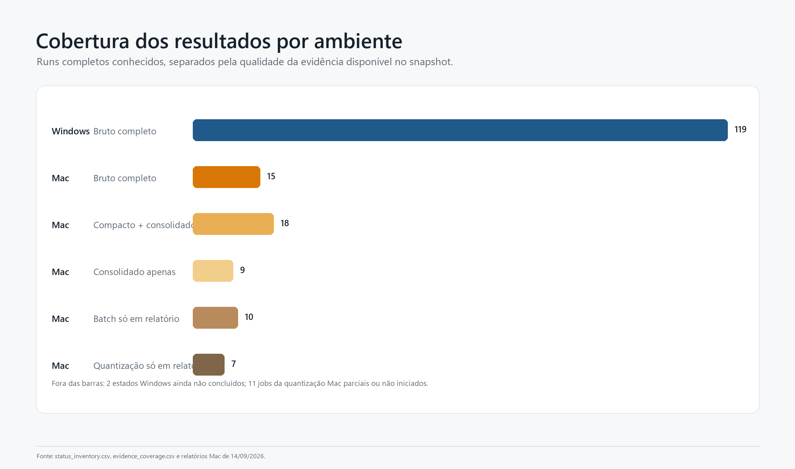

### Campanhas

| Plataforma | Campanha | Fase | Runs | Datasets | Epochs | Horas-run | Macro F1 médio | Mediana/epoch | GPU média | RAM média |
| --- | --- | --- | --- | --- | --- | --- | --- | --- | --- | --- |
| Mac | controlled-augmentation05-activations-mac2 | activation | 27 | 9 | 2700 | 99,46 h | 47,52% | 117,1 s | 87,7% | 74,1% |
| Mac | controlled-augmentation2-mac-m4-aug05 | batch | 6 | 3 | 600 | 53,75 h | 96,27% | 265,4 s | 75,4% | 75,8% |
| Mac | controlled-augmentation2-mac-m4-aug05 | smoke | 9 | 9 | 18 | 0,03 h | 10,97% | 4,7 s | 16,8% | 56,4% |
| Windows | controlled-augmentation05-batch-activation | activation | 21 | 7 | 2100 | 54,27 h | 56,08% | 78,1 s | 33,2% | 34,5% |
| Windows | controlled-augmentation05-batch-activation | batch | 36 | 9 | 3600 | 83,70 h | 81,36% | 50,1 s | 27,6% | 30,8% |
| Windows | controlled-augmentation2 | batch | 12 | 3 | 1200 | 63,66 h | 96,90% | 209,5 s | 26,8% | 32,2% |
| Windows | kmnist-alldata-noaug-batch-sweep-2026-08-06 | batch | 32 | 1 | 1600 | 27,66 h | 97,72% | 58,6 s | 24,6% | 21,8% |
| Windows | kmnist-batch32-noaugmentation-control-2026-08-28 | control | 1 | 1 | 100 | 2,57 h | 98,66% | 92,4 s | 28,2% | 26,4% |
| Windows | kmnist-quantization-2026-08-09 | quantization | 5 | 1 | 200 | 2,20 h | 97,51% | 40,0 s | 39,3% | 23,4% |
| Windows | remaining-ram-capped | balance | 12 | 3 | 825 | 49,30 h | 76,32% | 227,9 s | 21,5% | 44,1% |

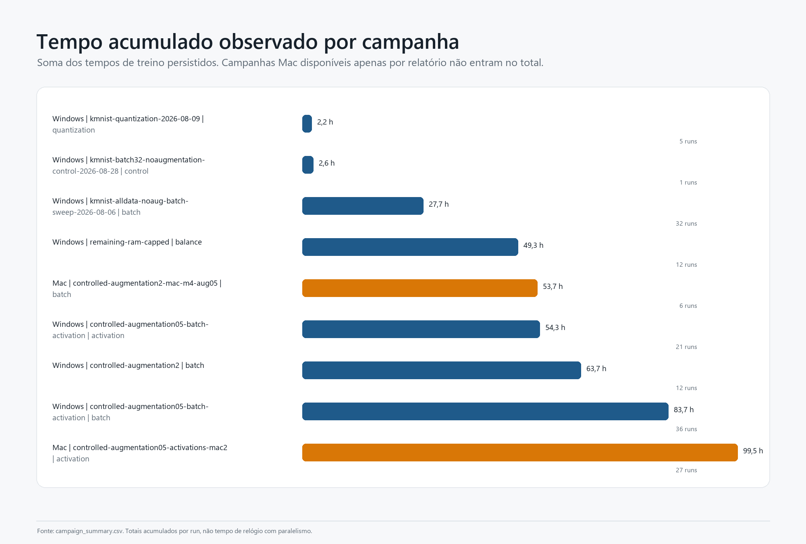

### Hardware e runtime

| Plataforma | GPU | Backend | TensorFlow | tensorflow-metal | Runs | Horas-run |
| --- | --- | --- | --- | --- | --- | --- |
| Mac | Apple M4 | apple-metal-ioreg | 2.18.1 | 1.2.0 | 42 | 153,24 h |
| Windows | NVIDIA RTX A2000 12GB | pynvml | 2.21.0 | — | 70 | 204,19 h |
| Windows | NVIDIA GeForce RTX 3050 | pynvml | 2.21.0 | — | 48 | 79,16 h |
| Windows | não registrado | não registrado | não registrado | — | 1 | 0,00 h |

O Windows combina execução host Windows com treinamento em WSL2/Linux. Os resultados históricos usam NVIDIA GeForce RTX 3050 ou RTX A2000 12 GB e TensorFlow 2.21.0. O Mac usa Apple M4, macOS 15.5, TensorFlow 2.18.1 e tensorflow-metal 1.2.0. Uma execução Windows não preservou todos os campos de ambiente.

## 2. Resultados de batch no Windows

### Melhor batch observado por dataset

| Dataset | Batch vencedor Windows | Macro F1 | Acurácia | Loss | Média/epoch |
| --- | --- | --- | --- | --- | --- |
| CIFAR-10 | 32 | 73,73% | 73,74% | 0,7948 | 60,1 s |
| CIFAR-100 coarse | 32 | 49,57% | 49,52% | 1,7054 | 60,9 s |
| EMNIST Balanced | 32 | 87,91% | 88,01% | 0,3530 | 142,8 s |
| FER2013 | 32 | 48,73% | 51,91% | 1,2818 | 51,0 s |
| Fashion-MNIST | 64 | 92,15% | 92,17% | 0,2267 | 44,9 s |
| GTSRB | 32 | 99,52% | 99,64% | 0,0136 | 359,8 s |
| KMNIST | 64 | 98,65% | 98,65% | 0,0558 | 41,2 s |
| MNIST | 128 | 99,02% | 99,03% | 0,0375 | 28,2 s |
| SVHN | 32 | 92,05% | 92,47% | 0,2632 | 168,2 s |

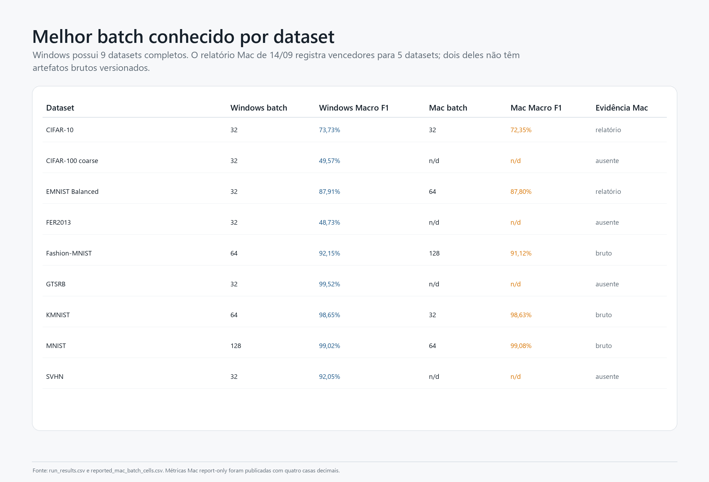

## 3. Resultados de ativações

### Melhor ativação por plataforma e dataset

| Plataforma | Dataset | Ativação vencedora | Macro F1 | Acurácia | Loss | Batch |
| --- | --- | --- | --- | --- | --- | --- |
| Mac | CIFAR-10 | sigmoid | 63,90% | 63,67% | 1,0122 | 256 |
| Mac | CIFAR-100 coarse | sigmoid | 35,02% | 36,61% | 2,0522 | 256 |
| Mac | EMNIST Balanced | sigmoid | 84,93% | 85,28% | 0,4362 | 256 |
| Mac | FER2013 | sigmoid | 37,54% | 47,45% | 1,3520 | 256 |
| Mac | Fashion-MNIST | sigmoid | 90,04% | 90,05% | 0,2771 | 256 |
| Mac | GTSRB | relu | 57,75% | 68,76% | 0,1083 | 256 |
| Mac | KMNIST | sigmoid | 97,11% | 97,11% | 0,1064 | 256 |
| Mac | MNIST | sigmoid | 98,44% | 98,46% | 0,0556 | 256 |
| Mac | SVHN | sigmoid | 87,07% | 87,76% | 0,3869 | 256 |
| Windows | CIFAR-10 | relu | 71,87% | 71,82% | 0,8235 | 32 |
| Windows | CIFAR-100 coarse | sigmoid | 46,34% | 46,66% | 1,7084 | 32 |
| Windows | EMNIST Balanced | relu | 87,06% | 87,27% | 0,3636 | 32 |
| Windows | Fashion-MNIST | relu | 91,77% | 91,83% | 0,2294 | 64 |
| Windows | KMNIST | relu | 98,30% | 98,30% | 0,0636 | 64 |
| Windows | MNIST | relu | 99,00% | 99,01% | 0,0385 | 128 |
| Windows | SVHN | relu | 91,42% | 91,84% | 0,2757 | 32 |

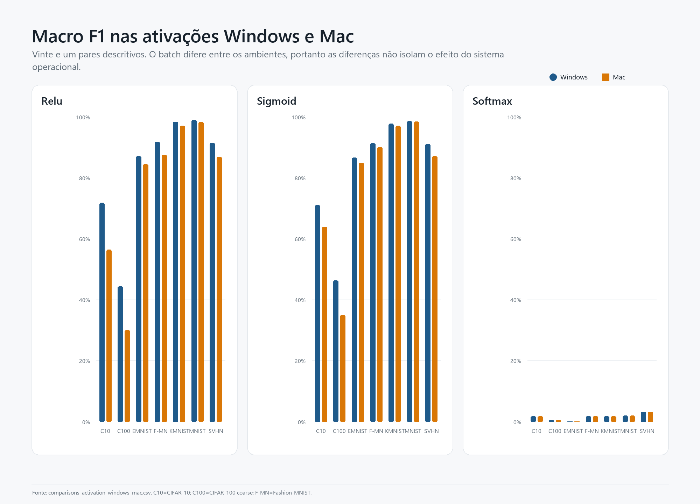

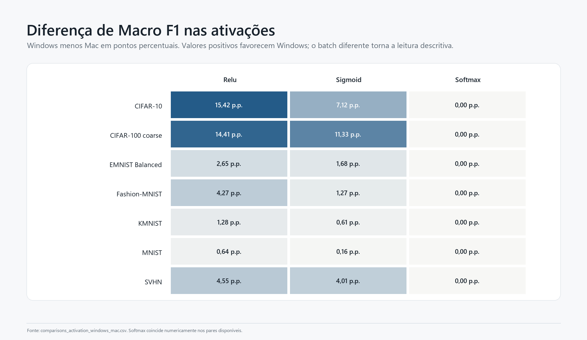

### Todos os 21 pares de ativações

| Dataset | Ativação | Batch W | Batch Mac | Acc. W | Acc. Mac | Macro F1 W | Macro F1 Mac | Δ F1 W−Mac | Loss W | Loss Mac | Epoch W | Epoch Mac |
| --- | --- | --- | --- | --- | --- | --- | --- | --- | --- | --- | --- | --- |
| CIFAR-10 | relu | 32 | 256 | 71,82% | 56,64% | 71,87% | 56,45% | +15,420 p.p. | 0,8235 | 1,1607 | 78,1 s | 115,1 s |
| CIFAR-10 | sigmoid | 32 | 256 | 71,41% | 63,67% | 71,01% | 63,90% | +7,115 p.p. | 0,8327 | 1,0122 | 91,5 s | 142,0 s |
| CIFAR-10 | softmax | 32 | 256 | 10,00% | 10,00% | 1,82% | 1,82% | +0,000 p.p. | 2,3026 | 2,3026 | 90,9 s | 113,7 s |
| CIFAR-100 coarse | relu | 32 | 256 | 44,86% | 30,32% | 44,39% | 29,98% | +14,410 p.p. | 1,8183 | 2,2578 | 90,7 s | 114,2 s |
| CIFAR-100 coarse | sigmoid | 32 | 256 | 46,66% | 36,61% | 46,34% | 35,02% | +11,328 p.p. | 1,7084 | 2,0522 | 79,2 s | 142,1 s |
| CIFAR-100 coarse | softmax | 32 | 256 | 5,00% | 5,00% | 0,48% | 0,48% | +0,000 p.p. | 2,9958 | 2,9957 | 61,8 s | 115,7 s |
| EMNIST Balanced | relu | 32 | 256 | 87,27% | 84,86% | 87,06% | 84,42% | +2,647 p.p. | 0,3636 | 0,5687 | 121,6 s | 236,8 s |
| EMNIST Balanced | sigmoid | 32 | 256 | 86,76% | 85,28% | 86,61% | 84,93% | +1,684 p.p. | 0,3787 | 0,4362 | 183,3 s | 303,8 s |
| EMNIST Balanced | softmax | 32 | 256 | 2,13% | 2,13% | 0,09% | 0,09% | +0,000 p.p. | 3,8502 | 3,8502 | 184,2 s | 244,9 s |
| Fashion-MNIST | relu | 64 | 256 | 91,83% | 87,82% | 91,77% | 87,50% | +4,270 p.p. | 0,2294 | 0,3273 | 40,2 s | 117,9 s |
| Fashion-MNIST | sigmoid | 64 | 256 | 91,32% | 90,05% | 91,31% | 90,04% | +1,268 p.p. | 0,2385 | 0,2771 | 55,7 s | 150,3 s |
| Fashion-MNIST | softmax | 64 | 256 | 10,00% | 10,00% | 1,82% | 1,82% | +0,000 p.p. | 2,3026 | 2,3026 | 55,0 s | 117,1 s |
| KMNIST | relu | 64 | 256 | 98,30% | 97,02% | 98,30% | 97,02% | +1,279 p.p. | 0,0636 | 0,1384 | 51,6 s | 115,1 s |
| KMNIST | sigmoid | 64 | 256 | 97,72% | 97,11% | 97,73% | 97,11% | +0,611 p.p. | 0,0813 | 0,1064 | 54,6 s | 147,1 s |
| KMNIST | softmax | 64 | 256 | 10,00% | 10,00% | 1,82% | 1,82% | +0,000 p.p. | 2,3026 | 2,3026 | 55,6 s | 116,2 s |
| MNIST | relu | 128 | 256 | 99,01% | 98,37% | 99,00% | 98,36% | +0,642 p.p. | 0,0385 | 0,0594 | 34,2 s | 115,2 s |
| MNIST | sigmoid | 128 | 256 | 98,62% | 98,46% | 98,60% | 98,44% | +0,164 p.p. | 0,0473 | 0,0556 | 27,4 s | 152,4 s |
| MNIST | softmax | 128 | 256 | 11,25% | 11,25% | 2,02% | 2,02% | +0,000 p.p. | 2,3013 | 2,3014 | 36,3 s | 117,8 s |
| SVHN | relu | 32 | 256 | 91,84% | 86,44% | 91,42% | 86,86% | +4,553 p.p. | 0,2757 | 0,4234 | 216,7 s | 188,7 s |
| SVHN | sigmoid | 32 | 256 | 91,48% | 87,76% | 91,08% | 87,07% | +4,012 p.p. | 0,2850 | 0,3869 | 167,7 s | 236,9 s |
| SVHN | softmax | 32 | 256 | 19,10% | 19,10% | 3,21% | 3,21% | +0,000 p.p. | 2,2331 | 2,2578 | 178,9 s | 190,7 s |

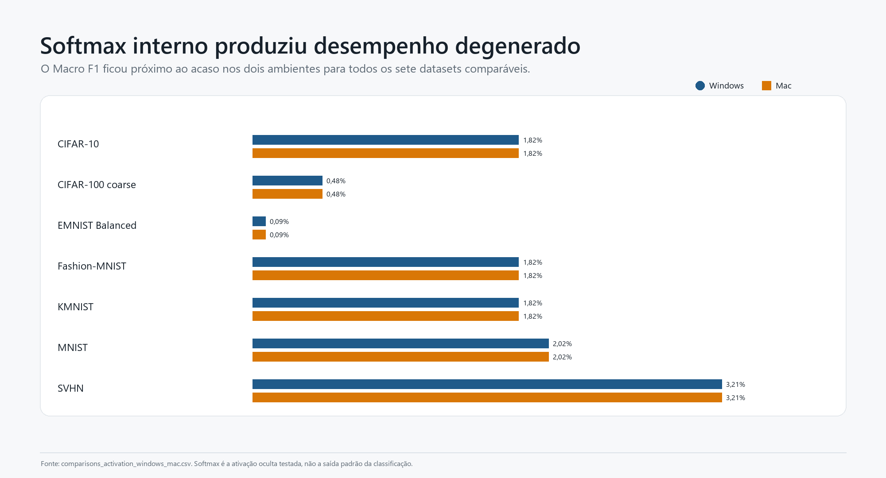

## 4. Comparação Windows × Mac: pares batch equivalentes

Estes pares usam o mesmo dataset, batch, augmentation, seed e fingerprint de split. Ainda diferem em hardware, sistema, backend e versão do TensorFlow.

| Dataset | Batch | Acc. W | Acc. Mac | Macro F1 W | Macro F1 Mac | Δ F1 W−Mac | Loss W | Loss Mac | Epoch W | Epoch Mac | Mac/Windows |
| --- | --- | --- | --- | --- | --- | --- | --- | --- | --- | --- | --- |
| Fashion-MNIST | 128 | 91,56% | 91,15% | 91,52% | 91,12% | +0,406 p.p. | 0,2357 | 0,2469 | 35,1 s | 233,2 s | 6,65× |
| Fashion-MNIST | 256 | 90,83% | 90,99% | 90,78% | 90,97% | -0,192 p.p. | 0,2551 | 0,2537 | 26,1 s | 134,2 s | 5,14× |
| KMNIST | 32 | 98,58% | 98,63% | 98,58% | 98,63% | -0,049 p.p. | 0,0536 | 0,0576 | 96,7 s | 616,0 s | 6,37× |
| MNIST | 32 | 98,96% | 98,84% | 98,95% | 98,82% | +0,125 p.p. | 0,0335 | 0,0484 | 97,0 s | 513,6 s | 5,29× |
| MNIST | 64 | 99,00% | 99,09% | 98,99% | 99,08% | -0,088 p.p. | 0,0417 | 0,0326 | 56,4 s | 297,5 s | 5,28× |
| MNIST | 256 | 98,93% | 99,02% | 98,92% | 99,01% | -0,088 p.p. | 0,0353 | 0,0352 | 26,7 s | 140,4 s | 5,25× |

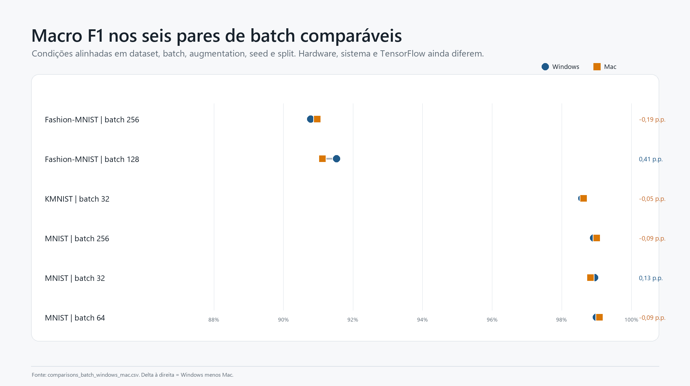

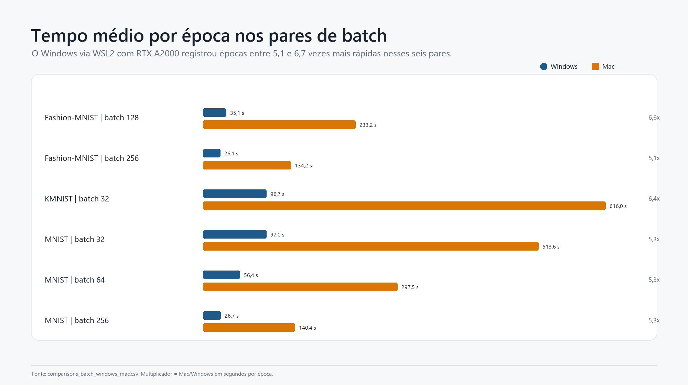

## 5. Loss, curvas e duração das epochs

As séries por epoch incluem loss, acurácia, `val_loss`, `val_accuracy`, `val_balanced_accuracy`, `val_macro_f1`, learning rate, duração e throughput. O anexo `epoch_metrics.csv` contém 10,243 linhas. Nos seis pares equivalentes, o Mac levou aproximadamente **5,1× a 6,6×** mais tempo por epoch.

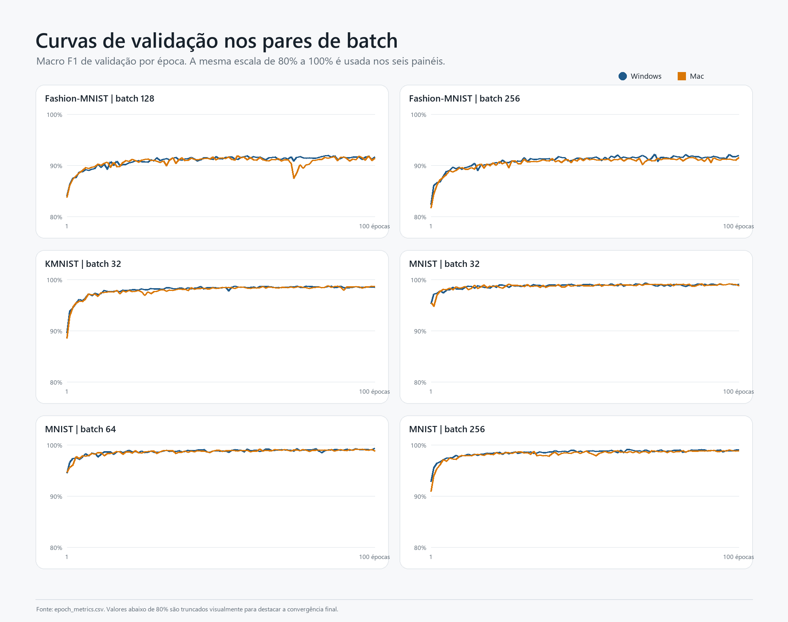

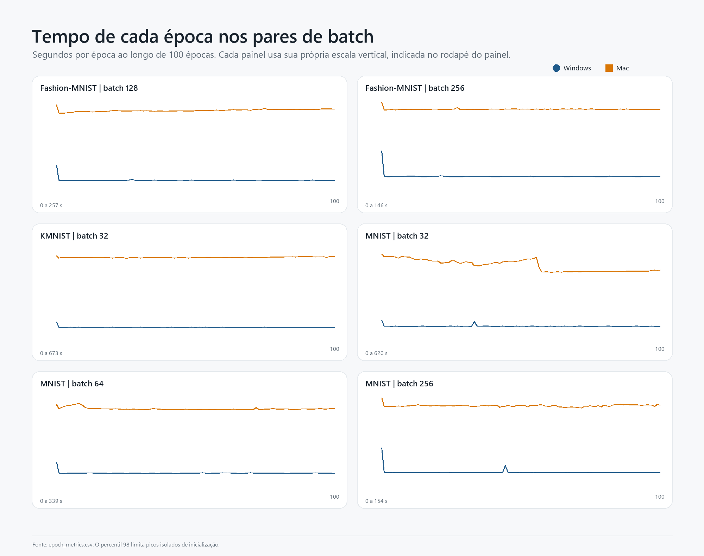

## 6. Telemetria de hardware

| Dataset | Batch | GPU W | GPU Mac | Mem. GPU W | Mem. GPU Mac | CPU proc. W | CPU proc. Mac | RAM W | RAM Mac |
| --- | --- | --- | --- | --- | --- | --- | --- | --- | --- |
| Fashion-MNIST | 128 | 32,6% | 84,4% | 1,75 GiB | 0,49 GiB | 102,9% | 72,4% | 20,8% | 74,3% |
| Fashion-MNIST | 256 | 35,1% | 83,4% | 2,01 GiB | 0,75 GiB | 88,1% | 81,7% | 20,7% | 68,8% |
| KMNIST | 32 | 35,0% | 76,0% | 1,64 GiB | 0,43 GiB | 117,0% | 83,5% | 20,5% | 79,9% |
| MNIST | 32 | 35,2% | 67,6% | 1,63 GiB | 0,35 GiB | 115,6% | 94,4% | 20,4% | 77,4% |
| MNIST | 64 | 33,3% | 73,3% | 1,63 GiB | 0,39 GiB | 110,9% | 91,9% | 20,7% | 71,4% |
| MNIST | 256 | 34,8% | 83,1% | 2,01 GiB | 0,71 GiB | 91,0% | 85,1% | 21,0% | 71,7% |

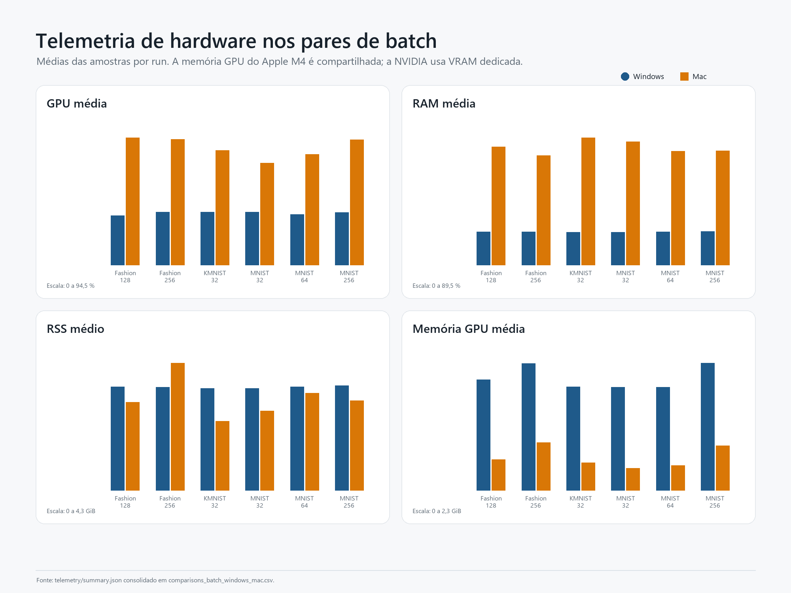

Os percentuais de GPU têm semântica distinta entre CUDA/NVML e Metal. Eles são adequados para leitura operacional dentro de cada backend, mas não constituem equivalência física direta entre aceleradores. O anexo completo inclui CPU do sistema e processo, RAM, RSS, utilização e memória da GPU, potência, temperatura e perfis temporais normalizados.

## 7. Métricas por classe

Foram preservadas **2,307 linhas** de precisão, recall, F1 e suporte por classe. Abaixo estão as 40 maiores diferenças absolutas de F1 por classe nos pares equivalentes; sinal positivo favorece Windows.

| Dataset | Batch | Classe | Suporte W | Suporte Mac | F1 W | F1 Mac | Δ F1 W−Mac |
| --- | --- | --- | --- | --- | --- | --- | --- |
| Fashion-MNIST | 128 | 4 | 1050 | 1050 | 86,18% | 84,84% | +1,339 p.p. |
| Fashion-MNIST | 128 | 6 | 1050 | 1050 | 77,96% | 76,63% | +1,331 p.p. |
| Fashion-MNIST | 128 | 2 | 1050 | 1050 | 86,10% | 85,10% | +1,004 p.p. |
| Fashion-MNIST | 256 | 6 | 1050 | 1050 | 75,24% | 76,22% | -0,984 p.p. |
| Fashion-MNIST | 128 | 0 | 1050 | 1050 | 86,83% | 85,86% | +0,963 p.p. |
| Fashion-MNIST | 256 | 3 | 1050 | 1050 | 90,42% | 91,36% | -0,945 p.p. |
| Fashion-MNIST | 128 | 7 | 1050 | 1050 | 95,36% | 96,26% | -0,908 p.p. |
| Fashion-MNIST | 256 | 4 | 1050 | 1050 | 85,28% | 84,44% | +0,845 p.p. |
| MNIST | 256 | 5 | 947 | 947 | 97,97% | 98,58% | -0,607 p.p. |
| MNIST | 64 | 5 | 947 | 947 | 98,15% | 98,68% | -0,534 p.p. |
| KMNIST | 32 | 4 | 1050 | 1050 | 98,20% | 98,71% | -0,511 p.p. |
| MNIST | 32 | 9 | 1044 | 1044 | 98,85% | 98,37% | +0,476 p.p. |
| Fashion-MNIST | 128 | 1 | 1050 | 1050 | 99,04% | 98,57% | +0,469 p.p. |
| KMNIST | 32 | 1 | 1050 | 1050 | 98,18% | 97,72% | +0,460 p.p. |
| MNIST | 256 | 0 | 1035 | 1035 | 99,90% | 99,47% | +0,437 p.p. |
| MNIST | 32 | 5 | 947 | 947 | 98,14% | 97,73% | +0,412 p.p. |
| KMNIST | 32 | 8 | 1050 | 1050 | 98,56% | 98,95% | -0,385 p.p. |
| Fashion-MNIST | 256 | 0 | 1050 | 1050 | 85,54% | 85,16% | +0,384 p.p. |
| Fashion-MNIST | 256 | 8 | 1050 | 1050 | 97,38% | 97,77% | -0,383 p.p. |
| KMNIST | 32 | 3 | 1050 | 1050 | 98,91% | 99,29% | -0,382 p.p. |
| KMNIST | 32 | 5 | 1050 | 1050 | 98,72% | 98,35% | +0,373 p.p. |
| Fashion-MNIST | 256 | 2 | 1050 | 1050 | 85,22% | 85,58% | -0,352 p.p. |
| Fashion-MNIST | 256 | 1 | 1050 | 1050 | 98,41% | 98,76% | -0,346 p.p. |
| MNIST | 32 | 6 | 1031 | 1031 | 98,75% | 99,08% | -0,334 p.p. |
| MNIST | 64 | 9 | 1044 | 1044 | 98,48% | 98,80% | -0,322 p.p. |
| MNIST | 64 | 0 | 1035 | 1035 | 99,76% | 99,47% | +0,288 p.p. |
| Fashion-MNIST | 256 | 5 | 1050 | 1050 | 97,75% | 98,03% | -0,284 p.p. |
| MNIST | 256 | 3 | 1071 | 1071 | 99,11% | 99,39% | -0,281 p.p. |
| KMNIST | 32 | 6 | 1050 | 1050 | 98,05% | 98,33% | -0,275 p.p. |
| MNIST | 32 | 7 | 1094 | 1094 | 99,04% | 98,78% | +0,268 p.p. |
| MNIST | 256 | 1 | 1181 | 1181 | 99,41% | 99,66% | -0,255 p.p. |
| MNIST | 32 | 4 | 1023 | 1023 | 99,36% | 99,17% | +0,196 p.p. |
| MNIST | 64 | 3 | 1071 | 1071 | 99,25% | 99,44% | -0,188 p.p. |
| MNIST | 64 | 7 | 1094 | 1094 | 98,73% | 98,91% | -0,178 p.p. |
| MNIST | 256 | 4 | 1023 | 1023 | 99,12% | 99,27% | -0,152 p.p. |
| Fashion-MNIST | 256 | 7 | 1050 | 1050 | 96,07% | 95,94% | +0,129 p.p. |
| MNIST | 32 | 1 | 1181 | 1181 | 99,53% | 99,41% | +0,127 p.p. |
| KMNIST | 32 | 7 | 1050 | 1050 | 99,00% | 98,90% | +0,100 p.p. |
| KMNIST | 32 | 9 | 1050 | 1050 | 99,10% | 99,00% | +0,099 p.p. |
| MNIST | 32 | 0 | 1035 | 1035 | 99,71% | 99,61% | +0,097 p.p. |

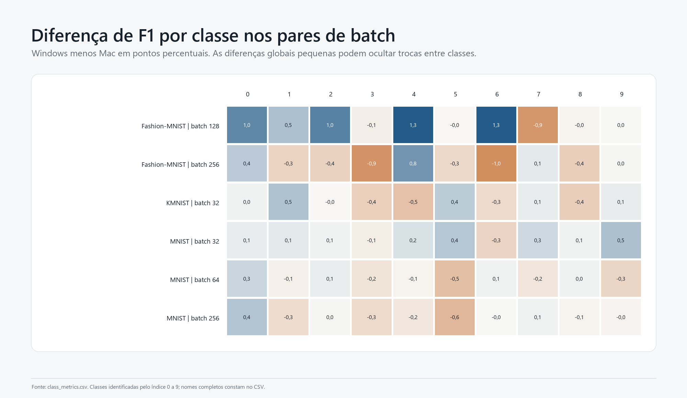

O arquivo [class_metrics.csv](data/class_metrics.csv) contém todas as classes de todos os runs disponíveis.

## 8. Matrizes de confusão

As matrizes são normalizadas por classe verdadeira nos gráficos. O arquivo [confusion_matrices_long.csv](data/confusion_matrices_long.csv) preserva as **47,954 células** e contagens absolutas.

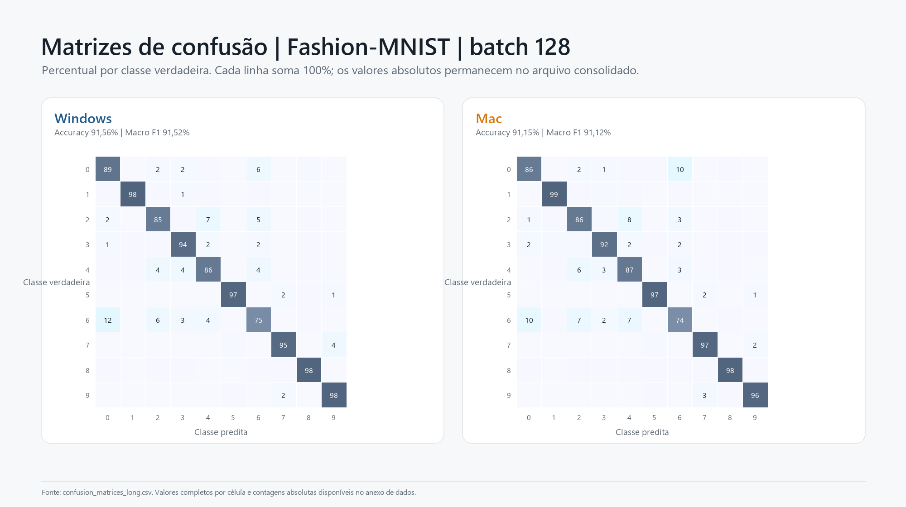

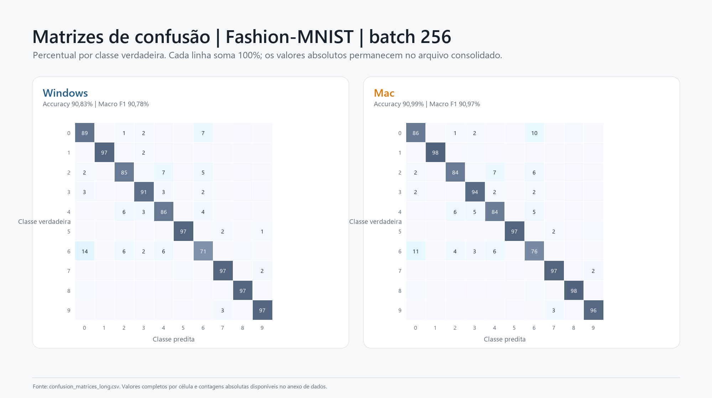

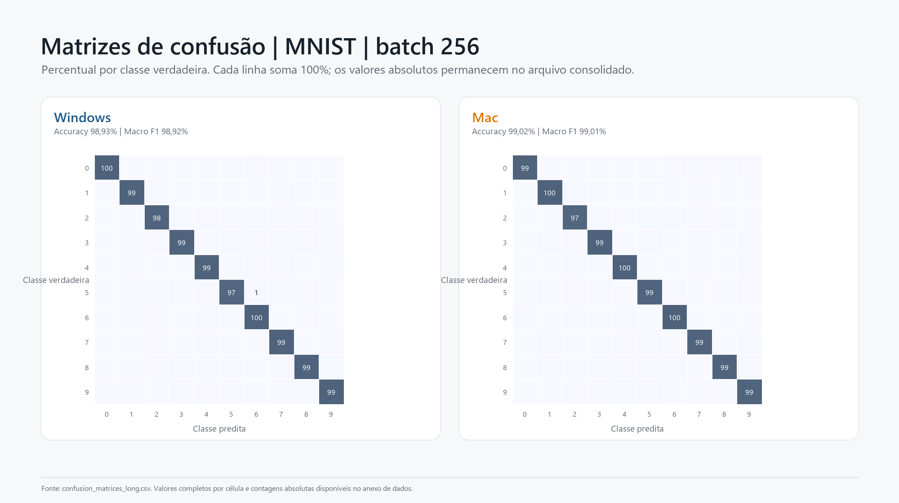

## 9. Lacunas documentadas no Mac

O relatório de batch do Mac registra **16 células concluídas**, das quais **6** têm artefatos brutos versionados e **10** permanecem report-only.

| Dataset | Batch | Status | Bruto versionado | Melhor reportado | Macro F1 reportado | Evidência |
| --- | --- | --- | --- | --- | --- | --- |
| CIFAR-10 | 32 | completed | não | sim | 72,35% | progress_report_only |
| CIFAR-10 | 64 | completed | não | não | — | progress_report_only |
| CIFAR-10 | 128 | completed | não | não | — | progress_report_only |
| CIFAR-10 | 256 | completed | não | não | — | progress_report_only |
| EMNIST Balanced | 64 | completed | não | sim | 87,80% | progress_report_only |
| EMNIST Balanced | 128 | completed | não | não | — | progress_report_only |
| EMNIST Balanced | 256 | completed | não | não | — | progress_report_only |
| Fashion-MNIST | 128 | completed | sim | sim | 91,12% | raw_complete |
| Fashion-MNIST | 256 | completed | sim | não | — | raw_complete |
| KMNIST | 32 | completed | sim | sim | 98,63% | raw_complete |
| KMNIST | 64 | completed | não | não | — | progress_report_only |
| KMNIST | 128 | completed | não | não | — | progress_report_only |
| KMNIST | 256 | completed | não | não | — | progress_report_only |
| MNIST | 32 | completed | sim | não | — | raw_complete |
| MNIST | 64 | completed | sim | sim | 99,08% | raw_complete |
| MNIST | 256 | completed | sim | não | — | raw_complete |

Na quantização do Mac, o relatório registra **7 concluídos**, **1 parcial/stale** e **10 não iniciados**. Os valores finais exatos não foram versionados, portanto nenhum deles entra nas comparações numéricas.

| Dataset | Variante | Status | Epochs observadas | Métricas finais reportadas | Valores exatos disponíveis | Evidência |
| --- | --- | --- | --- | --- | --- | --- |
| CIFAR-10 | fp16 | not_started | 0 | não | não | progress_report_only |
| CIFAR-10 | fp32 | not_started | 0 | não | não | progress_report_only |
| CIFAR-100 coarse | fp16 | not_started | 0 | não | não | progress_report_only |
| CIFAR-100 coarse | fp32 | not_started | 0 | não | não | progress_report_only |
| EMNIST Balanced | fp16 | partial_stale | 66 | não | não | progress_report_only |
| EMNIST Balanced | fp32 | completed | 100 | sim | não | progress_report_only |
| FER2013 | fp16 | not_started | 0 | não | não | progress_report_only |
| FER2013 | fp32 | not_started | 0 | não | não | progress_report_only |
| Fashion-MNIST | fp16 | completed | 100 | sim | não | progress_report_only |
| Fashion-MNIST | fp32 | completed | 100 | sim | não | progress_report_only |
| GTSRB | fp16 | not_started | 0 | não | não | progress_report_only |
| GTSRB | fp32 | not_started | 0 | não | não | progress_report_only |
| KMNIST | fp16 | completed | 100 | sim | não | progress_report_only |
| KMNIST | fp32 | completed | 100 | sim | não | progress_report_only |
| MNIST | fp16 | completed | 100 | sim | não | progress_report_only |
| MNIST | fp32 | completed | 100 | sim | não | progress_report_only |
| SVHN | fp16 | not_started | 0 | não | não | progress_report_only |
| SVHN | fp32 | not_started | 0 | não | não | progress_report_only |

## 10. Validações de integridade

| Check | Status | Observado | Esperado | Detalhe |
| --- | --- | --- | --- | --- |
| run_uid_unique | pass | 0.0 | 0 | Chave composta por plataforma, campanha, fase, dataset, variante, seed e tentativa. |
| metrics_in_unit_interval | pass | 0.0 | 0 | Métricas de classificação devem permanecer entre 0 e 1. |
| macro_f1_recomputed_from_classes | pass | 3.33066907388e-16 | <=1e-9 | 152 runs com relatório por classe comparável. |
| confusion_matrix_totals | pass | 0.0 | 0 | 134 matrizes confrontadas com o total de teste. |
| epoch_counts_match_summary | pass | 0.0 | 0 | 133 runs com série por época. |
| activation_pair_count | pass | 21.0 | 21 | Pares disponíveis para sete datasets e três ativações; GTSRB e FER2013 ainda não têm resultado Windows final no snapshot. |
| batch_pair_count | pass | 6.0 | 6 | Pares com artefatos brutos versionados nos dois ambientes. |

Os checks confirmam unicidade do `run_uid`, métricas dentro de `[0,1]`, recomposição do Macro F1 pelas classes, soma das matrizes de confusão e contagem de epochs.

## 11. Limitações

- Os seis pares batch são a comparação mais forte disponível, mas hardware, sistema operacional, backend e TensorFlow ainda diferem.
- Os 21 pares de ativações usam batches distintos e não isolam o efeito do sistema operacional.
- Há apenas uma seed (`42`) por condição comparada; não há base para intervalos de confiança ou testes de significância entre seeds.
- Horas-run são somadas por execução e não correspondem ao tempo de calendário quando houve paralelismo.
- Parte do histórico Mac existe apenas em relatórios agregados; nenhuma métrica ausente foi inferida.
- Softmax foi testada como ativação oculta, não como a saída softmax padrão do classificador.

## 12. Conclusão

1. **Qualidade nos pares batch:** empate prático em média, com resultados alternando por dataset e batch.
2. **Tempo:** o Windows foi sistematicamente mais rápido nos seis pares protocolarmente alinhados.
3. **Ativações:** ReLU e Sigmoid funcionam; Softmax oculta apresenta desempenho degenerado.
4. **Telemetria:** maior utilização percentual no Mac não compensou a duração maior das epochs; as APIs de medição não são diretamente equivalentes.
5. **Evidência:** Windows possui cobertura granular quase completa; parte dos resultados Mac permanece apenas em relatórios.

## Apêndice A — inventário completo dos 161 runs

| Plataforma | Campanha | Fase | Dataset | Variante | Acc. | Bal. Acc. | Macro P | Macro R | Macro F1 | Loss | Epochs | Horas | s/epoch | GPU |
| --- | --- | --- | --- | --- | --- | --- | --- | --- | --- | --- | --- | --- | --- | --- |
| Mac | controlled-augmentation05-activations-mac2 | activation | CIFAR-10 | relu | 56,64% | 56,64% | 58,81% | 56,64% | 56,45% | 1,1607 | 100 | 3,20 | 115,1 | Apple M4 |
| Mac | controlled-augmentation05-activations-mac2 | activation | CIFAR-10 | sigmoid | 63,67% | 63,67% | 64,79% | 63,67% | 63,90% | 1,0122 | 100 | 3,95 | 142,0 | Apple M4 |
| Mac | controlled-augmentation05-activations-mac2 | activation | CIFAR-10 | softmax | 10,00% | 10,00% | 1,00% | 10,00% | 1,82% | 2,3026 | 100 | 3,16 | 113,7 | Apple M4 |
| Mac | controlled-augmentation05-activations-mac2 | activation | CIFAR-100 coarse | relu | 30,32% | 30,32% | 36,90% | 30,32% | 29,98% | 2,2578 | 100 | 3,17 | 114,2 | Apple M4 |
| Mac | controlled-augmentation05-activations-mac2 | activation | CIFAR-100 coarse | sigmoid | 36,61% | 36,61% | 36,26% | 36,61% | 35,02% | 2,0522 | 100 | 3,95 | 142,1 | Apple M4 |
| Mac | controlled-augmentation05-activations-mac2 | activation | CIFAR-100 coarse | softmax | 5,00% | 5,00% | 0,25% | 5,00% | 0,48% | 2,9957 | 100 | 3,21 | 115,7 | Apple M4 |
| Mac | controlled-augmentation05-activations-mac2 | activation | EMNIST Balanced | relu | 84,86% | 84,86% | 85,95% | 84,86% | 84,42% | 0,5687 | 100 | 3,81 | 236,8 | Apple M4 |
| Mac | controlled-augmentation05-activations-mac2 | activation | EMNIST Balanced | sigmoid | 85,28% | 85,28% | 85,93% | 85,28% | 84,93% | 0,4362 | 100 | 8,44 | 303,8 | Apple M4 |
| Mac | controlled-augmentation05-activations-mac2 | activation | EMNIST Balanced | softmax | 2,13% | 2,13% | 0,05% | 2,13% | 0,09% | 3,8502 | 100 | 6,80 | 244,9 | Apple M4 |
| Mac | controlled-augmentation05-activations-mac2 | activation | FER2013 | relu | 40,32% | 33,33% | 24,26% | 33,33% | 27,47% | 1,4326 | 100 | 1,68 | 60,3 | Apple M4 |
| Mac | controlled-augmentation05-activations-mac2 | activation | FER2013 | sigmoid | 47,45% | 38,37% | 39,17% | 38,37% | 37,54% | 1,3520 | 100 | 2,19 | 78,8 | Apple M4 |
| Mac | controlled-augmentation05-activations-mac2 | activation | FER2013 | softmax | 25,05% | 14,29% | 3,58% | 14,29% | 5,72% | 1,8104 | 100 | 0,92 | 58,2 | Apple M4 |
| Mac | controlled-augmentation05-activations-mac2 | activation | Fashion-MNIST | relu | 87,82% | 87,82% | 88,18% | 87,82% | 87,50% | 0,3273 | 100 | 3,27 | 117,9 | Apple M4 |
| Mac | controlled-augmentation05-activations-mac2 | activation | Fashion-MNIST | sigmoid | 90,05% | 90,05% | 90,20% | 90,05% | 90,04% | 0,2771 | 100 | 4,18 | 150,3 | Apple M4 |
| Mac | controlled-augmentation05-activations-mac2 | activation | Fashion-MNIST | softmax | 10,00% | 10,00% | 1,00% | 10,00% | 1,82% | 2,3026 | 100 | 3,25 | 117,1 | Apple M4 |
| Mac | controlled-augmentation05-activations-mac2 | activation | GTSRB | relu | 68,76% | 67,91% | 62,13% | 67,91% | 57,75% | 0,1083 | 100 | 2,09 | 75,3 | Apple M4 |
| Mac | controlled-augmentation05-activations-mac2 | activation | GTSRB | sigmoid | 75,37% | 47,10% | 51,11% | 47,10% | 45,31% | 0,6583 | 100 | 2,38 | 85,5 | Apple M4 |
| Mac | controlled-augmentation05-activations-mac2 | activation | GTSRB | softmax | 12,34% | 4,57% | 0,54% | 4,57% | 0,96% | 2,8331 | 100 | 2,13 | 76,7 | Apple M4 |
| Mac | controlled-augmentation05-activations-mac2 | activation | KMNIST | relu | 97,02% | 97,02% | 97,06% | 97,02% | 97,02% | 0,1384 | 100 | 3,20 | 115,1 | Apple M4 |
| Mac | controlled-augmentation05-activations-mac2 | activation | KMNIST | sigmoid | 97,11% | 97,11% | 97,13% | 97,11% | 97,11% | 0,1064 | 100 | 3,43 | 147,1 | Apple M4 |
| Mac | controlled-augmentation05-activations-mac2 | activation | KMNIST | softmax | 10,00% | 10,00% | 1,00% | 10,00% | 1,82% | 2,3026 | 100 | 3,23 | 116,2 | Apple M4 |
| Mac | controlled-augmentation05-activations-mac2 | activation | MNIST | relu | 98,37% | 98,35% | 98,38% | 98,35% | 98,36% | 0,0594 | 100 | 3,20 | 115,2 | Apple M4 |
| Mac | controlled-augmentation05-activations-mac2 | activation | MNIST | sigmoid | 98,46% | 98,43% | 98,45% | 98,43% | 98,44% | 0,0556 | 100 | 4,23 | 152,4 | Apple M4 |
| Mac | controlled-augmentation05-activations-mac2 | activation | MNIST | softmax | 11,25% | 10,00% | 1,12% | 10,00% | 2,02% | 2,3014 | 100 | 3,27 | 117,8 | Apple M4 |
| Mac | controlled-augmentation05-activations-mac2 | activation | SVHN | relu | 86,44% | 84,99% | 89,78% | 84,99% | 86,86% | 0,4234 | 100 | 5,24 | 188,7 | Apple M4 |
| Mac | controlled-augmentation05-activations-mac2 | activation | SVHN | sigmoid | 87,76% | 86,12% | 88,28% | 86,12% | 87,07% | 0,3869 | 100 | 6,58 | 236,9 | Apple M4 |
| Mac | controlled-augmentation05-activations-mac2 | activation | SVHN | softmax | 19,10% | 10,00% | 1,91% | 10,00% | 3,21% | 2,2578 | 100 | 5,30 | 190,7 | Apple M4 |
| Mac | controlled-augmentation2-mac-m4-aug05 | batch | Fashion-MNIST | batch-128 | 91,15% | 91,15% | 91,12% | 91,15% | 91,12% | 0,2469 | 100 | 6,48 | 233,2 | Apple M4 |
| Mac | controlled-augmentation2-mac-m4-aug05 | batch | Fashion-MNIST | batch-256 | 90,99% | 90,99% | 90,98% | 90,99% | 90,97% | 0,2537 | 100 | 3,73 | 134,2 | Apple M4 |
| Mac | controlled-augmentation2-mac-m4-aug05 | batch | KMNIST | batch-032 | 98,63% | 98,63% | 98,63% | 98,63% | 98,63% | 0,0576 | 100 | 17,11 | 616,0 | Apple M4 |
| Mac | controlled-augmentation2-mac-m4-aug05 | batch | MNIST | batch-032 | 98,84% | 98,82% | 98,83% | 98,82% | 98,82% | 0,0484 | 100 | 14,27 | 513,6 | Apple M4 |
| Mac | controlled-augmentation2-mac-m4-aug05 | batch | MNIST | batch-064 | 99,09% | 99,08% | 99,08% | 99,08% | 99,08% | 0,0326 | 100 | 8,26 | 297,5 | Apple M4 |
| Mac | controlled-augmentation2-mac-m4-aug05 | batch | MNIST | batch-256 | 99,02% | 99,01% | 99,01% | 99,01% | 99,01% | 0,0352 | 100 | 3,90 | 140,4 | Apple M4 |
| Mac | controlled-augmentation2-mac-m4-aug05 | smoke | CIFAR-10 | smoke | 15,00% | 15,00% | 6,83% | 15,00% | 9,00% | 2,3029 | 2 | 0,00 | 4,7 | Apple M4 |
| Mac | controlled-augmentation2-mac-m4-aug05 | smoke | CIFAR-100 coarse | smoke | 5,00% | 5,00% | 3,75% | 5,00% | 4,17% | 3,0049 | 2 | 0,00 | 5,9 | Apple M4 |
| Mac | controlled-augmentation2-mac-m4-aug05 | smoke | EMNIST Balanced | smoke | 6,38% | 6,38% | 2,85% | 6,38% | 2,64% | 3,8102 | 2 | 0,01 | 9,7 | Apple M4 |
| Mac | controlled-augmentation2-mac-m4-aug05 | smoke | FER2013 | smoke | 14,29% | 14,29% | 7,14% | 14,29% | 9,52% | 1,9442 | 2 | 0,00 | 4,2 | Apple M4 |
| Mac | controlled-augmentation2-mac-m4-aug05 | smoke | Fashion-MNIST | smoke | 45,00% | 45,00% | 35,33% | 45,00% | 36,00% | 2,1565 | 2 | 0,00 | 4,6 | Apple M4 |
| Mac | controlled-augmentation2-mac-m4-aug05 | smoke | GTSRB | smoke | 3,49% | 3,49% | 1,07% | 3,49% | 1,45% | 3,7557 | 2 | 0,01 | 10,5 | Apple M4 |
| Mac | controlled-augmentation2-mac-m4-aug05 | smoke | KMNIST | smoke | 20,00% | 20,00% | 5,00% | 20,00% | 8,00% | 2,3045 | 2 | 0,00 | 4,6 | Apple M4 |
| Mac | controlled-augmentation2-mac-m4-aug05 | smoke | MNIST | smoke | 30,00% | 30,00% | 16,82% | 30,00% | 20,08% | 2,1937 | 2 | 0,00 | 4,9 | Apple M4 |
| Mac | controlled-augmentation2-mac-m4-aug05 | smoke | SVHN | smoke | 10,00% | 10,00% | 7,00% | 10,00% | 7,86% | 2,2831 | 2 | 0,00 | 4,6 | Apple M4 |
| Windows | controlled-augmentation05-batch-activation | activation | CIFAR-10 | relu | 71,82% | 71,82% | 72,06% | 71,82% | 71,87% | 0,8235 | 100 | 2,17 | 78,1 | NVIDIA RTX A2000 12GB |
| Windows | controlled-augmentation05-batch-activation | activation | CIFAR-10 | sigmoid | 71,41% | 71,41% | 71,16% | 71,41% | 71,01% | 0,8327 | 100 | 2,54 | 91,5 | NVIDIA RTX A2000 12GB |
| Windows | controlled-augmentation05-batch-activation | activation | CIFAR-10 | softmax | 10,00% | 10,00% | 1,00% | 10,00% | 1,82% | 2,3026 | 100 | 2,53 | 90,9 | NVIDIA RTX A2000 12GB |
| Windows | controlled-augmentation05-batch-activation | activation | CIFAR-100 coarse | relu | 44,86% | 44,86% | 44,45% | 44,86% | 44,39% | 1,8183 | 100 | 2,52 | 90,7 | NVIDIA RTX A2000 12GB |
| Windows | controlled-augmentation05-batch-activation | activation | CIFAR-100 coarse | sigmoid | 46,66% | 46,66% | 47,13% | 46,66% | 46,34% | 1,7084 | 100 | 2,20 | 79,2 | NVIDIA RTX A2000 12GB |
| Windows | controlled-augmentation05-batch-activation | activation | CIFAR-100 coarse | softmax | 5,00% | 5,00% | 0,25% | 5,00% | 0,48% | 2,9958 | 100 | 1,72 | 61,8 | NVIDIA RTX A2000 12GB |
| Windows | controlled-augmentation05-batch-activation | activation | EMNIST Balanced | relu | 87,27% | 87,27% | 87,74% | 87,27% | 87,06% | 0,3636 | 100 | 3,38 | 121,6 | NVIDIA RTX A2000 12GB |
| Windows | controlled-augmentation05-batch-activation | activation | EMNIST Balanced | sigmoid | 86,76% | 86,76% | 87,20% | 86,76% | 86,61% | 0,3787 | 100 | 5,09 | 183,3 | NVIDIA RTX A2000 12GB |
| Windows | controlled-augmentation05-batch-activation | activation | EMNIST Balanced | softmax | 2,13% | 2,13% | 0,05% | 2,13% | 0,09% | 3,8502 | 100 | 5,12 | 184,2 | NVIDIA RTX A2000 12GB |
| Windows | controlled-augmentation05-batch-activation | activation | Fashion-MNIST | relu | 91,83% | 91,83% | 91,79% | 91,83% | 91,77% | 0,2294 | 100 | 1,12 | 40,2 | NVIDIA RTX A2000 12GB |
| Windows | controlled-augmentation05-batch-activation | activation | Fashion-MNIST | sigmoid | 91,32% | 91,32% | 91,38% | 91,32% | 91,31% | 0,2385 | 100 | 1,55 | 55,7 | NVIDIA RTX A2000 12GB |
| Windows | controlled-augmentation05-batch-activation | activation | Fashion-MNIST | softmax | 10,00% | 10,00% | 1,00% | 10,00% | 1,82% | 2,3026 | 100 | 1,53 | 55,0 | NVIDIA RTX A2000 12GB |
| Windows | controlled-augmentation05-batch-activation | activation | KMNIST | relu | 98,30% | 98,30% | 98,30% | 98,30% | 98,30% | 0,0636 | 100 | 1,43 | 51,6 | NVIDIA RTX A2000 12GB |
| Windows | controlled-augmentation05-batch-activation | activation | KMNIST | sigmoid | 97,72% | 97,72% | 97,74% | 97,72% | 97,73% | 0,0813 | 100 | 1,52 | 54,6 | NVIDIA RTX A2000 12GB |
| Windows | controlled-augmentation05-batch-activation | activation | KMNIST | softmax | 10,00% | 10,00% | 1,00% | 10,00% | 1,82% | 2,3026 | 100 | 1,54 | 55,6 | NVIDIA RTX A2000 12GB |
| Windows | controlled-augmentation05-batch-activation | activation | MNIST | relu | 99,01% | 99,00% | 99,01% | 99,00% | 99,00% | 0,0385 | 100 | 0,95 | 34,2 | NVIDIA RTX A2000 12GB |
| Windows | controlled-augmentation05-batch-activation | activation | MNIST | sigmoid | 98,62% | 98,58% | 98,62% | 98,58% | 98,60% | 0,0473 | 100 | 0,76 | 27,4 | NVIDIA RTX A2000 12GB |
| Windows | controlled-augmentation05-batch-activation | activation | MNIST | softmax | 11,25% | 10,00% | 1,12% | 10,00% | 2,02% | 2,3013 | 100 | 1,01 | 36,3 | NVIDIA RTX A2000 12GB |
| Windows | controlled-augmentation05-batch-activation | activation | SVHN | relu | 91,84% | 91,21% | 91,65% | 91,21% | 91,42% | 0,2757 | 100 | 6,02 | 216,7 | NVIDIA RTX A2000 12GB |
| Windows | controlled-augmentation05-batch-activation | activation | SVHN | sigmoid | 91,48% | 90,50% | 91,79% | 90,50% | 91,08% | 0,2850 | 100 | 4,66 | 167,7 | NVIDIA RTX A2000 12GB |
| Windows | controlled-augmentation05-batch-activation | activation | SVHN | softmax | 19,10% | 10,00% | 1,91% | 10,00% | 3,21% | 2,2331 | 100 | 4,92 | 178,9 | NVIDIA RTX A2000 12GB |
| Windows | controlled-augmentation05-batch-activation | batch | CIFAR-10 | batch-032 | 73,74% | 73,74% | 74,01% | 73,74% | 73,73% | 0,7948 | 100 | 1,67 | 60,1 | NVIDIA RTX A2000 12GB |
| Windows | controlled-augmentation05-batch-activation | batch | CIFAR-10 | batch-064 | 72,07% | 72,07% | 72,08% | 72,07% | 71,86% | 0,8442 | 100 | 1,08 | 38,7 | NVIDIA RTX A2000 12GB |
| Windows | controlled-augmentation05-batch-activation | batch | CIFAR-10 | batch-128 | 70,87% | 70,87% | 70,98% | 70,87% | 70,77% | 0,8509 | 100 | 0,93 | 33,5 | NVIDIA RTX A2000 12GB |
| Windows | controlled-augmentation05-batch-activation | batch | CIFAR-10 | batch-256 | 69,22% | 69,22% | 69,43% | 69,22% | 69,27% | 0,9000 | 100 | 0,71 | 25,7 | NVIDIA RTX A2000 12GB |
| Windows | controlled-augmentation05-batch-activation | batch | CIFAR-100 coarse | batch-032 | 49,52% | 49,52% | 49,91% | 49,52% | 49,57% | 1,7054 | 100 | 1,69 | 60,9 | NVIDIA RTX A2000 12GB |
| Windows | controlled-augmentation05-batch-activation | batch | CIFAR-100 coarse | batch-064 | 47,90% | 47,90% | 48,33% | 47,90% | 47,70% | 1,7073 | 100 | 0,98 | 38,3 | NVIDIA RTX A2000 12GB |
| Windows | controlled-augmentation05-batch-activation | batch | CIFAR-100 coarse | batch-128 | 46,57% | 46,57% | 46,89% | 46,57% | 46,50% | 1,7498 | 100 | 0,79 | 28,4 | NVIDIA RTX A2000 12GB |
| Windows | controlled-augmentation05-batch-activation | batch | CIFAR-100 coarse | batch-256 | 44,94% | 44,94% | 45,90% | 44,94% | 44,86% | 1,7976 | 100 | 0,63 | 22,7 | NVIDIA RTX A2000 12GB |
| Windows | controlled-augmentation05-batch-activation | batch | EMNIST Balanced | batch-032 | 88,01% | 88,01% | 88,08% | 88,01% | 87,91% | 0,3530 | 100 | 3,97 | 142,8 | NVIDIA RTX A2000 12GB |
| Windows | controlled-augmentation05-batch-activation | batch | EMNIST Balanced | batch-064 | 87,63% | 87,63% | 88,08% | 87,63% | 87,45% | 0,3556 | 100 | 2,15 | 77,5 | NVIDIA RTX A2000 12GB |
| Windows | controlled-augmentation05-batch-activation | batch | EMNIST Balanced | batch-128 | 87,82% | 87,82% | 88,14% | 87,82% | 87,69% | 0,3496 | 100 | 0,78 | 53,3 | NVIDIA RTX A2000 12GB |
| Windows | controlled-augmentation05-batch-activation | batch | EMNIST Balanced | batch-256 | 87,37% | 87,37% | 87,73% | 87,37% | 87,17% | 0,3663 | 100 | 1,37 | 49,3 | NVIDIA RTX A2000 12GB |
| Windows | controlled-augmentation05-batch-activation | batch | FER2013 | batch-032 | 51,91% | 47,30% | 52,71% | 47,30% | 48,73% | 1,2818 | 100 | 1,42 | 51,0 | NVIDIA RTX A2000 12GB |
| Windows | controlled-augmentation05-batch-activation | batch | FER2013 | batch-064 | 50,95% | 45,94% | 51,11% | 45,94% | 47,21% | 1,3027 | 100 | 0,80 | 28,8 | NVIDIA RTX A2000 12GB |
| Windows | controlled-augmentation05-batch-activation | batch | FER2013 | batch-128 | 49,80% | 44,48% | 48,36% | 44,48% | 45,15% | 1,3195 | 100 | 0,50 | 18,1 | NVIDIA RTX A2000 12GB |
| Windows | controlled-augmentation05-batch-activation | batch | FER2013 | batch-256 | 48,94% | 43,20% | 46,51% | 43,20% | 43,83% | 1,3454 | 100 | 0,38 | 13,7 | NVIDIA RTX A2000 12GB |
| Windows | controlled-augmentation05-batch-activation | batch | Fashion-MNIST | batch-032 | 91,93% | 91,93% | 91,96% | 91,93% | 91,92% | 0,2344 | 100 | 2,00 | 71,8 | NVIDIA RTX A2000 12GB |
| Windows | controlled-augmentation05-batch-activation | batch | Fashion-MNIST | batch-064 | 92,17% | 92,17% | 92,17% | 92,17% | 92,15% | 0,2267 | 100 | 1,25 | 44,9 | NVIDIA RTX A2000 12GB |
| Windows | controlled-augmentation05-batch-activation | batch | Fashion-MNIST | batch-128 | 91,56% | 91,56% | 91,54% | 91,56% | 91,52% | 0,2357 | 100 | 0,97 | 35,1 | NVIDIA RTX A2000 12GB |
| Windows | controlled-augmentation05-batch-activation | batch | Fashion-MNIST | batch-256 | 90,83% | 90,83% | 90,81% | 90,83% | 90,78% | 0,2551 | 100 | 0,73 | 26,1 | NVIDIA RTX A2000 12GB |
| Windows | controlled-augmentation05-batch-activation | batch | GTSRB | batch-032 | 99,64% | 99,59% | 99,46% | 99,59% | 99,52% | 0,0136 | 100 | 10,00 | 359,8 | NVIDIA RTX A2000 12GB |
| Windows | controlled-augmentation05-batch-activation | batch | GTSRB | batch-064 | 99,46% | 99,50% | 99,38% | 99,50% | 99,43% | 0,0166 | 100 | 9,46 | 340,7 | NVIDIA RTX A2000 12GB |
| Windows | controlled-augmentation05-batch-activation | batch | GTSRB | batch-128 | 99,39% | 99,30% | 99,08% | 99,30% | 99,18% | 0,0201 | 100 | 3,98 | 298,7 | NVIDIA RTX A2000 12GB |
| Windows | controlled-augmentation05-batch-activation | batch | GTSRB | batch-256 | 99,25% | 99,16% | 99,16% | 99,16% | 99,15% | 0,0248 | 100 | 8,17 | 294,3 | NVIDIA RTX A2000 12GB |
| Windows | controlled-augmentation05-batch-activation | batch | KMNIST | batch-032 | 98,58% | 98,58% | 98,58% | 98,58% | 98,58% | 0,0536 | 100 | 2,69 | 96,7 | NVIDIA RTX A2000 12GB |
| Windows | controlled-augmentation05-batch-activation | batch | KMNIST | batch-064 | 98,65% | 98,65% | 98,65% | 98,65% | 98,65% | 0,0558 | 100 | 1,14 | 41,2 | NVIDIA RTX A2000 12GB |
| Windows | controlled-augmentation05-batch-activation | batch | KMNIST | batch-128 | 98,42% | 98,42% | 98,42% | 98,42% | 98,42% | 0,0630 | 100 | 0,96 | 34,7 | NVIDIA RTX A2000 12GB |
| Windows | controlled-augmentation05-batch-activation | batch | KMNIST | batch-256 | 98,47% | 98,47% | 98,47% | 98,47% | 98,47% | 0,0603 | 100 | 0,65 | 23,3 | NVIDIA RTX A2000 12GB |
| Windows | controlled-augmentation05-batch-activation | batch | MNIST | batch-032 | 98,96% | 98,94% | 98,95% | 98,94% | 98,95% | 0,0335 | 100 | 2,70 | 97,0 | NVIDIA RTX A2000 12GB |
| Windows | controlled-augmentation05-batch-activation | batch | MNIST | batch-064 | 99,00% | 98,98% | 99,00% | 98,98% | 98,99% | 0,0417 | 100 | 1,57 | 56,4 | NVIDIA RTX A2000 12GB |
| Windows | controlled-augmentation05-batch-activation | batch | MNIST | batch-128 | 99,03% | 99,02% | 99,02% | 99,02% | 99,02% | 0,0375 | 100 | 0,78 | 28,2 | NVIDIA RTX A2000 12GB |
| Windows | controlled-augmentation05-batch-activation | batch | MNIST | batch-256 | 98,93% | 98,91% | 98,94% | 98,91% | 98,92% | 0,0353 | 100 | 0,74 | 26,7 | NVIDIA RTX A2000 12GB |
| Windows | controlled-augmentation05-batch-activation | batch | SVHN | batch-032 | 92,47% | 91,82% | 92,30% | 91,82% | 92,05% | 0,2632 | 100 | 4,67 | 168,2 | NVIDIA RTX A2000 12GB |
| Windows | controlled-augmentation05-batch-activation | batch | SVHN | batch-064 | 92,11% | 91,53% | 91,75% | 91,53% | 91,63% | 0,2773 | 100 | 4,39 | 157,9 | NVIDIA RTX A2000 12GB |
| Windows | controlled-augmentation05-batch-activation | batch | SVHN | batch-128 | 91,84% | 91,20% | 91,49% | 91,20% | 91,33% | 0,2788 | 100 | 3,80 | 136,7 | NVIDIA RTX A2000 12GB |
| Windows | controlled-augmentation05-batch-activation | batch | SVHN | batch-256 | 91,48% | 90,80% | 91,05% | 90,80% | 90,90% | 0,2966 | 100 | 3,21 | 115,6 | NVIDIA RTX A2000 12GB |
| Windows | controlled-augmentation2 | batch | Fashion-MNIST | batch-032 | 93,06% | 93,06% | 92,99% | 93,06% | 93,01% | 0,2074 | 100 | 9,36 | 337,0 | NVIDIA RTX A2000 12GB |
| Windows | controlled-augmentation2 | batch | Fashion-MNIST | batch-064 | 92,55% | 92,55% | 92,52% | 92,55% | 92,53% | 0,2176 | 100 | 6,03 | 217,2 | NVIDIA RTX A2000 12GB |
| Windows | controlled-augmentation2 | batch | Fashion-MNIST | batch-128 | 92,55% | 92,55% | 92,54% | 92,55% | 92,54% | 0,2218 | 100 | 5,26 | 189,2 | NVIDIA RTX A2000 12GB |
| Windows | controlled-augmentation2 | batch | Fashion-MNIST | batch-256 | 92,66% | 92,66% | 92,64% | 92,66% | 92,64% | 0,2166 | 100 | 5,05 | 181,7 | NVIDIA RTX A2000 12GB |
| Windows | controlled-augmentation2 | batch | KMNIST | batch-032 | 99,10% | 99,10% | 99,10% | 99,10% | 99,10% | 0,0441 | 100 | 1,88 | 322,3 | NVIDIA RTX A2000 12GB |
| Windows | controlled-augmentation2 | batch | KMNIST | batch-064 | 98,98% | 98,98% | 98,98% | 98,98% | 98,98% | 0,0511 | 100 | 6,02 | 216,8 | NVIDIA RTX A2000 12GB |
| Windows | controlled-augmentation2 | batch | KMNIST | batch-128 | 98,82% | 98,82% | 98,82% | 98,82% | 98,82% | 0,0498 | 100 | 5,62 | 202,3 | NVIDIA RTX A2000 12GB |
| Windows | controlled-augmentation2 | batch | KMNIST | batch-256 | 98,79% | 98,79% | 98,80% | 98,79% | 98,79% | 0,0531 | 100 | 4,96 | 178,5 | NVIDIA RTX A2000 12GB |
| Windows | controlled-augmentation2 | batch | MNIST | batch-032 | 99,16% | 99,14% | 99,16% | 99,14% | 99,15% | 0,0358 | 100 | 7,12 | 256,3 | NVIDIA RTX A2000 12GB |
| Windows | controlled-augmentation2 | batch | MNIST | batch-064 | 99,10% | 99,09% | 99,11% | 99,09% | 99,10% | 0,0370 | 100 | 1,76 | 218,9 | NVIDIA RTX A2000 12GB |
| Windows | controlled-augmentation2 | batch | MNIST | batch-128 | 99,11% | 99,10% | 99,10% | 99,10% | 99,10% | 0,0363 | 100 | 5,43 | 195,3 | NVIDIA RTX A2000 12GB |
| Windows | controlled-augmentation2 | batch | MNIST | batch-256 | 99,10% | 99,09% | 99,09% | 99,09% | 99,09% | 0,0349 | 100 | 5,17 | 186,0 | NVIDIA RTX A2000 12GB |
| Windows | kmnist-alldata-noaug-batch-sweep-2026-08-06 | batch | KMNIST | batch-016 | 98,49% | 98,49% | — | — | 98,49% | 0,0911 | 50 | 2,54 | 186,3 | NVIDIA GeForce RTX 3050 |
| Windows | kmnist-alldata-noaug-batch-sweep-2026-08-06 | batch | KMNIST | batch-032 | 98,44% | 98,44% | — | — | 98,44% | 0,0811 | 50 | 1,86 | 133,9 | NVIDIA GeForce RTX 3050 |
| Windows | kmnist-alldata-noaug-batch-sweep-2026-08-06 | batch | KMNIST | batch-048 | 98,34% | 98,34% | — | — | 98,34% | 0,0981 | 50 | 0,10 | 93,1 | NVIDIA GeForce RTX 3050 |
| Windows | kmnist-alldata-noaug-batch-sweep-2026-08-06 | batch | KMNIST | batch-064 | 98,12% | 98,12% | — | — | 98,12% | 0,0844 | 50 | 0,98 | 86,3 | NVIDIA GeForce RTX 3050 |
| Windows | kmnist-alldata-noaug-batch-sweep-2026-08-06 | batch | KMNIST | batch-080 | 98,13% | 98,13% | — | — | 98,13% | 0,0892 | 50 | 1,09 | 78,2 | NVIDIA GeForce RTX 3050 |
| Windows | kmnist-alldata-noaug-batch-sweep-2026-08-06 | batch | KMNIST | batch-096 | 97,97% | 97,97% | — | — | 97,97% | 0,1100 | 50 | 1,02 | 73,5 | NVIDIA GeForce RTX 3050 |
| Windows | kmnist-alldata-noaug-batch-sweep-2026-08-06 | batch | KMNIST | batch-112 | 98,00% | 98,00% | — | — | 98,00% | 0,1014 | 50 | 0,91 | 65,7 | NVIDIA GeForce RTX 3050 |
| Windows | kmnist-alldata-noaug-batch-sweep-2026-08-06 | batch | KMNIST | batch-128 | 97,90% | 97,90% | — | — | 97,90% | 0,1189 | 50 | 0,91 | 65,6 | NVIDIA GeForce RTX 3050 |
| Windows | kmnist-alldata-noaug-batch-sweep-2026-08-06 | batch | KMNIST | batch-144 | 97,97% | 97,97% | — | — | 97,98% | 0,1083 | 50 | 0,84 | 60,3 | NVIDIA GeForce RTX 3050 |
| Windows | kmnist-alldata-noaug-batch-sweep-2026-08-06 | batch | KMNIST | batch-160 | 97,81% | 97,81% | — | — | 97,81% | 0,1214 | 50 | 0,85 | 61,0 | NVIDIA GeForce RTX 3050 |
| Windows | kmnist-alldata-noaug-batch-sweep-2026-08-06 | batch | KMNIST | batch-176 | 97,75% | 97,75% | — | — | 97,75% | 0,1197 | 50 | 0,82 | 58,8 | NVIDIA GeForce RTX 3050 |
| Windows | kmnist-alldata-noaug-batch-sweep-2026-08-06 | batch | KMNIST | batch-192 | 97,65% | 97,65% | — | — | 97,65% | 0,1361 | 50 | 0,74 | 53,5 | NVIDIA GeForce RTX 3050 |
| Windows | kmnist-alldata-noaug-batch-sweep-2026-08-06 | batch | KMNIST | batch-208 | 97,80% | 97,80% | — | — | 97,80% | 0,1238 | 50 | 0,74 | 53,3 | NVIDIA GeForce RTX 3050 |
| Windows | kmnist-alldata-noaug-batch-sweep-2026-08-06 | batch | KMNIST | batch-224 | 97,66% | 97,66% | — | — | 97,66% | 0,1266 | 50 | 0,15 | 76,0 | NVIDIA GeForce RTX 3050 |
| Windows | kmnist-alldata-noaug-batch-sweep-2026-08-06 | batch | KMNIST | batch-240 | 97,67% | 97,67% | — | — | 97,67% | 0,1200 | 50 | 1,00 | 72,1 | NVIDIA GeForce RTX 3050 |
| Windows | kmnist-alldata-noaug-batch-sweep-2026-08-06 | batch | KMNIST | batch-256 | 97,30% | 97,30% | — | — | 97,30% | 0,1408 | 50 | 0,81 | 58,3 | NVIDIA GeForce RTX 3050 |
| Windows | kmnist-alldata-noaug-batch-sweep-2026-08-06 | batch | KMNIST | batch-272 | 97,84% | 97,84% | — | — | 97,84% | 0,1156 | 50 | 1,02 | 73,7 | NVIDIA GeForce RTX 3050 |
| Windows | kmnist-alldata-noaug-batch-sweep-2026-08-06 | batch | KMNIST | batch-288 | 97,43% | 97,43% | — | — | 97,42% | 0,1496 | 50 | 0,88 | 63,7 | NVIDIA GeForce RTX 3050 |
| Windows | kmnist-alldata-noaug-batch-sweep-2026-08-06 | batch | KMNIST | batch-304 | 97,69% | 97,69% | — | — | 97,69% | 0,1148 | 50 | 0,80 | 57,9 | NVIDIA GeForce RTX 3050 |
| Windows | kmnist-alldata-noaug-batch-sweep-2026-08-06 | batch | KMNIST | batch-320 | 97,44% | 97,44% | — | — | 97,44% | 0,1365 | 50 | 0,82 | 59,0 | NVIDIA GeForce RTX 3050 |
| Windows | kmnist-alldata-noaug-batch-sweep-2026-08-06 | batch | KMNIST | batch-336 | 97,35% | 97,35% | — | — | 97,35% | 0,1324 | 50 | 0,75 | 53,8 | NVIDIA GeForce RTX 3050 |
| Windows | kmnist-alldata-noaug-batch-sweep-2026-08-06 | batch | KMNIST | batch-352 | 97,74% | 97,74% | — | — | 97,74% | 0,1215 | 50 | 0,75 | 53,6 | NVIDIA GeForce RTX 3050 |
| Windows | kmnist-alldata-noaug-batch-sweep-2026-08-06 | batch | KMNIST | batch-368 | 97,68% | 97,68% | — | — | 97,68% | 0,1234 | 50 | 0,73 | 52,2 | NVIDIA GeForce RTX 3050 |
| Windows | kmnist-alldata-noaug-batch-sweep-2026-08-06 | batch | KMNIST | batch-384 | 97,37% | 97,37% | — | — | 97,38% | 0,1400 | 50 | 0,76 | 54,4 | NVIDIA GeForce RTX 3050 |
| Windows | kmnist-alldata-noaug-batch-sweep-2026-08-06 | batch | KMNIST | batch-400 | 97,50% | 97,50% | — | — | 97,50% | 0,1408 | 50 | 0,76 | 54,6 | NVIDIA GeForce RTX 3050 |
| Windows | kmnist-alldata-noaug-batch-sweep-2026-08-06 | batch | KMNIST | batch-416 | 97,50% | 97,50% | — | — | 97,51% | 0,1386 | 50 | 0,71 | 51,1 | NVIDIA GeForce RTX 3050 |
| Windows | kmnist-alldata-noaug-batch-sweep-2026-08-06 | batch | KMNIST | batch-432 | 97,15% | 97,15% | — | — | 97,15% | 0,1308 | 50 | 0,70 | 50,7 | NVIDIA GeForce RTX 3050 |
| Windows | kmnist-alldata-noaug-batch-sweep-2026-08-06 | batch | KMNIST | batch-448 | 97,41% | 97,41% | — | — | 97,41% | 0,1390 | 50 | 0,74 | 53,0 | NVIDIA GeForce RTX 3050 |
| Windows | kmnist-alldata-noaug-batch-sweep-2026-08-06 | batch | KMNIST | batch-464 | 97,39% | 97,39% | — | — | 97,39% | 0,1355 | 50 | 0,72 | 52,0 | NVIDIA GeForce RTX 3050 |
| Windows | kmnist-alldata-noaug-batch-sweep-2026-08-06 | batch | KMNIST | batch-480 | 97,57% | 97,57% | — | — | 97,57% | 0,1358 | 50 | 0,72 | 51,5 | NVIDIA GeForce RTX 3050 |
| Windows | kmnist-alldata-noaug-batch-sweep-2026-08-06 | batch | KMNIST | batch-496 | 97,33% | 97,33% | — | — | 97,33% | 0,1436 | 50 | 0,73 | 52,2 | NVIDIA GeForce RTX 3050 |
| Windows | kmnist-alldata-noaug-batch-sweep-2026-08-06 | batch | KMNIST | batch-512 | 97,53% | 97,53% | — | — | 97,53% | 0,1400 | 50 | 0,73 | 52,6 | NVIDIA GeForce RTX 3050 |
| Windows | kmnist-batch32-noaugmentation-control-2026-08-28 | control | KMNIST | batch-032-noaugmentation | 98,66% | 98,66% | 98,66% | 98,66% | 98,66% | 0,0943 | 100 | 2,57 | 92,4 | NVIDIA RTX A2000 12GB |
| Windows | kmnist-quantization-2026-08-09 | quantization | KMNIST | fp16 | 97,30% | 97,30% | 97,31% | 97,30% | 97,30% | 0,1408 | 50 | 0,79 | 56,6 | NVIDIA GeForce RTX 3050 |
| Windows | kmnist-quantization-2026-08-09 | quantization | KMNIST | fp32 | 97,86% | 97,86% | 97,87% | 97,86% | 97,86% | 0,1138 | 50 | 0,77 | 59,1 | NVIDIA GeForce RTX 3050 |
| Windows | kmnist-quantization-2026-08-09 | quantization | KMNIST | int4_qat | 98,01% | 98,01% | 98,01% | 98,01% | 98,01% | 0,0822 | 50 | 0,32 | 23,4 | NVIDIA GeForce RTX 3050 |
| Windows | kmnist-quantization-2026-08-09 | quantization | KMNIST | int8_ptq | 96,65% | 96,65% | 96,68% | 96,65% | 96,64% | — | — | — | — | n/d |
| Windows | kmnist-quantization-2026-08-09 | quantization | KMNIST | int8_qat | 97,72% | 97,72% | 97,73% | 97,72% | 97,72% | 0,1180 | 50 | 0,32 | 23,0 | NVIDIA GeForce RTX 3050 |
| Windows | remaining-ram-capped | balance | FER2013 | all_raw | 52,75% | 47,31% | — | — | 48,25% | 1,2572 | 54 | 0,57 | 38,1 | NVIDIA GeForce RTX 3050 |
| Windows | remaining-ram-capped | balance | FER2013 | class_weight | 44,85% | 46,73% | — | — | 42,13% | 1,4095 | 46 | 0,51 | 40,1 | NVIDIA GeForce RTX 3050 |
| Windows | remaining-ram-capped | balance | FER2013 | oversample | 49,46% | 50,85% | — | — | 48,28% | 1,3311 | 44 | 0,84 | 68,5 | NVIDIA GeForce RTX 3050 |
| Windows | remaining-ram-capped | balance | FER2013 | undersample | 31,51% | 35,16% | — | — | 28,97% | 1,8147 | 49 | 0,07 | 5,2 | NVIDIA GeForce RTX 3050 |
| Windows | remaining-ram-capped | balance | GTSRB | all_raw | 99,39% | 99,38% | — | — | 99,37% | 0,0233 | 72 | 5,20 | 260,2 | NVIDIA GeForce RTX 3050 |
| Windows | remaining-ram-capped | balance | GTSRB | class_weight | 98,28% | 98,84% | — | — | 98,57% | 0,0558 | 90 | 6,38 | 255,2 | NVIDIA GeForce RTX 3050 |
| Windows | remaining-ram-capped | balance | GTSRB | oversample | 99,54% | 99,71% | — | — | 99,67% | 0,0164 | 61 | 9,90 | 584,1 | NVIDIA GeForce RTX 3050 |
| Windows | remaining-ram-capped | balance | GTSRB | undersample | 83,02% | 89,73% | — | — | 85,68% | 0,4922 | 100 | 1,14 | 41,1 | NVIDIA GeForce RTX 3050 |
| Windows | remaining-ram-capped | balance | SVHN | all_raw | 92,45% | 91,89% | — | — | 92,01% | 0,2572 | 87 | 7,77 | 321,6 | NVIDIA GeForce RTX 3050 |
| Windows | remaining-ram-capped | balance | SVHN | class_weight | 91,98% | 91,78% | — | — | 91,47% | 0,2671 | 100 | 6,81 | 336,0 | NVIDIA GeForce RTX 3050 |
| Windows | remaining-ram-capped | balance | SVHN | oversample | 92,33% | 92,15% | — | — | 91,85% | 0,2667 | 42 | 5,64 | 483,8 | NVIDIA GeForce RTX 3050 |
| Windows | remaining-ram-capped | balance | SVHN | undersample | 90,21% | 90,11% | — | — | 89,61% | 0,3192 | 80 | 4,46 | 200,5 | NVIDIA GeForce RTX 3050 |

## Apêndice B — arquivos reproduzíveis

- [Notebook pré-executado](../../notebooks/consolidacao_resultados_windows_mac.ipynb)
- [Resultados por run](data/run_results.csv)
- [Métricas por classe](data/class_metrics.csv)
- [Matrizes de confusão](data/confusion_matrices_long.csv)
- [Métricas por epoch](data/epoch_metrics.csv)
- [Telemetria resumida](data/telemetry_metrics_long.csv)
- [Perfis temporais de telemetria](data/telemetry_profiles.csv)
- [Comparação batch](data/comparisons_batch_windows_mac.csv)
- [Comparação de ativações](data/comparisons_activation_windows_mac.csv)
- [Manifesto de captura](data/capture_manifest.json)
- [Checksums SHA-256](data/checksums.sha256)
