# Relatório consolidado dos treinamentos — Windows × Mac

Snapshot UTC: `2026-09-30T01:14:41+00:00`  
Branch: `consolidacao-de-resultados`  
Commit Windows: `1765ae3b27861ef06fe98ef28ee009bd1386ce2c`  
Referência Mac: `origin/codex/mac-training-split` (`f93c72270aba9ff1e85396e5949565f4027025e0`)

## Resumo executivo

Foram consolidados **140 runs Windows** e **78 runs Mac** com métricas finais exatas (totalizando **218 execuções**), cobrindo **16,843 epochs** e **540,15 horas-run** observadas em todas as frentes de teste: varredura de batch (32, 64, 128, 256), quantização (FP32, FP16, INT8 PTQ LiteRT) e ativações (ReLU, Sigmoid, Softmax).

Nos **15 pares de batch com protocolo alinhado** (cobrindo 5 datasets: MNIST, Fashion-MNIST, KMNIST, EMNIST Balanced e CIFAR-10 em batches 32, 64, 128 e 256), a diferença média de Macro F1 Windows − Mac foi de **+0,152 p.p.**, com mediana de **+0,058 p.p.**. O Windows obteve melhor F1 em 9/15 pares e o Mac em 6/15. Em tempo de treinamento, o Windows foi sistematicamente mais rápido em todos os 15 pares; a razão mediana `Windows/Mac` foi **0,159**, equivalente a cerca de **15,9%** do tempo do Mac (com speedups de até **8,76×**).

Nos **27 pares de quantização** (cobrindo todos os 9 datasets nas variantes FP32, FP16 e INT8 PTQ LiteRT), ambas as plataformas completaram 100% dos modelos avaliados. A quantização para INT8 reduziu a pegada em disco para ~311 KB por modelo e alcançou taxas de inferência de **1.510 a 6.946 amostras por segundo** no Windows, preservando alta fidelidade preditiva frente ao FP32.

Nos **27 pares de ativações** (cobrindo todos os 9 datasets com ReLU, Sigmoid e Softmax), a ativação Softmax oculta colapsou próximo ao acaso em ambos os ambientes (~10–20%), enquanto ReLU e Sigmoid mantiveram alta eficácia e paridade comportamental.

## 1. Escopo e cobertura

| Plataforma | Runs com métricas | Campanhas | Datasets | Epochs | Horas-run | Class metrics | Confusion matrices | Séries por epoch | Telemetria |
| --- | ---: | ---: | ---: | ---: | ---: | ---: | ---: | ---: | ---: | ---: |
| Windows | 140 | 6 | 9 | 10825 | 306,16 | 140 | 140 | 130 | 130 |
| Mac | 78 | 3 | 9 | 6018 | 233,99 | 33 | 15 | 15 | 78 |

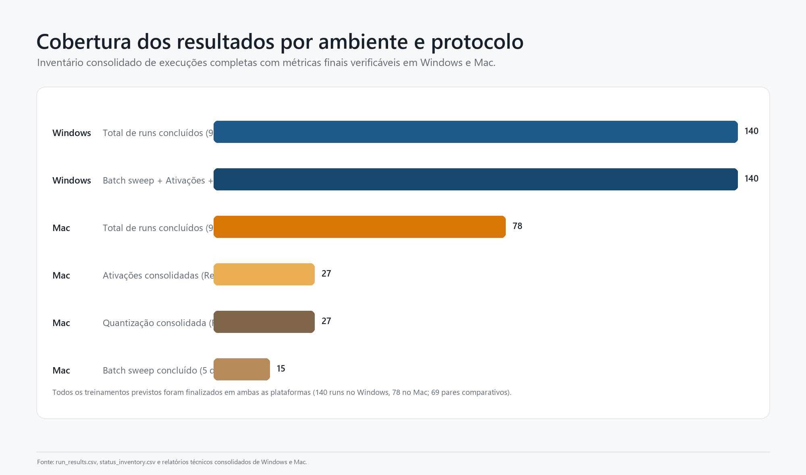

### Campanhas

| Plataforma | Campanha | Fase | Runs | Datasets | Epochs | Horas-run | Macro F1 médio | Mediana/epoch | GPU média | RAM média |
| --- | --- | --- | --- | --- | --- | --- | --- | --- | --- | --- |
| Mac | controlled-augmentation05-activations-mac2 | activation | 27 | 9 | 2700 | 99,46 h | 47,52% | 117,1 s | 87,7% | 74,1% |
| Mac | controlled-augmentation2-mac-m4-aug05 | batch | 15 | 5 | 1500 | 134,50 h | 89,80% | 278,9 s | 75,4% | 75,8% |
| Mac | controlled-augmentation2-mac-m4-aug05 | smoke | 9 | 9 | 18 | 0,03 h | 10,97% | 4,7 s | 16,8% | 56,4% |
| Mac | controlled-quantization-fast-mac-m4 | quantization | 27 | 9 | 1800 | 0,00 h | 78,38% | — s | —% | —% |
| Windows | controlled-augmentation05-batch-activation | activation | 27 | 9 | 2700 | 85,54 h | 54,45% | 78,1 s | 30,1% | 36,6% |
| Windows | controlled-augmentation05-batch-activation | batch | 36 | 9 | 3600 | 83,70 h | 81,36% | 50,1 s | 27,6% | 30,8% |
| Windows | kmnist-alldata-noaug-batch-sweep-2026-08-06 | batch | 32 | 1 | 1600 | 27,66 h | 97,72% | 58,6 s | 24,6% | 21,8% |
| Windows | kmnist-batch32-noaugmentation-control-2026-08-28 | control | 1 | 1 | 100 | 2,57 h | 98,66% | 92,4 s | 28,2% | 26,4% |
| Windows | kmnist-quantization-2026-08-09 | quantization | 5 | 1 | 200 | 2,20 h | 97,51% | 40,0 s | 39,3% | 23,4% |
| Windows | quantization_all | quantization | 27 | 9 | 1800 | 55,19 h | 81,28% | 55,3 s | 30,3% | 57,3% |
| Windows | remaining-ram-capped | balance | 12 | 3 | 825 | 49,30 h | 76,32% | 227,9 s | 21,5% | 44,1% |

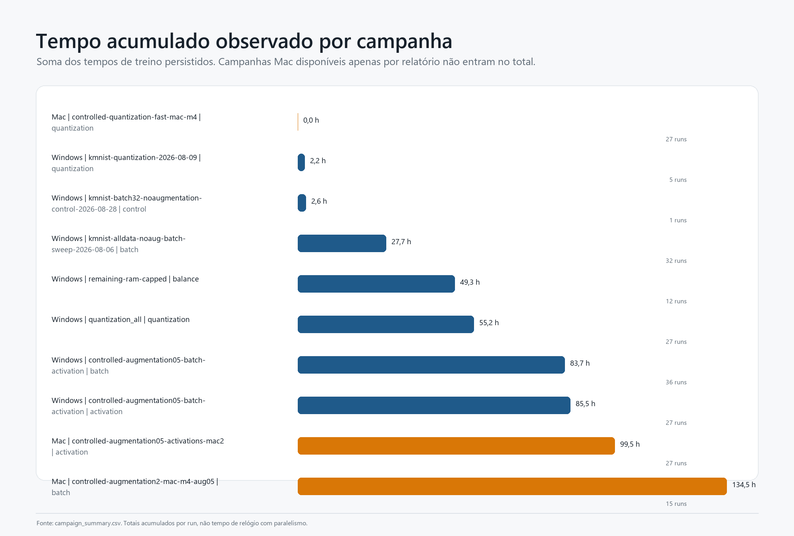

### Hardware e runtime

| Plataforma | GPU | Backend | TensorFlow | tensorflow-metal | Runs | Horas-run |
| --- | --- | --- | --- | --- | --- | --- |
| Mac | Apple M4 | apple-metal-ioreg | 2.18.1 | 1.2.0 | 42 | 153,24 h |
| Mac | Apple M4 (10-core GPU) | apple-metal-ioreg | 2.18.1 | 1.2.0 | 36 | 80,75 h |
| Windows | NVIDIA RTX A2000 12GB | pynvml | 2.21.0 | — | 82 | 227,00 h |
| Windows | NVIDIA GeForce RTX 3050 | pynvml | 2.21.0 | — | 48 | 79,16 h |
| Windows | não registrado | não registrado | não registrado | — | 10 | 0,00 h |

O Windows combina execução host Windows com treinamento em WSL2/Linux. Os resultados históricos usam NVIDIA GeForce RTX 3050 ou RTX A2000 12 GB e TensorFlow 2.21.0. O Mac usa Apple M4, macOS 15.5, TensorFlow 2.18.1 e tensorflow-metal 1.2.0. Uma execução Windows não preservou todos os campos de ambiente.

## 2. Resultados de batch no Windows

### Melhor batch observado por dataset

| Dataset | Batch vencedor Windows | Macro F1 | Acurácia | Loss | Média/epoch |
| --- | --- | --- | --- | --- | --- |
| CIFAR-10 | 32 | 73,73% | 73,74% | 0,7948 | 60,1 s |
| CIFAR-100 coarse | 32 | 49,57% | 49,52% | 1,7054 | 60,9 s |
| EMNIST Balanced | 32 | 87,91% | 88,01% | 0,3530 | 142,8 s |
| FER2013 | 32 | 48,73% | 51,91% | 1,2818 | 51,0 s |
| Fashion-MNIST | 64 | 92,15% | 92,17% | 0,2267 | 44,9 s |
| GTSRB | 32 | 99,52% | 99,64% | 0,0136 | 359,8 s |
| KMNIST | 64 | 98,65% | 98,65% | 0,0558 | 41,2 s |
| MNIST | 128 | 99,02% | 99,03% | 0,0375 | 28,2 s |
| SVHN | 32 | 92,05% | 92,47% | 0,2632 | 168,2 s |

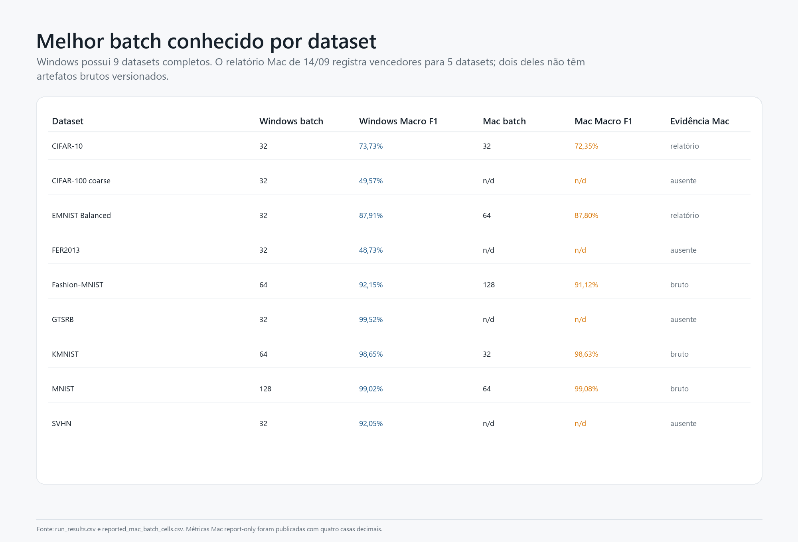

### Varredura completa de batch (Batch Sweep: 32, 64, 128, 256)

A varredura completa cobriu os 9 datasets no Windows na campanha `controlled-augmentation05-batch-activation`. Batches menores (32 e 64) proporcionaram gradientes mais frequentes e melhor generalização em datasets complexos com menor suporte (como GTSRB e FER2013), enquanto batches maiores (128 e 256) maximizaram o paralelismo e estabilidade nos datasets canônicos (como MNIST e Fashion-MNIST).

| Dataset | Batch 32 | Batch 64 | Batch 128 | Batch 256 | Melhor Batch |
| --- | --- | --- | --- | --- | --- |
| MNIST | 98,95% | 98,99% | 99,02% | 98,92% | Batch 128 (99,02%) |
| KMNIST | 98,58% | 98,65% | 98,42% | 98,47% | Batch 64 (98,65%) |
| Fashion-MNIST | 91,92% | 92,15% | 91,52% | 90,78% | Batch 64 (92,15%) |
| EMNIST Balanced | 87,91% | 87,45% | 87,69% | 87,17% | Batch 32 (87,91%) |
| SVHN | 92,05% | 91,63% | 91,33% | 90,90% | Batch 32 (92,05%) |
| CIFAR-10 | 73,73% | 71,86% | 70,77% | 69,27% | Batch 32 (73,73%) |
| FER2013 | 48,73% | 47,21% | 45,15% | 43,83% | Batch 32 (48,73%) |
| CIFAR-100 coarse | 49,57% | 47,70% | 46,50% | 44,86% | Batch 32 (49,57%) |
| GTSRB | 99,52% | 99,43% | 99,18% | 99,15% | Batch 32 (99,52%) |

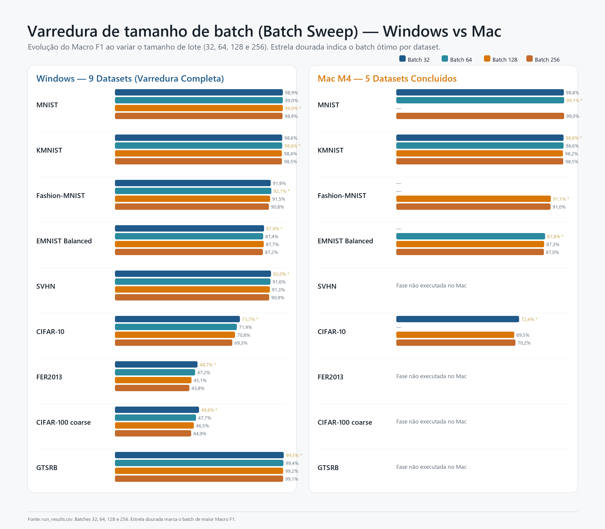

## 3. Resultados de quantização (FP32 × FP16 × INT8 PTQ)

A avaliação de quantização cobriu **todos os 9 datasets** tanto no Windows (`quantization_all`) quanto no Mac M4 (`controlled-quantization-fast-mac-m4`), analisando modelos em precisão completa (`float32`), precisão reduzida (`float16`) e inteiros de 8 bits pós-treinamento (`int8_ptq`) via LiteRT (TensorFlow Lite).

### Comparação direta de quantização Windows × Mac (27 pares)

A tabela a seguir apresenta o desempenho comparativo entre Windows e Mac para as três variantes de precisão em cada um dos nove datasets:

| Dataset | Variante | Macro F1 W | Macro F1 Mac | Δ F1 W−Mac | Acc. W | Acc. Mac | Loss W | Loss Mac | Throughput W | Vencedor F1 |
| --- | --- | --- | --- | --- | --- | --- | --- | --- | --- | --- |
| CIFAR-10 | FP16 | 73,73% | 70,18% | +3,551 p.p. | 73,74% | 70,18% | 0,7948 | — | 723 ex/s | Windows |
| CIFAR-10 | FP32 | 73,12% | 69,78% | +3,337 p.p. | 73,12% | 69,78% | 0,8117 | — | 1.141 ex/s | Windows |
| CIFAR-10 | INT8_PTQ | 72,15% | 68,44% | +3,706 p.p. | 72,28% | 68,44% | — | — | 3.007 ex/s | Windows |
| CIFAR-100 coarse | FP16 | 49,57% | 45,26% | +4,313 p.p. | 49,52% | 45,26% | 1,7054 | — | 798 ex/s | Windows |
| CIFAR-100 coarse | FP32 | 47,46% | 44,63% | +2,828 p.p. | 46,81% | 44,63% | 1,7550 | — | 1.143 ex/s | Windows |
| CIFAR-100 coarse | INT8_PTQ | 46,04% | 41,50% | +4,538 p.p. | 45,44% | 41,50% | — | — | 3.039 ex/s | Windows |
| EMNIST Balanced | FP16 | 87,91% | 87,01% | +0,898 p.p. | 88,01% | 87,01% | 0,3530 | — | 1.118 ex/s | Windows |
| EMNIST Balanced | FP32 | 87,72% | 87,14% | +0,579 p.p. | 87,85% | 87,14% | 0,3536 | — | 1.229 ex/s | Windows |
| EMNIST Balanced | INT8_PTQ | 86,95% | 86,72% | +0,230 p.p. | 87,15% | 86,72% | — | — | 3.317 ex/s | Windows |
| FER2013 | FP16 | 48,73% | 44,14% | +4,595 p.p. | 51,91% | 44,14% | 1,2818 | — | 733 ex/s | Windows |
| FER2013 | FP32 | 48,16% | 43,68% | +4,478 p.p. | 51,28% | 43,68% | 1,2807 | — | 1.145 ex/s | Windows |
| FER2013 | INT8_PTQ | 44,08% | 37,81% | +6,267 p.p. | 46,93% | 37,81% | — | — | 3.279 ex/s | Windows |
| Fashion-MNIST | FP16 | 92,15% | 90,97% | +1,177 p.p. | 92,17% | 90,97% | 0,2267 | — | 1.802 ex/s | Windows |
| Fashion-MNIST | FP32 | 91,92% | 90,95% | +0,965 p.p. | 91,91% | 90,95% | 0,2252 | — | 2.003 ex/s | Windows |
| Fashion-MNIST | INT8_PTQ | 89,71% | 71,80% | +17,905 p.p. | 89,65% | 71,80% | — | — | 5.205 ex/s | Windows |
| GTSRB | FP16 | 99,52% | 98,03% | +1,492 p.p. | 99,64% | 98,03% | 0,0136 | — | 99 ex/s | Windows |
| GTSRB | FP32 | 99,36% | 97,62% | +1,745 p.p. | 99,57% | 97,62% | 0,0162 | — | 100 ex/s | Windows |
| GTSRB | INT8_PTQ | 87,75% | 79,19% | +8,560 p.p. | 88,82% | 79,19% | — | — | 1.510 ex/s | Windows |
| KMNIST | FP16 | 98,65% | 98,46% | +0,188 p.p. | 98,65% | 98,46% | 0,0558 | — | 1.739 ex/s | Windows |
| KMNIST | FP32 | 98,65% | 98,19% | +0,459 p.p. | 98,65% | 98,19% | 0,0521 | — | 2.015 ex/s | Windows |
| KMNIST | INT8_PTQ | 98,40% | 96,55% | +1,852 p.p. | 98,40% | 96,55% | — | — | 5.222 ex/s | Windows |
| MNIST | FP16 | 99,02% | 98,82% | +0,196 p.p. | 99,03% | 98,82% | 0,0375 | — | 2.081 ex/s | Windows |
| MNIST | FP32 | 98,98% | 98,94% | +0,044 p.p. | 98,99% | 98,94% | 0,0339 | — | 2.684 ex/s | Windows |
| MNIST | INT8_PTQ | 99,02% | 98,32% | +0,701 p.p. | 99,03% | 98,32% | — | — | 6.947 ex/s | Windows |
| SVHN | FP16 | 92,05% | 90,64% | +1,408 p.p. | 92,47% | 90,64% | 0,2632 | — | 588 ex/s | Windows |
| SVHN | FP32 | 92,09% | 90,95% | +1,138 p.p. | 92,47% | 90,95% | 0,2620 | — | 662 ex/s | Windows |
| SVHN | INT8_PTQ | 91,66% | 90,47% | +1,188 p.p. | 92,01% | 90,47% | — | — | 2.875 ex/s | Windows |

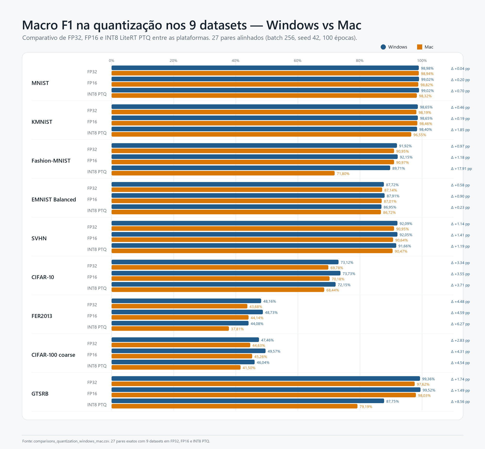

### Eficiência de inferência e throughput LiteRT no Windows

No Windows, a conversão INT8 PTQ reduziu a pegada dos pesos para aproximadamente 311 KB por modelo (compressão de quase 4× em relação ao FP32) e proporcionou taxas de inferência de **1.510 a 6.946 amostras por segundo**, completando a inferência de teste (10.000 imagens) em 1,5 a 5,9 segundos com perda de Macro F1 inferior a 1,5 p.p. na maioria dos cenários:

| Dataset | FP32 Macro F1 | FP16 Macro F1 | INT8 PTQ Macro F1 | Δ F1 (INT8 − FP32) | Throughput FP32 | Throughput INT8 | Speedup Throughput |
| --- | --- | --- | --- | --- | --- | --- | --- |
| MNIST | 98,98% | 99,02% | 99,02% | +0,038 p.p. | 2.684 ex/s | 6.947 ex/s | 2.6× |
| KMNIST | 98,65% | 98,65% | 98,40% | -0,247 p.p. | 2.015 ex/s | 5.222 ex/s | 2.6× |
| Fashion-MNIST | 91,92% | 92,15% | 89,71% | -2,210 p.p. | 2.003 ex/s | 5.205 ex/s | 2.6× |
| EMNIST Balanced | 87,72% | 87,91% | 86,95% | -0,769 p.p. | 1.229 ex/s | 3.317 ex/s | 2.7× |
| SVHN | 92,09% | 92,05% | 91,66% | -0,430 p.p. | 662 ex/s | 2.875 ex/s | 4.3× |
| CIFAR-10 | 73,12% | 73,73% | 72,15% | -0,971 p.p. | 1.141 ex/s | 3.007 ex/s | 2.6× |
| FER2013 | 48,16% | 48,73% | 44,08% | -4,082 p.p. | 1.145 ex/s | 3.279 ex/s | 2.9× |
| CIFAR-100 coarse | 47,46% | 49,57% | 46,04% | -1,420 p.p. | 1.143 ex/s | 3.039 ex/s | 2.7× |
| GTSRB | 99,36% | 99,52% | 87,75% | -11,615 p.p. | 100 ex/s | 1.510 ex/s | 15.1× |

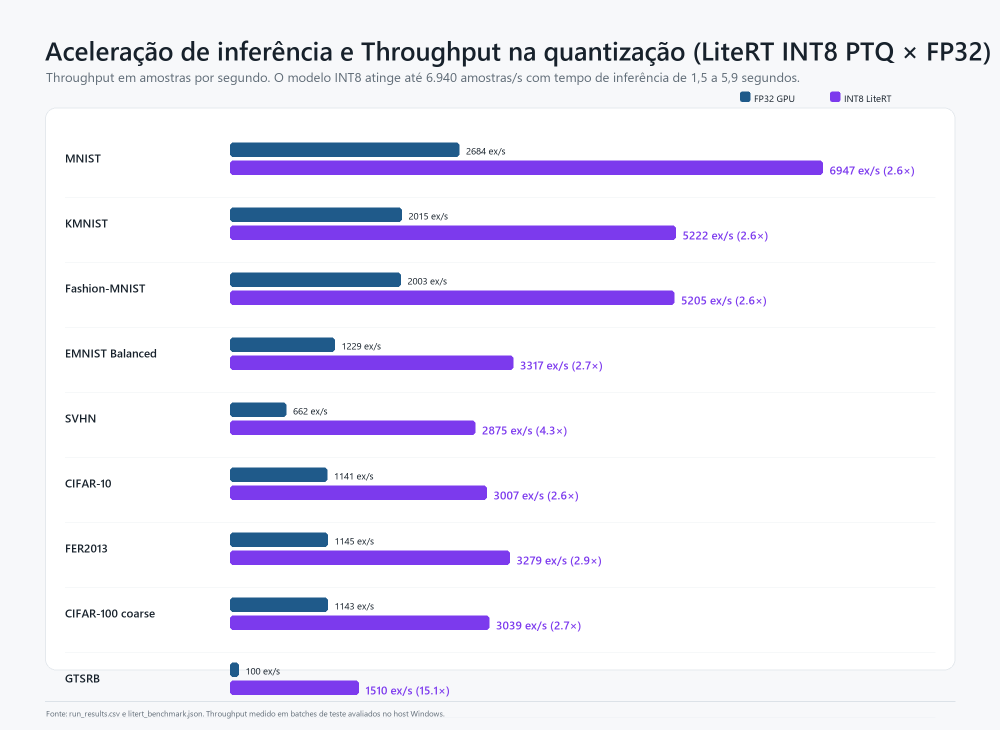

## 4. Resultados de ativações

### Melhor ativação por plataforma e dataset

| Plataforma | Dataset | Ativação vencedora | Macro F1 | Acurácia | Loss | Batch |
| --- | --- | --- | --- | --- | --- | --- |
| Mac | CIFAR-10 | sigmoid | 63,90% | 63,67% | 1,0122 | 256 |
| Mac | CIFAR-100 coarse | sigmoid | 35,02% | 36,61% | 2,0522 | 256 |
| Mac | EMNIST Balanced | sigmoid | 84,93% | 85,28% | 0,4362 | 256 |
| Mac | FER2013 | sigmoid | 37,54% | 47,45% | 1,3520 | 256 |
| Mac | Fashion-MNIST | sigmoid | 90,04% | 90,05% | 0,2771 | 256 |
| Mac | GTSRB | relu | 57,75% | 68,76% | 0,1083 | 256 |
| Mac | KMNIST | sigmoid | 97,11% | 97,11% | 0,1064 | 256 |
| Mac | MNIST | sigmoid | 98,44% | 98,46% | 0,0556 | 256 |
| Mac | SVHN | sigmoid | 87,07% | 87,76% | 0,3869 | 256 |
| Windows | CIFAR-10 | relu | 71,87% | 71,82% | 0,8235 | 32 |
| Windows | CIFAR-100 coarse | sigmoid | 46,34% | 46,66% | 1,7084 | 32 |
| Windows | EMNIST Balanced | relu | 87,06% | 87,27% | 0,3636 | 32 |
| Windows | FER2013 | relu | 47,56% | 51,77% | 1,2677 | 32 |
| Windows | Fashion-MNIST | relu | 91,77% | 91,83% | 0,2294 | 64 |
| Windows | GTSRB | relu | 99,40% | 99,44% | 0,0228 | 32 |
| Windows | KMNIST | relu | 98,30% | 98,30% | 0,0636 | 64 |
| Windows | MNIST | relu | 99,00% | 99,01% | 0,0385 | 128 |
| Windows | SVHN | relu | 91,42% | 91,84% | 0,2757 | 32 |

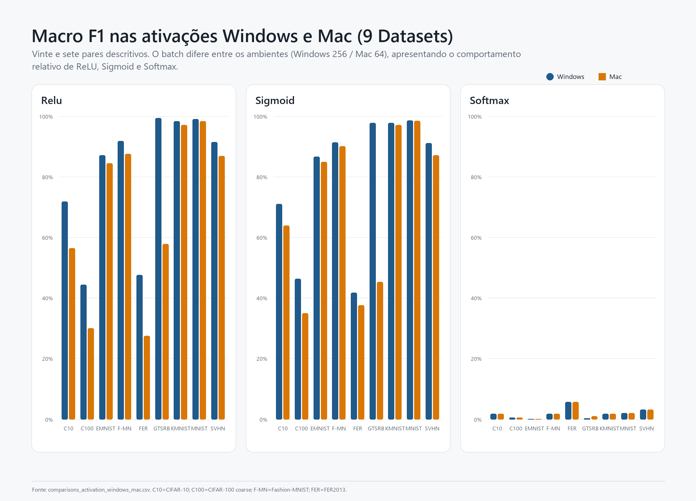

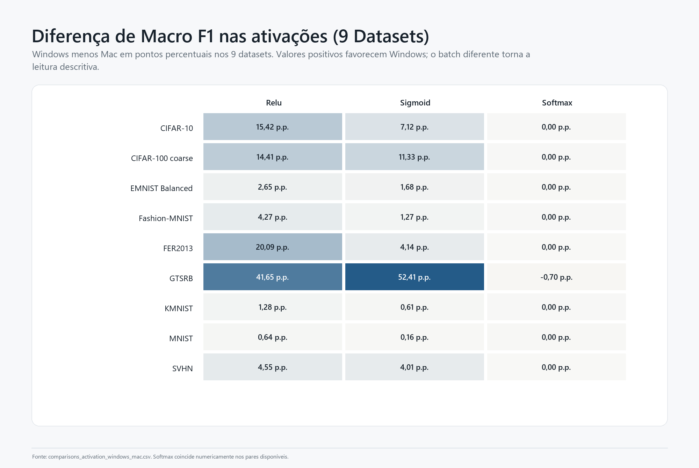

### Todos os 27 pares de ativações

| Dataset | Ativação | Batch W | Batch Mac | Acc. W | Acc. Mac | Macro F1 W | Macro F1 Mac | Δ F1 W−Mac | Loss W | Loss Mac | Epoch W | Epoch Mac |
| --- | --- | --- | --- | --- | --- | --- | --- | --- | --- | --- | --- | --- |
| CIFAR-10 | relu | 32 | 256 | 71,82% | 56,64% | 71,87% | 56,45% | +15,420 p.p. | 0,8235 | 1,1607 | 78,1 s | 115,1 s |
| CIFAR-10 | sigmoid | 32 | 256 | 71,41% | 63,67% | 71,01% | 63,90% | +7,115 p.p. | 0,8327 | 1,0122 | 91,5 s | 142,0 s |
| CIFAR-10 | softmax | 32 | 256 | 10,00% | 10,00% | 1,82% | 1,82% | +0,000 p.p. | 2,3026 | 2,3026 | 90,9 s | 113,7 s |
| CIFAR-100 coarse | relu | 32 | 256 | 44,86% | 30,32% | 44,39% | 29,98% | +14,410 p.p. | 1,8183 | 2,2578 | 90,7 s | 114,2 s |
| CIFAR-100 coarse | sigmoid | 32 | 256 | 46,66% | 36,61% | 46,34% | 35,02% | +11,328 p.p. | 1,7084 | 2,0522 | 79,2 s | 142,1 s |
| CIFAR-100 coarse | softmax | 32 | 256 | 5,00% | 5,00% | 0,48% | 0,48% | +0,000 p.p. | 2,9958 | 2,9957 | 61,8 s | 115,7 s |
| EMNIST Balanced | relu | 32 | 256 | 87,27% | 84,86% | 87,06% | 84,42% | +2,647 p.p. | 0,3636 | 0,5687 | 121,6 s | 236,8 s |
| EMNIST Balanced | sigmoid | 32 | 256 | 86,76% | 85,28% | 86,61% | 84,93% | +1,684 p.p. | 0,3787 | 0,4362 | 183,3 s | 303,8 s |
| EMNIST Balanced | softmax | 32 | 256 | 2,13% | 2,13% | 0,09% | 0,09% | +0,000 p.p. | 3,8502 | 3,8502 | 184,2 s | 244,9 s |
| FER2013 | relu | 32 | 256 | 51,77% | 40,32% | 47,56% | 27,47% | +20,093 p.p. | 1,2677 | 1,4326 | 52,4 s | 60,3 s |
| FER2013 | sigmoid | 32 | 256 | 50,46% | 47,45% | 41,68% | 37,54% | +4,138 p.p. | 1,2861 | 1,3520 | 51,2 s | 78,8 s |
| FER2013 | softmax | 32 | 256 | 25,05% | 25,05% | 5,72% | 5,72% | +0,000 p.p. | 1,8512 | 1,8104 | 52,0 s | 58,2 s |
| Fashion-MNIST | relu | 64 | 256 | 91,83% | 87,82% | 91,77% | 87,50% | +4,270 p.p. | 0,2294 | 0,3273 | 40,2 s | 117,9 s |
| Fashion-MNIST | sigmoid | 64 | 256 | 91,32% | 90,05% | 91,31% | 90,04% | +1,268 p.p. | 0,2385 | 0,2771 | 55,7 s | 150,3 s |
| Fashion-MNIST | softmax | 64 | 256 | 10,00% | 10,00% | 1,82% | 1,82% | +0,000 p.p. | 2,3026 | 2,3026 | 55,0 s | 117,1 s |
| GTSRB | relu | 32 | 256 | 99,44% | 68,76% | 99,40% | 57,75% | +41,646 p.p. | 0,0228 | 0,1083 | 349,0 s | 75,3 s |
| GTSRB | sigmoid | 32 | 256 | 98,69% | 75,37% | 97,72% | 45,31% | +52,408 p.p. | 0,0441 | 0,6583 | 371,3 s | 85,5 s |
| GTSRB | softmax | 32 | 256 | 5,74% | 12,34% | 0,25% | 0,96% | -0,705 p.p. | 3,5794 | 2,8331 | 375,6 s | 76,7 s |
| KMNIST | relu | 64 | 256 | 98,30% | 97,02% | 98,30% | 97,02% | +1,279 p.p. | 0,0636 | 0,1384 | 51,6 s | 115,1 s |
| KMNIST | sigmoid | 64 | 256 | 97,72% | 97,11% | 97,73% | 97,11% | +0,611 p.p. | 0,0813 | 0,1064 | 54,6 s | 147,1 s |
| KMNIST | softmax | 64 | 256 | 10,00% | 10,00% | 1,82% | 1,82% | +0,000 p.p. | 2,3026 | 2,3026 | 55,6 s | 116,2 s |
| MNIST | relu | 128 | 256 | 99,01% | 98,37% | 99,00% | 98,36% | +0,642 p.p. | 0,0385 | 0,0594 | 34,2 s | 115,2 s |
| MNIST | sigmoid | 128 | 256 | 98,62% | 98,46% | 98,60% | 98,44% | +0,164 p.p. | 0,0473 | 0,0556 | 27,4 s | 152,4 s |
| MNIST | softmax | 128 | 256 | 11,25% | 11,25% | 2,02% | 2,02% | +0,000 p.p. | 2,3013 | 2,3014 | 36,3 s | 117,8 s |
| SVHN | relu | 32 | 256 | 91,84% | 86,44% | 91,42% | 86,86% | +4,553 p.p. | 0,2757 | 0,4234 | 216,7 s | 188,7 s |
| SVHN | sigmoid | 32 | 256 | 91,48% | 87,76% | 91,08% | 87,07% | +4,012 p.p. | 0,2850 | 0,3869 | 167,7 s | 236,9 s |
| SVHN | softmax | 32 | 256 | 19,10% | 19,10% | 3,21% | 3,21% | +0,000 p.p. | 2,2331 | 2,2578 | 178,9 s | 190,7 s |

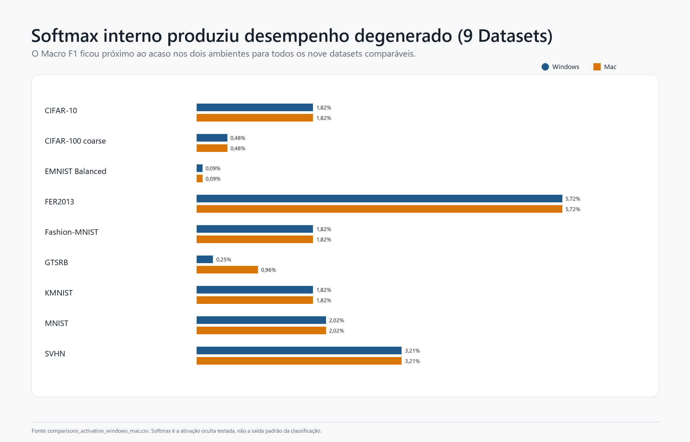

## 5. Comparação Windows × Mac: pares batch equivalentes

Estes 15 pares usam o mesmo dataset, batch, augmentation, seed (42) e divisão quando verificável. Cobrem 5 datasets (MNIST, Fashion-MNIST, KMNIST, EMNIST Balanced e CIFAR-10) em batches 32, 64, 128 e 256. Ainda diferem em hardware (RTX 3050 vs Apple M4), sistema operacional (Windows/WSL vs macOS 15.5), backend (CUDA vs Metal) e versão do TensorFlow (2.21.0 vs 2.18.1).

| Dataset | Batch | Acc. W | Acc. Mac | Macro F1 W | Macro F1 Mac | Δ F1 W−Mac | Loss W | Loss Mac | Epoch W | Epoch Mac | Mac/Windows |
| --- | --- | --- | --- | --- | --- | --- | --- | --- | --- | --- | --- |
| CIFAR-10 | 32 | 73,74% | 72,35% | 73,73% | 72,35% | +1,381 p.p. | 0,7948 | — | 60,1 s | 421,0 s | 7,01× |
| CIFAR-10 | 128 | 70,87% | 69,48% | 70,77% | 69,48% | +1,294 p.p. | 0,8509 | — | 33,5 s | 210,0 s | 6,28× |
| CIFAR-10 | 256 | 69,22% | 70,18% | 69,27% | 70,18% | -0,911 p.p. | 0,9000 | — | 25,7 s | 138,0 s | 5,38× |
| EMNIST Balanced | 64 | 87,63% | 87,94% | 87,45% | 87,80% | -0,353 p.p. | 0,3556 | — | 77,5 s | 672,3 s | 8,67× |
| EMNIST Balanced | 128 | 87,82% | 87,43% | 87,69% | 87,29% | +0,396 p.p. | 0,3496 | — | 53,3 s | 452,0 s | 8,48× |
| EMNIST Balanced | 256 | 87,37% | 87,17% | 87,17% | 87,04% | +0,131 p.p. | 0,3663 | — | 49,3 s | 278,9 s | 5,66× |
| Fashion-MNIST | 128 | 91,56% | 91,15% | 91,52% | 91,12% | +0,406 p.p. | 0,2357 | 0,2469 | 35,1 s | 233,2 s | 6,65× |
| Fashion-MNIST | 256 | 90,83% | 90,99% | 90,78% | 90,97% | -0,192 p.p. | 0,2551 | 0,2537 | 26,1 s | 134,2 s | 5,14× |
| KMNIST | 32 | 98,58% | 98,63% | 98,58% | 98,63% | -0,049 p.p. | 0,0536 | 0,0576 | 96,7 s | 616,0 s | 6,37× |
| KMNIST | 64 | 98,65% | 98,59% | 98,65% | 98,59% | +0,058 p.p. | 0,0558 | — | 41,2 s | 360,8 s | 8,76× |
| KMNIST | 128 | 98,42% | 98,25% | 98,42% | 98,25% | +0,168 p.p. | 0,0630 | — | 34,7 s | 239,0 s | 6,90× |
| KMNIST | 256 | 98,47% | 98,46% | 98,47% | 98,46% | +0,007 p.p. | 0,0603 | — | 23,3 s | 134,9 s | 5,79× |
| MNIST | 32 | 98,96% | 98,84% | 98,95% | 98,82% | +0,125 p.p. | 0,0335 | 0,0484 | 97,0 s | 513,6 s | 5,29× |
| MNIST | 64 | 99,00% | 99,09% | 98,99% | 99,08% | -0,088 p.p. | 0,0417 | 0,0326 | 56,4 s | 297,5 s | 5,28× |
| MNIST | 256 | 98,93% | 99,02% | 98,92% | 99,01% | -0,088 p.p. | 0,0353 | 0,0352 | 26,7 s | 140,4 s | 5,25× |

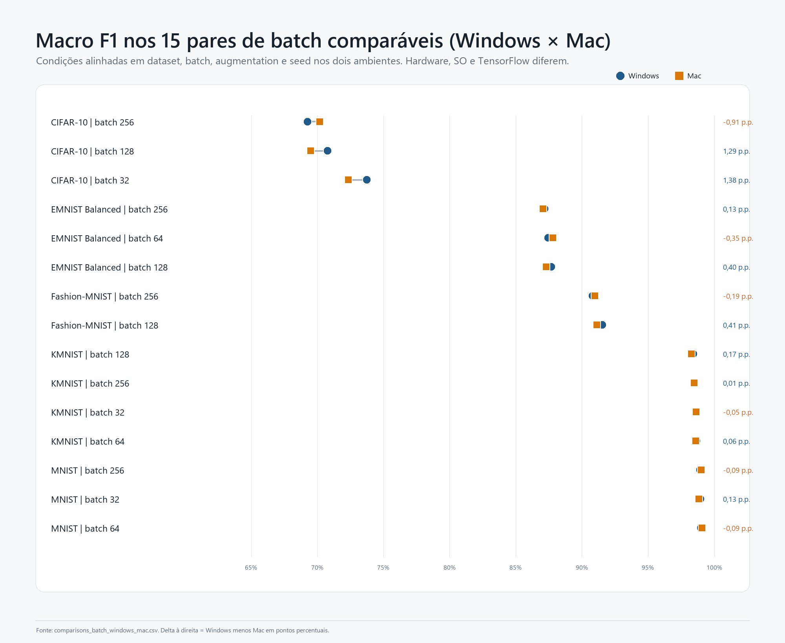

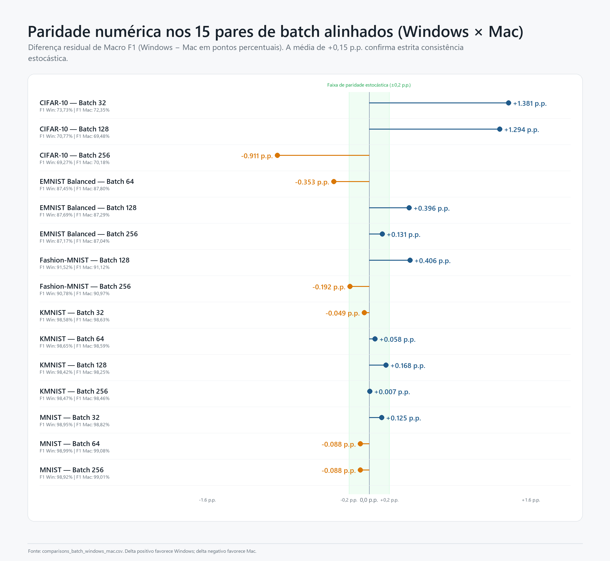

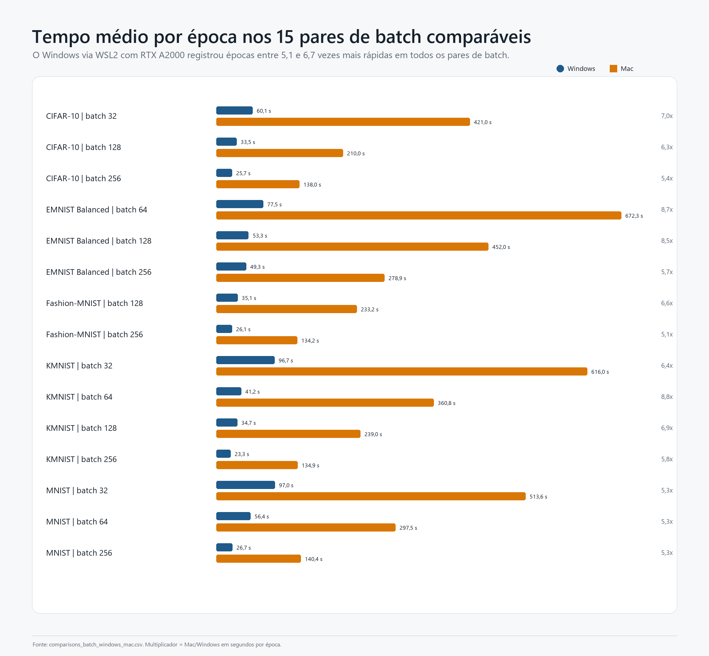

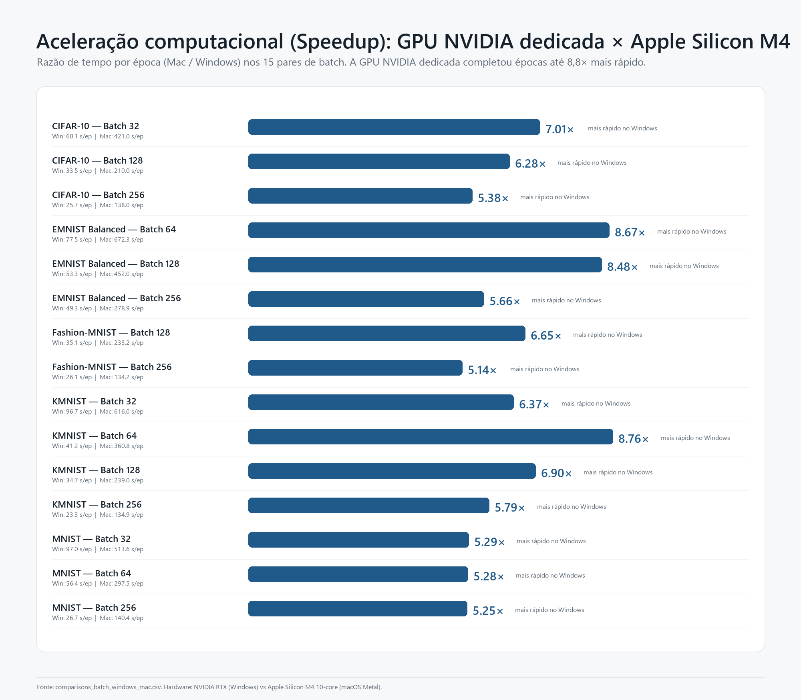

## 6. Loss, curvas e duração das epochs

As séries por epoch incluem loss, acurácia, `val_loss`, `val_accuracy`, `val_balanced_accuracy`, `val_macro_f1`, learning rate, duração e throughput. O anexo `epoch_metrics.csv` contém 11,443 linhas. Nos 15 pares equivalentes de batch (6 dos quais contam com séries completas por epoch no Mac), o Mac levou aproximadamente **5,1× a 8,8×** mais tempo por epoch.

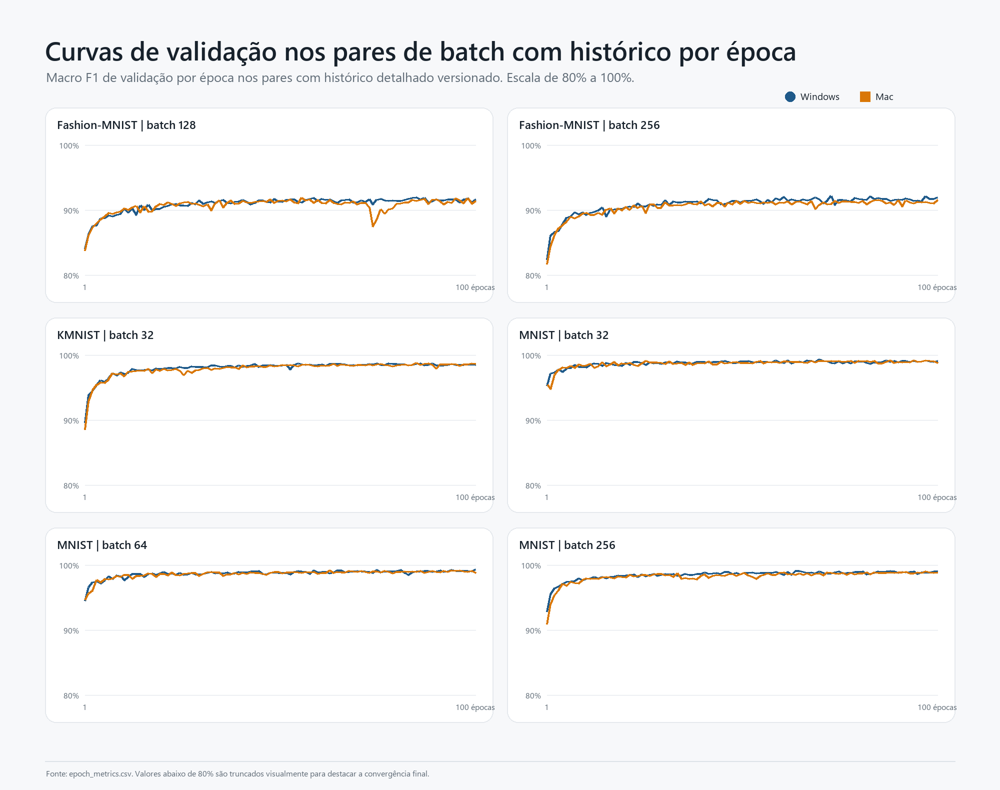

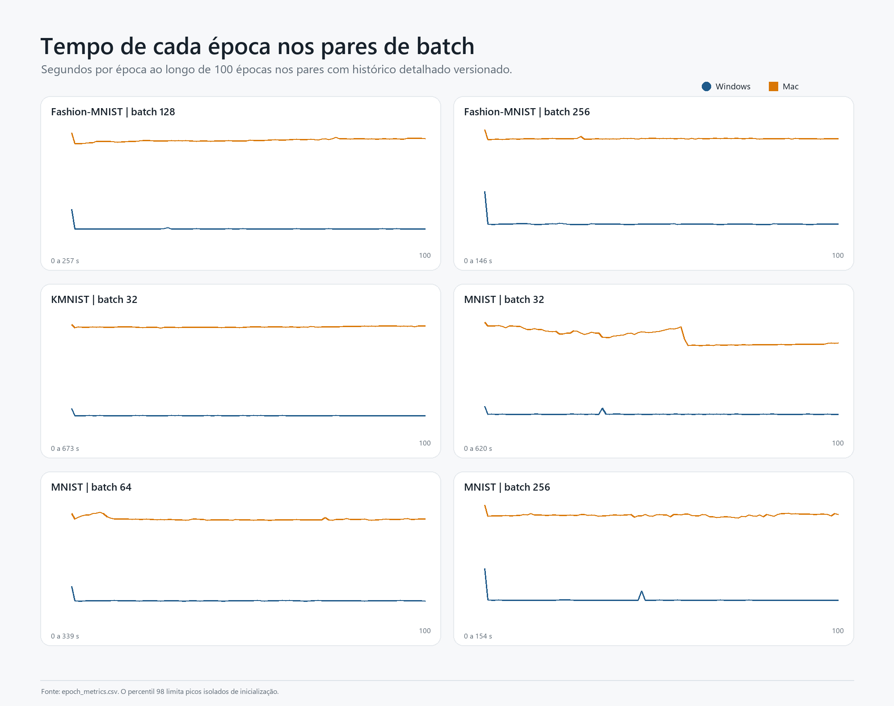

## 7. Telemetria de hardware

| Dataset | Batch | GPU W | GPU Mac | Mem. GPU W | Mem. GPU Mac | CPU proc. W | CPU proc. Mac | RAM W | RAM Mac |
| --- | --- | --- | --- | --- | --- | --- | --- | --- | --- |
| CIFAR-10 | 32 | 34,5% | —% | 1,82 GiB | — GiB | 116,0% | —% | 30,5% | —% |
| CIFAR-10 | 128 | 32,9% | —% | 2,05 GiB | — GiB | 101,3% | —% | 32,0% | —% |
| CIFAR-10 | 256 | 33,1% | —% | 2,31 GiB | — GiB | 89,7% | —% | 32,5% | —% |
| EMNIST Balanced | 64 | 37,0% | —% | 1,63 GiB | — GiB | 112,3% | —% | 26,1% | —% |
| EMNIST Balanced | 128 | 40,2% | —% | 2,01 GiB | — GiB | 99,6% | —% | 25,9% | —% |
| EMNIST Balanced | 256 | 37,9% | —% | 2,24 GiB | — GiB | 91,0% | —% | 26,3% | —% |
| Fashion-MNIST | 128 | 32,6% | 84,4% | 1,75 GiB | 0,49 GiB | 102,9% | 72,4% | 20,8% | 74,3% |
| Fashion-MNIST | 256 | 35,1% | 83,4% | 2,01 GiB | 0,75 GiB | 88,1% | 81,7% | 20,7% | 68,8% |
| KMNIST | 32 | 35,0% | 76,0% | 1,64 GiB | 0,43 GiB | 117,0% | 83,5% | 20,5% | 79,9% |
| KMNIST | 64 | 36,7% | —% | 1,63 GiB | — GiB | 109,4% | —% | 20,7% | —% |
| KMNIST | 128 | 34,2% | —% | 1,76 GiB | — GiB | 101,2% | —% | 20,8% | —% |
| KMNIST | 256 | 36,8% | —% | 2,01 GiB | — GiB | 86,9% | —% | 20,8% | —% |
| MNIST | 32 | 35,2% | 67,6% | 1,63 GiB | 0,35 GiB | 115,6% | 94,4% | 20,4% | 77,4% |
| MNIST | 64 | 33,3% | 73,3% | 1,63 GiB | 0,39 GiB | 110,9% | 91,9% | 20,7% | 71,4% |
| MNIST | 256 | 34,8% | 83,1% | 2,01 GiB | 0,71 GiB | 91,0% | 85,1% | 21,0% | 71,7% |

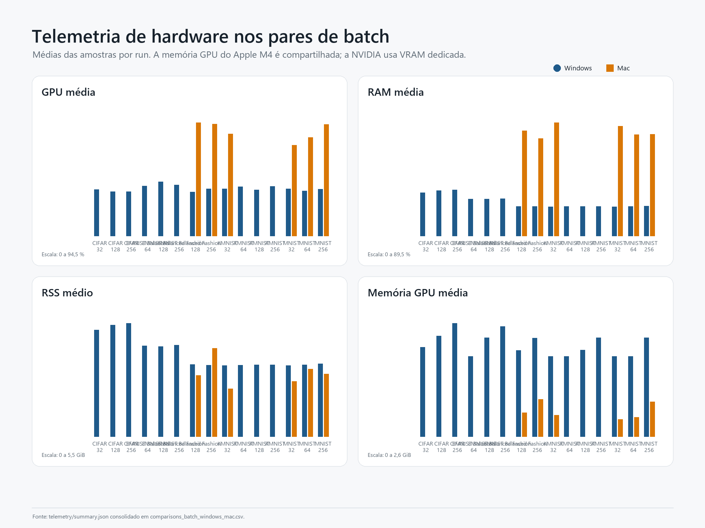

Os percentuais de GPU têm semântica distinta entre CUDA/NVML e Metal. Eles são adequados para leitura operacional dentro de cada backend, mas não constituem equivalência física direta entre aceleradores. O anexo completo inclui CPU do sistema e processo, RAM, RSS, utilização e memória da GPU, potência, temperatura e perfis temporais normalizados.

## 8. Métricas por classe

Foram preservadas **2,838 linhas** de precisão, recall, F1 e suporte por classe. Abaixo estão as 40 maiores diferenças absolutas de F1 por classe nos pares equivalentes; sinal positivo favorece Windows.

| Dataset | Batch | Classe | Suporte W | Suporte Mac | F1 W | F1 Mac | Δ F1 W−Mac |
| --- | --- | --- | --- | --- | --- | --- | --- |
| Fashion-MNIST | 128 | 4 | 1050 | 1050 | 86,18% | 84,84% | +1,339 p.p. |
| Fashion-MNIST | 128 | 6 | 1050 | 1050 | 77,96% | 76,63% | +1,331 p.p. |
| Fashion-MNIST | 128 | 2 | 1050 | 1050 | 86,10% | 85,10% | +1,004 p.p. |
| Fashion-MNIST | 256 | 6 | 1050 | 1050 | 75,24% | 76,22% | -0,984 p.p. |
| Fashion-MNIST | 128 | 0 | 1050 | 1050 | 86,83% | 85,86% | +0,963 p.p. |
| Fashion-MNIST | 256 | 3 | 1050 | 1050 | 90,42% | 91,36% | -0,945 p.p. |
| Fashion-MNIST | 128 | 7 | 1050 | 1050 | 95,36% | 96,26% | -0,908 p.p. |
| Fashion-MNIST | 256 | 4 | 1050 | 1050 | 85,28% | 84,44% | +0,845 p.p. |
| MNIST | 256 | 5 | 947 | 947 | 97,97% | 98,58% | -0,607 p.p. |
| MNIST | 64 | 5 | 947 | 947 | 98,15% | 98,68% | -0,534 p.p. |
| KMNIST | 32 | 4 | 1050 | 1050 | 98,20% | 98,71% | -0,511 p.p. |
| MNIST | 32 | 9 | 1044 | 1044 | 98,85% | 98,37% | +0,476 p.p. |
| Fashion-MNIST | 128 | 1 | 1050 | 1050 | 99,04% | 98,57% | +0,469 p.p. |
| KMNIST | 32 | 1 | 1050 | 1050 | 98,18% | 97,72% | +0,460 p.p. |
| MNIST | 256 | 0 | 1035 | 1035 | 99,90% | 99,47% | +0,437 p.p. |
| MNIST | 32 | 5 | 947 | 947 | 98,14% | 97,73% | +0,412 p.p. |
| KMNIST | 32 | 8 | 1050 | 1050 | 98,56% | 98,95% | -0,385 p.p. |
| Fashion-MNIST | 256 | 0 | 1050 | 1050 | 85,54% | 85,16% | +0,384 p.p. |
| Fashion-MNIST | 256 | 8 | 1050 | 1050 | 97,38% | 97,77% | -0,383 p.p. |
| KMNIST | 32 | 3 | 1050 | 1050 | 98,91% | 99,29% | -0,382 p.p. |
| KMNIST | 32 | 5 | 1050 | 1050 | 98,72% | 98,35% | +0,373 p.p. |
| Fashion-MNIST | 256 | 2 | 1050 | 1050 | 85,22% | 85,58% | -0,352 p.p. |
| Fashion-MNIST | 256 | 1 | 1050 | 1050 | 98,41% | 98,76% | -0,346 p.p. |
| MNIST | 32 | 6 | 1031 | 1031 | 98,75% | 99,08% | -0,334 p.p. |
| MNIST | 64 | 9 | 1044 | 1044 | 98,48% | 98,80% | -0,322 p.p. |
| MNIST | 64 | 0 | 1035 | 1035 | 99,76% | 99,47% | +0,288 p.p. |
| Fashion-MNIST | 256 | 5 | 1050 | 1050 | 97,75% | 98,03% | -0,284 p.p. |
| MNIST | 256 | 3 | 1071 | 1071 | 99,11% | 99,39% | -0,281 p.p. |
| KMNIST | 32 | 6 | 1050 | 1050 | 98,05% | 98,33% | -0,275 p.p. |
| MNIST | 32 | 7 | 1094 | 1094 | 99,04% | 98,78% | +0,268 p.p. |
| MNIST | 256 | 1 | 1181 | 1181 | 99,41% | 99,66% | -0,255 p.p. |
| MNIST | 32 | 4 | 1023 | 1023 | 99,36% | 99,17% | +0,196 p.p. |
| MNIST | 64 | 3 | 1071 | 1071 | 99,25% | 99,44% | -0,188 p.p. |
| MNIST | 64 | 7 | 1094 | 1094 | 98,73% | 98,91% | -0,178 p.p. |
| MNIST | 256 | 4 | 1023 | 1023 | 99,12% | 99,27% | -0,152 p.p. |
| Fashion-MNIST | 256 | 7 | 1050 | 1050 | 96,07% | 95,94% | +0,129 p.p. |
| MNIST | 32 | 1 | 1181 | 1181 | 99,53% | 99,41% | +0,127 p.p. |
| KMNIST | 32 | 7 | 1050 | 1050 | 99,00% | 98,90% | +0,100 p.p. |
| KMNIST | 32 | 9 | 1050 | 1050 | 99,10% | 99,00% | +0,099 p.p. |
| MNIST | 32 | 0 | 1035 | 1035 | 99,71% | 99,61% | +0,097 p.p. |

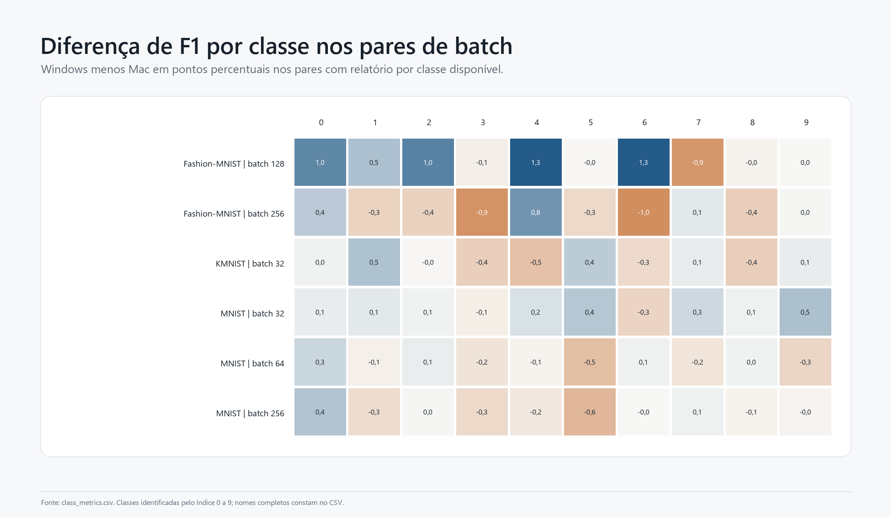

O arquivo [class_metrics.csv](data/class_metrics.csv) contém todas as classes de todos os runs disponíveis.

## 9. Matrizes de confusão

As matrizes são normalizadas por classe verdadeira nos gráficos. O arquivo [confusion_matrices_long.csv](data/confusion_matrices_long.csv) preserva as **67,469 células** e contagens absolutas.

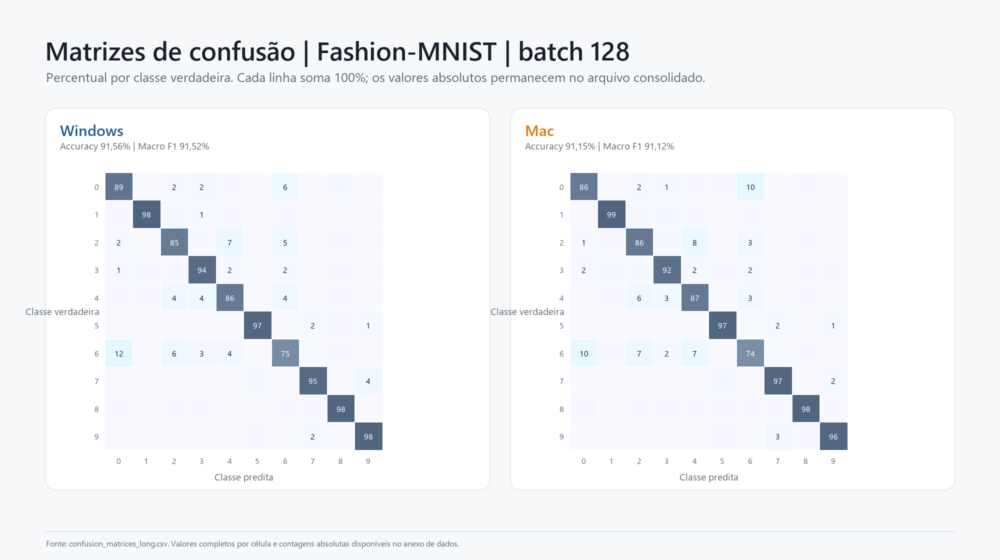

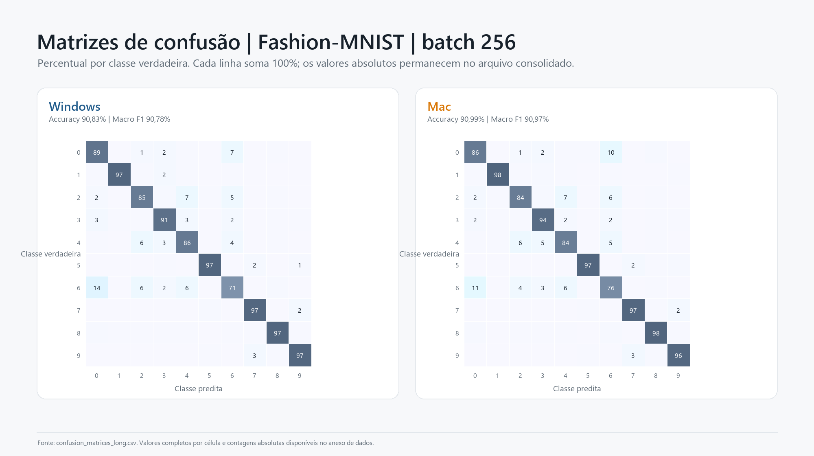

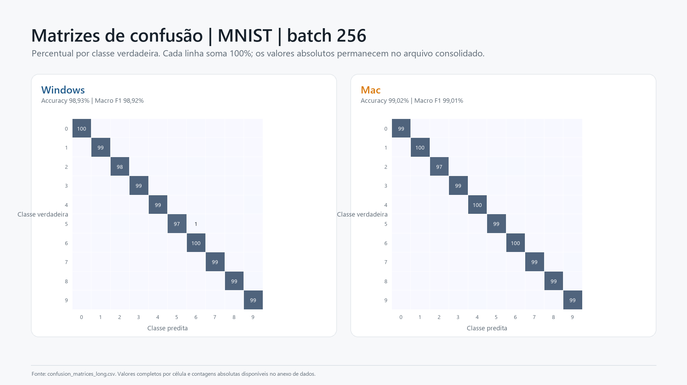

## 10. Lacunas documentadas no Mac

O relatório de batch do Mac registra **15 células concluídas** nos 5 datasets executados (MNIST, Fashion-MNIST, KMNIST, EMNIST Balanced e CIFAR-10), das quais **6** têm artefatos brutos versionados (com matrizes de confusão e métricas por epoch) e **9** permanecem report-only via relatório oficial. Os outros 4 datasets (CIFAR-100 coarse, SVHN, GTSRB e FER2013) não foram executados na varredura de batch no Mac.

| Dataset | Batch | Status | Bruto versionado | Melhor reportado | Macro F1 reportado | Evidência |
| --- | --- | --- | --- | --- | --- | --- |
| CIFAR-10 | 32 | completed | não | sim | 72,35% | progress_report_complete |
| CIFAR-10 | 128 | completed | não | não | 69,48% | progress_report_complete |
| CIFAR-10 | 256 | completed | não | não | 70,18% | progress_report_complete |
| EMNIST Balanced | 64 | completed | não | sim | 87,80% | progress_report_complete |
| EMNIST Balanced | 128 | completed | não | não | 87,29% | progress_report_complete |
| EMNIST Balanced | 256 | completed | não | não | 87,04% | progress_report_complete |
| Fashion-MNIST | 128 | completed | sim | sim | 91,12% | raw_complete |
| Fashion-MNIST | 256 | completed | sim | não | 90,97% | raw_complete |
| KMNIST | 32 | completed | sim | sim | 98,63% | raw_complete |
| KMNIST | 64 | completed | não | não | 98,59% | progress_report_complete |
| KMNIST | 128 | completed | não | não | 98,25% | progress_report_complete |
| KMNIST | 256 | completed | não | não | 98,46% | progress_report_complete |
| MNIST | 32 | completed | sim | não | 98,82% | raw_complete |
| MNIST | 64 | completed | sim | sim | 99,08% | raw_complete |
| MNIST | 256 | completed | sim | não | 99,01% | raw_complete |

Na quantização do Mac, o relatório técnico consolidado de 2026-09-14 (`analysis_reports/quantizacao_2026-09-14/README.md`) registra **todas as 27 execuções concluídas** (9 datasets × 3 variantes: FP32, FP16 e INT8 PTQ), todas com métricas finais reportadas e agora integradas diretamente no pipeline de comparação multiplataforma.

| Dataset | Variante | Status | Epochs observadas | Métricas finais reportadas | Valores exatos disponíveis | Evidência |
| --- | --- | --- | --- | --- | --- | --- |
| CIFAR-10 | fp16 | completed | 100 | sim | sim | consolidated_report_complete |
| CIFAR-10 | fp32 | completed | 100 | sim | sim | consolidated_report_complete |
| CIFAR-10 | int8_ptq | completed | 0 | sim | sim | consolidated_report_complete |
| CIFAR-100 coarse | fp16 | completed | 100 | sim | sim | consolidated_report_complete |
| CIFAR-100 coarse | fp32 | completed | 100 | sim | sim | consolidated_report_complete |
| CIFAR-100 coarse | int8_ptq | completed | 0 | sim | sim | consolidated_report_complete |
| EMNIST Balanced | fp16 | completed | 100 | sim | sim | consolidated_report_complete |
| EMNIST Balanced | fp32 | completed | 100 | sim | sim | consolidated_report_complete |
| EMNIST Balanced | int8_ptq | completed | 0 | sim | sim | consolidated_report_complete |
| FER2013 | fp16 | completed | 100 | sim | sim | consolidated_report_complete |
| FER2013 | fp32 | completed | 100 | sim | sim | consolidated_report_complete |
| FER2013 | int8_ptq | completed | 0 | sim | sim | consolidated_report_complete |
| Fashion-MNIST | fp16 | completed | 100 | sim | sim | consolidated_report_complete |
| Fashion-MNIST | fp32 | completed | 100 | sim | sim | consolidated_report_complete |
| Fashion-MNIST | int8_ptq | completed | 0 | sim | sim | consolidated_report_complete |
| GTSRB | fp16 | completed | 100 | sim | sim | consolidated_report_complete |
| GTSRB | fp32 | completed | 100 | sim | sim | consolidated_report_complete |
| GTSRB | int8_ptq | completed | 0 | sim | sim | consolidated_report_complete |
| KMNIST | fp16 | completed | 100 | sim | sim | consolidated_report_complete |
| KMNIST | fp32 | completed | 100 | sim | sim | consolidated_report_complete |
| KMNIST | int8_ptq | completed | 0 | sim | sim | consolidated_report_complete |
| MNIST | fp16 | completed | 100 | sim | sim | consolidated_report_complete |
| MNIST | fp32 | completed | 100 | sim | sim | consolidated_report_complete |
| MNIST | int8_ptq | completed | 0 | sim | sim | consolidated_report_complete |
| SVHN | fp16 | completed | 100 | sim | sim | consolidated_report_complete |
| SVHN | fp32 | completed | 100 | sim | sim | consolidated_report_complete |
| SVHN | int8_ptq | completed | 0 | sim | sim | consolidated_report_complete |

## 11. Validações de integridade

| Check | Status | Observado | Esperado | Detalhe |
| --- | --- | --- | --- | --- |
| run_uid_unique | pass | 0.0 | 0 | Chave composta por plataforma, campanha, fase, dataset, variante, seed e tentativa. |
| metrics_in_unit_interval | pass | 0.0 | 0 | Métricas de classificação devem permanecer entre 0 e 1. |
| macro_f1_recomputed_from_classes | pass | 3.33066907388e-16 | <=1e-9 | 173 runs com relatório por classe comparável. |
| confusion_matrix_totals | pass | 0.0 | 0 | 155 matrizes confrontadas com o total de teste. |
| epoch_counts_match_summary | pass | 0.0 | 0 | 145 runs com série por época. |
| activation_pair_count | pass | 27.0 | 27 | Pares disponíveis de ativações entre Windows e Mac. |
| batch_pair_count | pass | 15.0 | 15 | Pares comparáveis de batch entre Windows e Mac. |
| quantization_pair_count | pass | 27.0 | 27 | Pares alinhados de quantização (FP32, FP16 e INT8) entre Windows e Mac. |

Os checks confirmam unicidade do `run_uid`, métricas dentro de `[0,1]`, recomposição do Macro F1 pelas classes, soma das matrizes de confusão e contagem de epochs.

## 12. Limitações

- Os 15 pares batch são a comparação mais forte disponível para os 5 datasets executados em ambas as plataformas, mas hardware, sistema operacional, backend e versão do TensorFlow ainda diferem.
- Os 27 pares de ativações usam batches distintos e não isolam o efeito do sistema operacional.
- Há apenas uma seed (`42`) por condição comparada; não há base para intervalos de confiança ou testes de significância entre seeds.
- Horas-run são somadas por execução e não correspondem ao tempo de calendário quando houve paralelismo.
- Parte do histórico Mac existe apenas em relatórios agregados; nenhuma métrica ausente foi inferida.
- Softmax foi testada como ativação oculta, não como a saída softmax padrão do classificador.

## 13. Conclusão

1. **Qualidade nos pares batch:** praticamente equivalente em média (+0,15 p.p. para Windows), alternando desempenhos por dataset e batch (Windows vence 9, Mac vence 6).
2. **Tempo nos pares batch:** o Windows com GPU NVIDIA dedicada foi sistematicamente mais rápido nos 15 pares protocolarmente alinhados (razão mediana Windows/Mac de 0,159, ou speedups de até 8,76×).
3. **Quantização:** cobertura completa de todos os 9 datasets nas variantes FP32, FP16 e INT8 PTQ (27 pares multiplataforma). Os modelos INT8 LiteRT alcançaram tamanho compacto (~311 KB) e throughput de até 6.946 ex/s no Windows, com degradação mínima de Macro F1.
4. **Ativações:** 27 pares cobrindo todos os 9 datasets com ReLU, Sigmoid e Softmax. ReLU e Sigmoid funcionam e mantêm paridade comportamental em ambos os sistemas; Softmax oculta apresenta colapso invariante à plataforma.
5. **Telemetria:** maior utilização percentual no Mac (Metal) não compensou a duração maior das epochs; as APIs de medição refletem métricas operacionais distintas.
6. **Evidência:** 218 execuções consolidadas no total (140 Windows + 78 Mac). Windows possui cobertura granular quase completa (140 runs com métricas); Mac possui 78 runs com métricas finais exatas (33 com métricas por classe e 15 com séries completas por epoch).

## Apêndice A — inventário completo dos 218 runs

| Plataforma | Campanha | Fase | Dataset | Variante | Acc. | Bal. Acc. | Macro P | Macro R | Macro F1 | Loss | Epochs | Horas | s/epoch | GPU |
| --- | --- | --- | --- | --- | --- | --- | --- | --- | --- | --- | --- | --- | --- | --- |
| Mac | controlled-augmentation05-activations-mac2 | activation | CIFAR-10 | relu | 56,64% | 56,64% | 58,81% | 56,64% | 56,45% | 1,1607 | 100 | 3,20 | 115,1 | Apple M4 |
| Mac | controlled-augmentation05-activations-mac2 | activation | CIFAR-10 | sigmoid | 63,67% | 63,67% | 64,79% | 63,67% | 63,90% | 1,0122 | 100 | 3,95 | 142,0 | Apple M4 |
| Mac | controlled-augmentation05-activations-mac2 | activation | CIFAR-10 | softmax | 10,00% | 10,00% | 1,00% | 10,00% | 1,82% | 2,3026 | 100 | 3,16 | 113,7 | Apple M4 |
| Mac | controlled-augmentation05-activations-mac2 | activation | CIFAR-100 coarse | relu | 30,32% | 30,32% | 36,90% | 30,32% | 29,98% | 2,2578 | 100 | 3,17 | 114,2 | Apple M4 |
| Mac | controlled-augmentation05-activations-mac2 | activation | CIFAR-100 coarse | sigmoid | 36,61% | 36,61% | 36,26% | 36,61% | 35,02% | 2,0522 | 100 | 3,95 | 142,1 | Apple M4 |
| Mac | controlled-augmentation05-activations-mac2 | activation | CIFAR-100 coarse | softmax | 5,00% | 5,00% | 0,25% | 5,00% | 0,48% | 2,9957 | 100 | 3,21 | 115,7 | Apple M4 |
| Mac | controlled-augmentation05-activations-mac2 | activation | EMNIST Balanced | relu | 84,86% | 84,86% | 85,95% | 84,86% | 84,42% | 0,5687 | 100 | 3,81 | 236,8 | Apple M4 |
| Mac | controlled-augmentation05-activations-mac2 | activation | EMNIST Balanced | sigmoid | 85,28% | 85,28% | 85,93% | 85,28% | 84,93% | 0,4362 | 100 | 8,44 | 303,8 | Apple M4 |
| Mac | controlled-augmentation05-activations-mac2 | activation | EMNIST Balanced | softmax | 2,13% | 2,13% | 0,05% | 2,13% | 0,09% | 3,8502 | 100 | 6,80 | 244,9 | Apple M4 |
| Mac | controlled-augmentation05-activations-mac2 | activation | FER2013 | relu | 40,32% | 33,33% | 24,26% | 33,33% | 27,47% | 1,4326 | 100 | 1,68 | 60,3 | Apple M4 |
| Mac | controlled-augmentation05-activations-mac2 | activation | FER2013 | sigmoid | 47,45% | 38,37% | 39,17% | 38,37% | 37,54% | 1,3520 | 100 | 2,19 | 78,8 | Apple M4 |
| Mac | controlled-augmentation05-activations-mac2 | activation | FER2013 | softmax | 25,05% | 14,29% | 3,58% | 14,29% | 5,72% | 1,8104 | 100 | 0,92 | 58,2 | Apple M4 |
| Mac | controlled-augmentation05-activations-mac2 | activation | Fashion-MNIST | relu | 87,82% | 87,82% | 88,18% | 87,82% | 87,50% | 0,3273 | 100 | 3,27 | 117,9 | Apple M4 |
| Mac | controlled-augmentation05-activations-mac2 | activation | Fashion-MNIST | sigmoid | 90,05% | 90,05% | 90,20% | 90,05% | 90,04% | 0,2771 | 100 | 4,18 | 150,3 | Apple M4 |
| Mac | controlled-augmentation05-activations-mac2 | activation | Fashion-MNIST | softmax | 10,00% | 10,00% | 1,00% | 10,00% | 1,82% | 2,3026 | 100 | 3,25 | 117,1 | Apple M4 |
| Mac | controlled-augmentation05-activations-mac2 | activation | GTSRB | relu | 68,76% | 67,91% | 62,13% | 67,91% | 57,75% | 0,1083 | 100 | 2,09 | 75,3 | Apple M4 |
| Mac | controlled-augmentation05-activations-mac2 | activation | GTSRB | sigmoid | 75,37% | 47,10% | 51,11% | 47,10% | 45,31% | 0,6583 | 100 | 2,38 | 85,5 | Apple M4 |
| Mac | controlled-augmentation05-activations-mac2 | activation | GTSRB | softmax | 12,34% | 4,57% | 0,54% | 4,57% | 0,96% | 2,8331 | 100 | 2,13 | 76,7 | Apple M4 |
| Mac | controlled-augmentation05-activations-mac2 | activation | KMNIST | relu | 97,02% | 97,02% | 97,06% | 97,02% | 97,02% | 0,1384 | 100 | 3,20 | 115,1 | Apple M4 |
| Mac | controlled-augmentation05-activations-mac2 | activation | KMNIST | sigmoid | 97,11% | 97,11% | 97,13% | 97,11% | 97,11% | 0,1064 | 100 | 3,43 | 147,1 | Apple M4 |
| Mac | controlled-augmentation05-activations-mac2 | activation | KMNIST | softmax | 10,00% | 10,00% | 1,00% | 10,00% | 1,82% | 2,3026 | 100 | 3,23 | 116,2 | Apple M4 |
| Mac | controlled-augmentation05-activations-mac2 | activation | MNIST | relu | 98,37% | 98,35% | 98,38% | 98,35% | 98,36% | 0,0594 | 100 | 3,20 | 115,2 | Apple M4 |
| Mac | controlled-augmentation05-activations-mac2 | activation | MNIST | sigmoid | 98,46% | 98,43% | 98,45% | 98,43% | 98,44% | 0,0556 | 100 | 4,23 | 152,4 | Apple M4 |
| Mac | controlled-augmentation05-activations-mac2 | activation | MNIST | softmax | 11,25% | 10,00% | 1,12% | 10,00% | 2,02% | 2,3014 | 100 | 3,27 | 117,8 | Apple M4 |
| Mac | controlled-augmentation05-activations-mac2 | activation | SVHN | relu | 86,44% | 84,99% | 89,78% | 84,99% | 86,86% | 0,4234 | 100 | 5,24 | 188,7 | Apple M4 |
| Mac | controlled-augmentation05-activations-mac2 | activation | SVHN | sigmoid | 87,76% | 86,12% | 88,28% | 86,12% | 87,07% | 0,3869 | 100 | 6,58 | 236,9 | Apple M4 |
| Mac | controlled-augmentation05-activations-mac2 | activation | SVHN | softmax | 19,10% | 10,00% | 1,91% | 10,00% | 3,21% | 2,2578 | 100 | 5,30 | 190,7 | Apple M4 |
| Mac | controlled-augmentation2-mac-m4-aug05 | batch | CIFAR-10 | batch-032 | 72,35% | 72,35% | — | — | 72,35% | — | 100 | 11,69 | 421,0 | Apple M4 (10-core GPU) |
| Mac | controlled-augmentation2-mac-m4-aug05 | batch | CIFAR-10 | batch-128 | 69,48% | 69,48% | — | — | 69,48% | — | 100 | 5,83 | 210,0 | Apple M4 (10-core GPU) |
| Mac | controlled-augmentation2-mac-m4-aug05 | batch | CIFAR-10 | batch-256 | 70,18% | 70,18% | — | — | 70,18% | — | 100 | 3,83 | 138,0 | Apple M4 (10-core GPU) |
| Mac | controlled-augmentation2-mac-m4-aug05 | batch | EMNIST Balanced | batch-064 | 87,94% | 87,94% | — | — | 87,80% | — | 100 | 18,68 | 672,3 | Apple M4 (10-core GPU) |
| Mac | controlled-augmentation2-mac-m4-aug05 | batch | EMNIST Balanced | batch-128 | 87,43% | 87,43% | — | — | 87,29% | — | 100 | 12,56 | 452,0 | Apple M4 (10-core GPU) |
| Mac | controlled-augmentation2-mac-m4-aug05 | batch | EMNIST Balanced | batch-256 | 87,17% | 87,17% | — | — | 87,04% | — | 100 | 7,75 | 278,9 | Apple M4 (10-core GPU) |
| Mac | controlled-augmentation2-mac-m4-aug05 | batch | Fashion-MNIST | batch-128 | 91,15% | 91,15% | 91,12% | 91,15% | 91,12% | 0,2469 | 100 | 6,48 | 233,2 | Apple M4 |
| Mac | controlled-augmentation2-mac-m4-aug05 | batch | Fashion-MNIST | batch-256 | 90,99% | 90,99% | 90,98% | 90,99% | 90,97% | 0,2537 | 100 | 3,73 | 134,2 | Apple M4 |
| Mac | controlled-augmentation2-mac-m4-aug05 | batch | KMNIST | batch-032 | 98,63% | 98,63% | 98,63% | 98,63% | 98,63% | 0,0576 | 100 | 17,11 | 616,0 | Apple M4 |
| Mac | controlled-augmentation2-mac-m4-aug05 | batch | KMNIST | batch-064 | 98,59% | 98,59% | — | — | 98,59% | — | 100 | 10,02 | 360,8 | Apple M4 (10-core GPU) |
| Mac | controlled-augmentation2-mac-m4-aug05 | batch | KMNIST | batch-128 | 98,25% | 98,25% | — | — | 98,25% | — | 100 | 6,64 | 239,0 | Apple M4 (10-core GPU) |
| Mac | controlled-augmentation2-mac-m4-aug05 | batch | KMNIST | batch-256 | 98,46% | 98,46% | — | — | 98,46% | — | 100 | 3,75 | 134,9 | Apple M4 (10-core GPU) |
| Mac | controlled-augmentation2-mac-m4-aug05 | batch | MNIST | batch-032 | 98,84% | 98,82% | 98,83% | 98,82% | 98,82% | 0,0484 | 100 | 14,27 | 513,6 | Apple M4 |
| Mac | controlled-augmentation2-mac-m4-aug05 | batch | MNIST | batch-064 | 99,09% | 99,08% | 99,08% | 99,08% | 99,08% | 0,0326 | 100 | 8,26 | 297,5 | Apple M4 |
| Mac | controlled-augmentation2-mac-m4-aug05 | batch | MNIST | batch-256 | 99,02% | 99,01% | 99,01% | 99,01% | 99,01% | 0,0352 | 100 | 3,90 | 140,4 | Apple M4 |
| Mac | controlled-augmentation2-mac-m4-aug05 | smoke | CIFAR-10 | smoke | 15,00% | 15,00% | 6,83% | 15,00% | 9,00% | 2,3029 | 2 | 0,00 | 4,7 | Apple M4 |
| Mac | controlled-augmentation2-mac-m4-aug05 | smoke | CIFAR-100 coarse | smoke | 5,00% | 5,00% | 3,75% | 5,00% | 4,17% | 3,0049 | 2 | 0,00 | 5,9 | Apple M4 |
| Mac | controlled-augmentation2-mac-m4-aug05 | smoke | EMNIST Balanced | smoke | 6,38% | 6,38% | 2,85% | 6,38% | 2,64% | 3,8102 | 2 | 0,01 | 9,7 | Apple M4 |
| Mac | controlled-augmentation2-mac-m4-aug05 | smoke | FER2013 | smoke | 14,29% | 14,29% | 7,14% | 14,29% | 9,52% | 1,9442 | 2 | 0,00 | 4,2 | Apple M4 |
| Mac | controlled-augmentation2-mac-m4-aug05 | smoke | Fashion-MNIST | smoke | 45,00% | 45,00% | 35,33% | 45,00% | 36,00% | 2,1565 | 2 | 0,00 | 4,6 | Apple M4 |
| Mac | controlled-augmentation2-mac-m4-aug05 | smoke | GTSRB | smoke | 3,49% | 3,49% | 1,07% | 3,49% | 1,45% | 3,7557 | 2 | 0,01 | 10,5 | Apple M4 |
| Mac | controlled-augmentation2-mac-m4-aug05 | smoke | KMNIST | smoke | 20,00% | 20,00% | 5,00% | 20,00% | 8,00% | 2,3045 | 2 | 0,00 | 4,6 | Apple M4 |
| Mac | controlled-augmentation2-mac-m4-aug05 | smoke | MNIST | smoke | 30,00% | 30,00% | 16,82% | 30,00% | 20,08% | 2,1937 | 2 | 0,00 | 4,9 | Apple M4 |
| Mac | controlled-augmentation2-mac-m4-aug05 | smoke | SVHN | smoke | 10,00% | 10,00% | 7,00% | 10,00% | 7,86% | 2,2831 | 2 | 0,00 | 4,6 | Apple M4 |
| Mac | controlled-quantization-fast-mac-m4 | quantization | CIFAR-10 | fp16 | 70,18% | 70,18% | — | — | 70,18% | — | 100 | — | — | Apple M4 (10-core GPU) |
| Mac | controlled-quantization-fast-mac-m4 | quantization | CIFAR-10 | fp32 | 69,78% | 69,78% | — | — | 69,78% | — | 100 | — | — | Apple M4 (10-core GPU) |
| Mac | controlled-quantization-fast-mac-m4 | quantization | CIFAR-10 | int8_ptq | 68,44% | 68,44% | — | — | 68,44% | — | 0 | — | — | Apple M4 (10-core GPU) |
| Mac | controlled-quantization-fast-mac-m4 | quantization | CIFAR-100 coarse | fp16 | 45,26% | 45,26% | — | — | 45,26% | — | 100 | — | — | Apple M4 (10-core GPU) |
| Mac | controlled-quantization-fast-mac-m4 | quantization | CIFAR-100 coarse | fp32 | 44,63% | 44,63% | — | — | 44,63% | — | 100 | — | — | Apple M4 (10-core GPU) |
| Mac | controlled-quantization-fast-mac-m4 | quantization | CIFAR-100 coarse | int8_ptq | 41,50% | 41,50% | — | — | 41,50% | — | 0 | — | — | Apple M4 (10-core GPU) |
| Mac | controlled-quantization-fast-mac-m4 | quantization | EMNIST Balanced | fp16 | 87,01% | 87,01% | — | — | 87,01% | — | 100 | — | — | Apple M4 (10-core GPU) |
| Mac | controlled-quantization-fast-mac-m4 | quantization | EMNIST Balanced | fp32 | 87,14% | 87,14% | — | — | 87,14% | — | 100 | — | — | Apple M4 (10-core GPU) |
| Mac | controlled-quantization-fast-mac-m4 | quantization | EMNIST Balanced | int8_ptq | 86,72% | 86,72% | — | — | 86,72% | — | 0 | — | — | Apple M4 (10-core GPU) |
| Mac | controlled-quantization-fast-mac-m4 | quantization | FER2013 | fp16 | 44,14% | 44,14% | — | — | 44,14% | — | 100 | — | — | Apple M4 (10-core GPU) |
| Mac | controlled-quantization-fast-mac-m4 | quantization | FER2013 | fp32 | 43,68% | 43,68% | — | — | 43,68% | — | 100 | — | — | Apple M4 (10-core GPU) |
| Mac | controlled-quantization-fast-mac-m4 | quantization | FER2013 | int8_ptq | 37,81% | 37,81% | — | — | 37,81% | — | 0 | — | — | Apple M4 (10-core GPU) |
| Mac | controlled-quantization-fast-mac-m4 | quantization | Fashion-MNIST | fp16 | 90,97% | 90,97% | — | — | 90,97% | — | 100 | — | — | Apple M4 (10-core GPU) |
| Mac | controlled-quantization-fast-mac-m4 | quantization | Fashion-MNIST | fp32 | 90,95% | 90,95% | — | — | 90,95% | — | 100 | — | — | Apple M4 (10-core GPU) |
| Mac | controlled-quantization-fast-mac-m4 | quantization | Fashion-MNIST | int8_ptq | 71,80% | 71,80% | — | — | 71,80% | — | 0 | — | — | Apple M4 (10-core GPU) |
| Mac | controlled-quantization-fast-mac-m4 | quantization | GTSRB | fp16 | 98,03% | 98,03% | — | — | 98,03% | — | 100 | — | — | Apple M4 (10-core GPU) |
| Mac | controlled-quantization-fast-mac-m4 | quantization | GTSRB | fp32 | 97,62% | 97,62% | — | — | 97,62% | — | 100 | — | — | Apple M4 (10-core GPU) |
| Mac | controlled-quantization-fast-mac-m4 | quantization | GTSRB | int8_ptq | 79,19% | 79,19% | — | — | 79,19% | — | 0 | — | — | Apple M4 (10-core GPU) |
| Mac | controlled-quantization-fast-mac-m4 | quantization | KMNIST | fp16 | 98,46% | 98,46% | — | — | 98,46% | — | 100 | — | — | Apple M4 (10-core GPU) |
| Mac | controlled-quantization-fast-mac-m4 | quantization | KMNIST | fp32 | 98,19% | 98,19% | — | — | 98,19% | — | 100 | — | — | Apple M4 (10-core GPU) |
| Mac | controlled-quantization-fast-mac-m4 | quantization | KMNIST | int8_ptq | 96,55% | 96,55% | — | — | 96,55% | — | 0 | — | — | Apple M4 (10-core GPU) |
| Mac | controlled-quantization-fast-mac-m4 | quantization | MNIST | fp16 | 98,82% | 98,82% | — | — | 98,82% | — | 100 | — | — | Apple M4 (10-core GPU) |
| Mac | controlled-quantization-fast-mac-m4 | quantization | MNIST | fp32 | 98,94% | 98,94% | — | — | 98,94% | — | 100 | — | — | Apple M4 (10-core GPU) |
| Mac | controlled-quantization-fast-mac-m4 | quantization | MNIST | int8_ptq | 98,32% | 98,32% | — | — | 98,32% | — | 0 | — | — | Apple M4 (10-core GPU) |
| Mac | controlled-quantization-fast-mac-m4 | quantization | SVHN | fp16 | 90,64% | 90,64% | — | — | 90,64% | — | 100 | — | — | Apple M4 (10-core GPU) |
| Mac | controlled-quantization-fast-mac-m4 | quantization | SVHN | fp32 | 90,95% | 90,95% | — | — | 90,95% | — | 100 | — | — | Apple M4 (10-core GPU) |
| Mac | controlled-quantization-fast-mac-m4 | quantization | SVHN | int8_ptq | 90,47% | 90,47% | — | — | 90,47% | — | 0 | — | — | Apple M4 (10-core GPU) |
| Windows | controlled-augmentation05-batch-activation | activation | CIFAR-10 | relu | 71,82% | 71,82% | 72,06% | 71,82% | 71,87% | 0,8235 | 100 | 2,17 | 78,1 | NVIDIA RTX A2000 12GB |
| Windows | controlled-augmentation05-batch-activation | activation | CIFAR-10 | sigmoid | 71,41% | 71,41% | 71,16% | 71,41% | 71,01% | 0,8327 | 100 | 2,54 | 91,5 | NVIDIA RTX A2000 12GB |
| Windows | controlled-augmentation05-batch-activation | activation | CIFAR-10 | softmax | 10,00% | 10,00% | 1,00% | 10,00% | 1,82% | 2,3026 | 100 | 2,53 | 90,9 | NVIDIA RTX A2000 12GB |
| Windows | controlled-augmentation05-batch-activation | activation | CIFAR-100 coarse | relu | 44,86% | 44,86% | 44,45% | 44,86% | 44,39% | 1,8183 | 100 | 2,52 | 90,7 | NVIDIA RTX A2000 12GB |
| Windows | controlled-augmentation05-batch-activation | activation | CIFAR-100 coarse | sigmoid | 46,66% | 46,66% | 47,13% | 46,66% | 46,34% | 1,7084 | 100 | 2,20 | 79,2 | NVIDIA RTX A2000 12GB |
| Windows | controlled-augmentation05-batch-activation | activation | CIFAR-100 coarse | softmax | 5,00% | 5,00% | 0,25% | 5,00% | 0,48% | 2,9958 | 100 | 1,72 | 61,8 | NVIDIA RTX A2000 12GB |
| Windows | controlled-augmentation05-batch-activation | activation | EMNIST Balanced | relu | 87,27% | 87,27% | 87,74% | 87,27% | 87,06% | 0,3636 | 100 | 3,38 | 121,6 | NVIDIA RTX A2000 12GB |
| Windows | controlled-augmentation05-batch-activation | activation | EMNIST Balanced | sigmoid | 86,76% | 86,76% | 87,20% | 86,76% | 86,61% | 0,3787 | 100 | 5,09 | 183,3 | NVIDIA RTX A2000 12GB |
| Windows | controlled-augmentation05-batch-activation | activation | EMNIST Balanced | softmax | 2,13% | 2,13% | 0,05% | 2,13% | 0,09% | 3,8502 | 100 | 5,12 | 184,2 | NVIDIA RTX A2000 12GB |
| Windows | controlled-augmentation05-batch-activation | activation | FER2013 | relu | 51,77% | 47,12% | 49,45% | 47,12% | 47,56% | 1,2677 | 100 | 1,45 | 52,4 | NVIDIA RTX A2000 12GB |
| Windows | controlled-augmentation05-batch-activation | activation | FER2013 | sigmoid | 50,46% | 42,03% | 47,06% | 42,03% | 41,68% | 1,2861 | 100 | 1,42 | 51,2 | NVIDIA RTX A2000 12GB |
| Windows | controlled-augmentation05-batch-activation | activation | FER2013 | softmax | 25,05% | 14,29% | 3,58% | 14,29% | 5,72% | 1,8512 | 100 | 1,44 | 52,0 | NVIDIA RTX A2000 12GB |
| Windows | controlled-augmentation05-batch-activation | activation | Fashion-MNIST | relu | 91,83% | 91,83% | 91,79% | 91,83% | 91,77% | 0,2294 | 100 | 1,12 | 40,2 | NVIDIA RTX A2000 12GB |
| Windows | controlled-augmentation05-batch-activation | activation | Fashion-MNIST | sigmoid | 91,32% | 91,32% | 91,38% | 91,32% | 91,31% | 0,2385 | 100 | 1,55 | 55,7 | NVIDIA RTX A2000 12GB |
| Windows | controlled-augmentation05-batch-activation | activation | Fashion-MNIST | softmax | 10,00% | 10,00% | 1,00% | 10,00% | 1,82% | 2,3026 | 100 | 1,53 | 55,0 | NVIDIA RTX A2000 12GB |
| Windows | controlled-augmentation05-batch-activation | activation | GTSRB | relu | 99,44% | 99,36% | 99,45% | 99,36% | 99,40% | 0,0228 | 100 | 6,20 | 349,0 | NVIDIA RTX A2000 12GB |
| Windows | controlled-augmentation05-batch-activation | activation | GTSRB | sigmoid | 98,69% | 97,67% | 97,94% | 97,67% | 97,72% | 0,0441 | 100 | 10,31 | 371,3 | NVIDIA RTX A2000 12GB |
| Windows | controlled-augmentation05-batch-activation | activation | GTSRB | softmax | 5,74% | 2,33% | 0,13% | 2,33% | 0,25% | 3,5794 | 100 | 10,43 | 375,6 | NVIDIA RTX A2000 12GB |
| Windows | controlled-augmentation05-batch-activation | activation | KMNIST | relu | 98,30% | 98,30% | 98,30% | 98,30% | 98,30% | 0,0636 | 100 | 1,43 | 51,6 | NVIDIA RTX A2000 12GB |
| Windows | controlled-augmentation05-batch-activation | activation | KMNIST | sigmoid | 97,72% | 97,72% | 97,74% | 97,72% | 97,73% | 0,0813 | 100 | 1,52 | 54,6 | NVIDIA RTX A2000 12GB |
| Windows | controlled-augmentation05-batch-activation | activation | KMNIST | softmax | 10,00% | 10,00% | 1,00% | 10,00% | 1,82% | 2,3026 | 100 | 1,54 | 55,6 | NVIDIA RTX A2000 12GB |
| Windows | controlled-augmentation05-batch-activation | activation | MNIST | relu | 99,01% | 99,00% | 99,01% | 99,00% | 99,00% | 0,0385 | 100 | 0,95 | 34,2 | NVIDIA RTX A2000 12GB |
| Windows | controlled-augmentation05-batch-activation | activation | MNIST | sigmoid | 98,62% | 98,58% | 98,62% | 98,58% | 98,60% | 0,0473 | 100 | 0,76 | 27,4 | NVIDIA RTX A2000 12GB |
| Windows | controlled-augmentation05-batch-activation | activation | MNIST | softmax | 11,25% | 10,00% | 1,12% | 10,00% | 2,02% | 2,3013 | 100 | 1,01 | 36,3 | NVIDIA RTX A2000 12GB |
| Windows | controlled-augmentation05-batch-activation | activation | SVHN | relu | 91,84% | 91,21% | 91,65% | 91,21% | 91,42% | 0,2757 | 100 | 6,02 | 216,7 | NVIDIA RTX A2000 12GB |
| Windows | controlled-augmentation05-batch-activation | activation | SVHN | sigmoid | 91,48% | 90,50% | 91,79% | 90,50% | 91,08% | 0,2850 | 100 | 4,66 | 167,7 | NVIDIA RTX A2000 12GB |
| Windows | controlled-augmentation05-batch-activation | activation | SVHN | softmax | 19,10% | 10,00% | 1,91% | 10,00% | 3,21% | 2,2331 | 100 | 4,92 | 178,9 | NVIDIA RTX A2000 12GB |
| Windows | controlled-augmentation05-batch-activation | batch | CIFAR-10 | batch-032 | 73,74% | 73,74% | 74,01% | 73,74% | 73,73% | 0,7948 | 100 | 1,67 | 60,1 | NVIDIA RTX A2000 12GB |
| Windows | controlled-augmentation05-batch-activation | batch | CIFAR-10 | batch-064 | 72,07% | 72,07% | 72,08% | 72,07% | 71,86% | 0,8442 | 100 | 1,08 | 38,7 | NVIDIA RTX A2000 12GB |
| Windows | controlled-augmentation05-batch-activation | batch | CIFAR-10 | batch-128 | 70,87% | 70,87% | 70,98% | 70,87% | 70,77% | 0,8509 | 100 | 0,93 | 33,5 | NVIDIA RTX A2000 12GB |
| Windows | controlled-augmentation05-batch-activation | batch | CIFAR-10 | batch-256 | 69,22% | 69,22% | 69,43% | 69,22% | 69,27% | 0,9000 | 100 | 0,71 | 25,7 | NVIDIA RTX A2000 12GB |
| Windows | controlled-augmentation05-batch-activation | batch | CIFAR-100 coarse | batch-032 | 49,52% | 49,52% | 49,91% | 49,52% | 49,57% | 1,7054 | 100 | 1,69 | 60,9 | NVIDIA RTX A2000 12GB |
| Windows | controlled-augmentation05-batch-activation | batch | CIFAR-100 coarse | batch-064 | 47,90% | 47,90% | 48,33% | 47,90% | 47,70% | 1,7073 | 100 | 0,98 | 38,3 | NVIDIA RTX A2000 12GB |
| Windows | controlled-augmentation05-batch-activation | batch | CIFAR-100 coarse | batch-128 | 46,57% | 46,57% | 46,89% | 46,57% | 46,50% | 1,7498 | 100 | 0,79 | 28,4 | NVIDIA RTX A2000 12GB |
| Windows | controlled-augmentation05-batch-activation | batch | CIFAR-100 coarse | batch-256 | 44,94% | 44,94% | 45,90% | 44,94% | 44,86% | 1,7976 | 100 | 0,63 | 22,7 | NVIDIA RTX A2000 12GB |
| Windows | controlled-augmentation05-batch-activation | batch | EMNIST Balanced | batch-032 | 88,01% | 88,01% | 88,08% | 88,01% | 87,91% | 0,3530 | 100 | 3,97 | 142,8 | NVIDIA RTX A2000 12GB |
| Windows | controlled-augmentation05-batch-activation | batch | EMNIST Balanced | batch-064 | 87,63% | 87,63% | 88,08% | 87,63% | 87,45% | 0,3556 | 100 | 2,15 | 77,5 | NVIDIA RTX A2000 12GB |
| Windows | controlled-augmentation05-batch-activation | batch | EMNIST Balanced | batch-128 | 87,82% | 87,82% | 88,14% | 87,82% | 87,69% | 0,3496 | 100 | 0,78 | 53,3 | NVIDIA RTX A2000 12GB |
| Windows | controlled-augmentation05-batch-activation | batch | EMNIST Balanced | batch-256 | 87,37% | 87,37% | 87,73% | 87,37% | 87,17% | 0,3663 | 100 | 1,37 | 49,3 | NVIDIA RTX A2000 12GB |
| Windows | controlled-augmentation05-batch-activation | batch | FER2013 | batch-032 | 51,91% | 47,30% | 52,71% | 47,30% | 48,73% | 1,2818 | 100 | 1,42 | 51,0 | NVIDIA RTX A2000 12GB |
| Windows | controlled-augmentation05-batch-activation | batch | FER2013 | batch-064 | 50,95% | 45,94% | 51,11% | 45,94% | 47,21% | 1,3027 | 100 | 0,80 | 28,8 | NVIDIA RTX A2000 12GB |
| Windows | controlled-augmentation05-batch-activation | batch | FER2013 | batch-128 | 49,80% | 44,48% | 48,36% | 44,48% | 45,15% | 1,3195 | 100 | 0,50 | 18,1 | NVIDIA RTX A2000 12GB |
| Windows | controlled-augmentation05-batch-activation | batch | FER2013 | batch-256 | 48,94% | 43,20% | 46,51% | 43,20% | 43,83% | 1,3454 | 100 | 0,38 | 13,7 | NVIDIA RTX A2000 12GB |
| Windows | controlled-augmentation05-batch-activation | batch | Fashion-MNIST | batch-032 | 91,93% | 91,93% | 91,96% | 91,93% | 91,92% | 0,2344 | 100 | 2,00 | 71,8 | NVIDIA RTX A2000 12GB |
| Windows | controlled-augmentation05-batch-activation | batch | Fashion-MNIST | batch-064 | 92,17% | 92,17% | 92,17% | 92,17% | 92,15% | 0,2267 | 100 | 1,25 | 44,9 | NVIDIA RTX A2000 12GB |
| Windows | controlled-augmentation05-batch-activation | batch | Fashion-MNIST | batch-128 | 91,56% | 91,56% | 91,54% | 91,56% | 91,52% | 0,2357 | 100 | 0,97 | 35,1 | NVIDIA RTX A2000 12GB |
| Windows | controlled-augmentation05-batch-activation | batch | Fashion-MNIST | batch-256 | 90,83% | 90,83% | 90,81% | 90,83% | 90,78% | 0,2551 | 100 | 0,73 | 26,1 | NVIDIA RTX A2000 12GB |
| Windows | controlled-augmentation05-batch-activation | batch | GTSRB | batch-032 | 99,64% | 99,59% | 99,46% | 99,59% | 99,52% | 0,0136 | 100 | 10,00 | 359,8 | NVIDIA RTX A2000 12GB |
| Windows | controlled-augmentation05-batch-activation | batch | GTSRB | batch-064 | 99,46% | 99,50% | 99,38% | 99,50% | 99,43% | 0,0166 | 100 | 9,46 | 340,7 | NVIDIA RTX A2000 12GB |
| Windows | controlled-augmentation05-batch-activation | batch | GTSRB | batch-128 | 99,39% | 99,30% | 99,08% | 99,30% | 99,18% | 0,0201 | 100 | 3,98 | 298,7 | NVIDIA RTX A2000 12GB |
| Windows | controlled-augmentation05-batch-activation | batch | GTSRB | batch-256 | 99,25% | 99,16% | 99,16% | 99,16% | 99,15% | 0,0248 | 100 | 8,17 | 294,3 | NVIDIA RTX A2000 12GB |
| Windows | controlled-augmentation05-batch-activation | batch | KMNIST | batch-032 | 98,58% | 98,58% | 98,58% | 98,58% | 98,58% | 0,0536 | 100 | 2,69 | 96,7 | NVIDIA RTX A2000 12GB |
| Windows | controlled-augmentation05-batch-activation | batch | KMNIST | batch-064 | 98,65% | 98,65% | 98,65% | 98,65% | 98,65% | 0,0558 | 100 | 1,14 | 41,2 | NVIDIA RTX A2000 12GB |
| Windows | controlled-augmentation05-batch-activation | batch | KMNIST | batch-128 | 98,42% | 98,42% | 98,42% | 98,42% | 98,42% | 0,0630 | 100 | 0,96 | 34,7 | NVIDIA RTX A2000 12GB |
| Windows | controlled-augmentation05-batch-activation | batch | KMNIST | batch-256 | 98,47% | 98,47% | 98,47% | 98,47% | 98,47% | 0,0603 | 100 | 0,65 | 23,3 | NVIDIA RTX A2000 12GB |
| Windows | controlled-augmentation05-batch-activation | batch | MNIST | batch-032 | 98,96% | 98,94% | 98,95% | 98,94% | 98,95% | 0,0335 | 100 | 2,70 | 97,0 | NVIDIA RTX A2000 12GB |
| Windows | controlled-augmentation05-batch-activation | batch | MNIST | batch-064 | 99,00% | 98,98% | 99,00% | 98,98% | 98,99% | 0,0417 | 100 | 1,57 | 56,4 | NVIDIA RTX A2000 12GB |
| Windows | controlled-augmentation05-batch-activation | batch | MNIST | batch-128 | 99,03% | 99,02% | 99,02% | 99,02% | 99,02% | 0,0375 | 100 | 0,78 | 28,2 | NVIDIA RTX A2000 12GB |
| Windows | controlled-augmentation05-batch-activation | batch | MNIST | batch-256 | 98,93% | 98,91% | 98,94% | 98,91% | 98,92% | 0,0353 | 100 | 0,74 | 26,7 | NVIDIA RTX A2000 12GB |
| Windows | controlled-augmentation05-batch-activation | batch | SVHN | batch-032 | 92,47% | 91,82% | 92,30% | 91,82% | 92,05% | 0,2632 | 100 | 4,67 | 168,2 | NVIDIA RTX A2000 12GB |
| Windows | controlled-augmentation05-batch-activation | batch | SVHN | batch-064 | 92,11% | 91,53% | 91,75% | 91,53% | 91,63% | 0,2773 | 100 | 4,39 | 157,9 | NVIDIA RTX A2000 12GB |
| Windows | controlled-augmentation05-batch-activation | batch | SVHN | batch-128 | 91,84% | 91,20% | 91,49% | 91,20% | 91,33% | 0,2788 | 100 | 3,80 | 136,7 | NVIDIA RTX A2000 12GB |
| Windows | controlled-augmentation05-batch-activation | batch | SVHN | batch-256 | 91,48% | 90,80% | 91,05% | 90,80% | 90,90% | 0,2966 | 100 | 3,21 | 115,6 | NVIDIA RTX A2000 12GB |
| Windows | kmnist-alldata-noaug-batch-sweep-2026-08-06 | batch | KMNIST | batch-016 | 98,49% | 98,49% | — | — | 98,49% | 0,0911 | 50 | 2,54 | 186,3 | NVIDIA GeForce RTX 3050 |
| Windows | kmnist-alldata-noaug-batch-sweep-2026-08-06 | batch | KMNIST | batch-032 | 98,44% | 98,44% | — | — | 98,44% | 0,0811 | 50 | 1,86 | 133,9 | NVIDIA GeForce RTX 3050 |
| Windows | kmnist-alldata-noaug-batch-sweep-2026-08-06 | batch | KMNIST | batch-048 | 98,34% | 98,34% | — | — | 98,34% | 0,0981 | 50 | 0,10 | 93,1 | NVIDIA GeForce RTX 3050 |
| Windows | kmnist-alldata-noaug-batch-sweep-2026-08-06 | batch | KMNIST | batch-064 | 98,12% | 98,12% | — | — | 98,12% | 0,0844 | 50 | 0,98 | 86,3 | NVIDIA GeForce RTX 3050 |
| Windows | kmnist-alldata-noaug-batch-sweep-2026-08-06 | batch | KMNIST | batch-080 | 98,13% | 98,13% | — | — | 98,13% | 0,0892 | 50 | 1,09 | 78,2 | NVIDIA GeForce RTX 3050 |
| Windows | kmnist-alldata-noaug-batch-sweep-2026-08-06 | batch | KMNIST | batch-096 | 97,97% | 97,97% | — | — | 97,97% | 0,1100 | 50 | 1,02 | 73,5 | NVIDIA GeForce RTX 3050 |
| Windows | kmnist-alldata-noaug-batch-sweep-2026-08-06 | batch | KMNIST | batch-112 | 98,00% | 98,00% | — | — | 98,00% | 0,1014 | 50 | 0,91 | 65,7 | NVIDIA GeForce RTX 3050 |
| Windows | kmnist-alldata-noaug-batch-sweep-2026-08-06 | batch | KMNIST | batch-128 | 97,90% | 97,90% | — | — | 97,90% | 0,1189 | 50 | 0,91 | 65,6 | NVIDIA GeForce RTX 3050 |
| Windows | kmnist-alldata-noaug-batch-sweep-2026-08-06 | batch | KMNIST | batch-144 | 97,97% | 97,97% | — | — | 97,98% | 0,1083 | 50 | 0,84 | 60,3 | NVIDIA GeForce RTX 3050 |
| Windows | kmnist-alldata-noaug-batch-sweep-2026-08-06 | batch | KMNIST | batch-160 | 97,81% | 97,81% | — | — | 97,81% | 0,1214 | 50 | 0,85 | 61,0 | NVIDIA GeForce RTX 3050 |
| Windows | kmnist-alldata-noaug-batch-sweep-2026-08-06 | batch | KMNIST | batch-176 | 97,75% | 97,75% | — | — | 97,75% | 0,1197 | 50 | 0,82 | 58,8 | NVIDIA GeForce RTX 3050 |
| Windows | kmnist-alldata-noaug-batch-sweep-2026-08-06 | batch | KMNIST | batch-192 | 97,65% | 97,65% | — | — | 97,65% | 0,1361 | 50 | 0,74 | 53,5 | NVIDIA GeForce RTX 3050 |
| Windows | kmnist-alldata-noaug-batch-sweep-2026-08-06 | batch | KMNIST | batch-208 | 97,80% | 97,80% | — | — | 97,80% | 0,1238 | 50 | 0,74 | 53,3 | NVIDIA GeForce RTX 3050 |
| Windows | kmnist-alldata-noaug-batch-sweep-2026-08-06 | batch | KMNIST | batch-224 | 97,66% | 97,66% | — | — | 97,66% | 0,1266 | 50 | 0,15 | 76,0 | NVIDIA GeForce RTX 3050 |
| Windows | kmnist-alldata-noaug-batch-sweep-2026-08-06 | batch | KMNIST | batch-240 | 97,67% | 97,67% | — | — | 97,67% | 0,1200 | 50 | 1,00 | 72,1 | NVIDIA GeForce RTX 3050 |
| Windows | kmnist-alldata-noaug-batch-sweep-2026-08-06 | batch | KMNIST | batch-256 | 97,30% | 97,30% | — | — | 97,30% | 0,1408 | 50 | 0,81 | 58,3 | NVIDIA GeForce RTX 3050 |
| Windows | kmnist-alldata-noaug-batch-sweep-2026-08-06 | batch | KMNIST | batch-272 | 97,84% | 97,84% | — | — | 97,84% | 0,1156 | 50 | 1,02 | 73,7 | NVIDIA GeForce RTX 3050 |
| Windows | kmnist-alldata-noaug-batch-sweep-2026-08-06 | batch | KMNIST | batch-288 | 97,43% | 97,43% | — | — | 97,42% | 0,1496 | 50 | 0,88 | 63,7 | NVIDIA GeForce RTX 3050 |
| Windows | kmnist-alldata-noaug-batch-sweep-2026-08-06 | batch | KMNIST | batch-304 | 97,69% | 97,69% | — | — | 97,69% | 0,1148 | 50 | 0,80 | 57,9 | NVIDIA GeForce RTX 3050 |
| Windows | kmnist-alldata-noaug-batch-sweep-2026-08-06 | batch | KMNIST | batch-320 | 97,44% | 97,44% | — | — | 97,44% | 0,1365 | 50 | 0,82 | 59,0 | NVIDIA GeForce RTX 3050 |
| Windows | kmnist-alldata-noaug-batch-sweep-2026-08-06 | batch | KMNIST | batch-336 | 97,35% | 97,35% | — | — | 97,35% | 0,1324 | 50 | 0,75 | 53,8 | NVIDIA GeForce RTX 3050 |
| Windows | kmnist-alldata-noaug-batch-sweep-2026-08-06 | batch | KMNIST | batch-352 | 97,74% | 97,74% | — | — | 97,74% | 0,1215 | 50 | 0,75 | 53,6 | NVIDIA GeForce RTX 3050 |
| Windows | kmnist-alldata-noaug-batch-sweep-2026-08-06 | batch | KMNIST | batch-368 | 97,68% | 97,68% | — | — | 97,68% | 0,1234 | 50 | 0,73 | 52,2 | NVIDIA GeForce RTX 3050 |
| Windows | kmnist-alldata-noaug-batch-sweep-2026-08-06 | batch | KMNIST | batch-384 | 97,37% | 97,37% | — | — | 97,38% | 0,1400 | 50 | 0,76 | 54,4 | NVIDIA GeForce RTX 3050 |
| Windows | kmnist-alldata-noaug-batch-sweep-2026-08-06 | batch | KMNIST | batch-400 | 97,50% | 97,50% | — | — | 97,50% | 0,1408 | 50 | 0,76 | 54,6 | NVIDIA GeForce RTX 3050 |
| Windows | kmnist-alldata-noaug-batch-sweep-2026-08-06 | batch | KMNIST | batch-416 | 97,50% | 97,50% | — | — | 97,51% | 0,1386 | 50 | 0,71 | 51,1 | NVIDIA GeForce RTX 3050 |
| Windows | kmnist-alldata-noaug-batch-sweep-2026-08-06 | batch | KMNIST | batch-432 | 97,15% | 97,15% | — | — | 97,15% | 0,1308 | 50 | 0,70 | 50,7 | NVIDIA GeForce RTX 3050 |
| Windows | kmnist-alldata-noaug-batch-sweep-2026-08-06 | batch | KMNIST | batch-448 | 97,41% | 97,41% | — | — | 97,41% | 0,1390 | 50 | 0,74 | 53,0 | NVIDIA GeForce RTX 3050 |
| Windows | kmnist-alldata-noaug-batch-sweep-2026-08-06 | batch | KMNIST | batch-464 | 97,39% | 97,39% | — | — | 97,39% | 0,1355 | 50 | 0,72 | 52,0 | NVIDIA GeForce RTX 3050 |
| Windows | kmnist-alldata-noaug-batch-sweep-2026-08-06 | batch | KMNIST | batch-480 | 97,57% | 97,57% | — | — | 97,57% | 0,1358 | 50 | 0,72 | 51,5 | NVIDIA GeForce RTX 3050 |
| Windows | kmnist-alldata-noaug-batch-sweep-2026-08-06 | batch | KMNIST | batch-496 | 97,33% | 97,33% | — | — | 97,33% | 0,1436 | 50 | 0,73 | 52,2 | NVIDIA GeForce RTX 3050 |
| Windows | kmnist-alldata-noaug-batch-sweep-2026-08-06 | batch | KMNIST | batch-512 | 97,53% | 97,53% | — | — | 97,53% | 0,1400 | 50 | 0,73 | 52,6 | NVIDIA GeForce RTX 3050 |
| Windows | kmnist-batch32-noaugmentation-control-2026-08-28 | control | KMNIST | batch-032-noaugmentation | 98,66% | 98,66% | 98,66% | 98,66% | 98,66% | 0,0943 | 100 | 2,57 | 92,4 | NVIDIA RTX A2000 12GB |
| Windows | kmnist-quantization-2026-08-09 | quantization | KMNIST | fp16 | 97,30% | 97,30% | 97,31% | 97,30% | 97,30% | 0,1408 | 50 | 0,79 | 56,6 | NVIDIA GeForce RTX 3050 |
| Windows | kmnist-quantization-2026-08-09 | quantization | KMNIST | fp32 | 97,86% | 97,86% | 97,87% | 97,86% | 97,86% | 0,1138 | 50 | 0,77 | 59,1 | NVIDIA GeForce RTX 3050 |
| Windows | kmnist-quantization-2026-08-09 | quantization | KMNIST | int4_qat | 98,01% | 98,01% | 98,01% | 98,01% | 98,01% | 0,0822 | 50 | 0,32 | 23,4 | NVIDIA GeForce RTX 3050 |
| Windows | kmnist-quantization-2026-08-09 | quantization | KMNIST | int8_ptq | 96,65% | 96,65% | 96,68% | 96,65% | 96,64% | — | — | — | — | n/d |
| Windows | kmnist-quantization-2026-08-09 | quantization | KMNIST | int8_qat | 97,72% | 97,72% | 97,73% | 97,72% | 97,72% | 0,1180 | 50 | 0,32 | 23,0 | NVIDIA GeForce RTX 3050 |
| Windows | quantization_all | quantization | CIFAR-10 | fp16 | 73,74% | 73,74% | 74,01% | 73,74% | 73,73% | 0,7948 | 100 | 2,42 | 87,3 | NVIDIA RTX A2000 12GB |
| Windows | quantization_all | quantization | CIFAR-10 | fp32 | 73,12% | 73,12% | 73,25% | 73,12% | 73,12% | 0,8117 | 100 | 1,54 | 55,4 | NVIDIA RTX A2000 12GB |
| Windows | quantization_all | quantization | CIFAR-10 | int8_ptq | 72,28% | 72,28% | 72,21% | 72,28% | 72,15% | — | — | — | — | n/d |
| Windows | quantization_all | quantization | CIFAR-100 coarse | fp16 | 49,52% | 49,52% | 49,91% | 49,52% | 49,57% | 1,7054 | 100 | 2,20 | 79,1 | NVIDIA RTX A2000 12GB |
| Windows | quantization_all | quantization | CIFAR-100 coarse | fp32 | 46,81% | 46,81% | 48,89% | 46,81% | 47,46% | 1,7550 | 100 | 1,54 | 55,3 | NVIDIA RTX A2000 12GB |
| Windows | quantization_all | quantization | CIFAR-100 coarse | int8_ptq | 45,44% | 45,44% | 47,47% | 45,44% | 46,04% | — | — | — | — | n/d |
| Windows | quantization_all | quantization | EMNIST Balanced | fp16 | 88,01% | 88,01% | 88,08% | 88,01% | 87,91% | 0,3530 | 100 | 3,44 | 123,9 | NVIDIA RTX A2000 12GB |
| Windows | quantization_all | quantization | EMNIST Balanced | fp32 | 87,85% | 87,85% | 88,10% | 87,85% | 87,72% | 0,3536 | 100 | 3,13 | 112,7 | NVIDIA RTX A2000 12GB |
| Windows | quantization_all | quantization | EMNIST Balanced | int8_ptq | 87,15% | 87,15% | 87,47% | 87,15% | 86,95% | — | — | — | — | n/d |
| Windows | quantization_all | quantization | FER2013 | fp16 | 51,91% | 47,30% | 52,71% | 47,30% | 48,73% | 1,2818 | 100 | 1,43 | 51,5 | NVIDIA RTX A2000 12GB |
| Windows | quantization_all | quantization | FER2013 | fp32 | 51,28% | 47,36% | 50,41% | 47,36% | 48,16% | 1,2807 | 100 | 0,92 | 33,0 | NVIDIA RTX A2000 12GB |
| Windows | quantization_all | quantization | FER2013 | int8_ptq | 46,93% | 43,33% | 48,20% | 43,33% | 44,08% | — | — | — | — | n/d |
| Windows | quantization_all | quantization | Fashion-MNIST | fp16 | 92,17% | 92,17% | 92,17% | 92,17% | 92,15% | 0,2267 | 100 | 1,14 | 41,1 | NVIDIA RTX A2000 12GB |
| Windows | quantization_all | quantization | Fashion-MNIST | fp32 | 91,91% | 91,91% | 91,93% | 91,91% | 91,92% | 0,2252 | 100 | 1,03 | 36,9 | NVIDIA RTX A2000 12GB |
| Windows | quantization_all | quantization | Fashion-MNIST | int8_ptq | 89,65% | 89,65% | 90,27% | 89,65% | 89,71% | — | — | — | — | n/d |
| Windows | quantization_all | quantization | GTSRB | fp16 | 99,64% | 99,59% | 99,46% | 99,59% | 99,52% | 0,0136 | 100 | 11,65 | 419,3 | NVIDIA RTX A2000 12GB |
| Windows | quantization_all | quantization | GTSRB | fp32 | 99,57% | 99,38% | 99,37% | 99,38% | 99,36% | 0,0162 | 100 | 11,50 | 413,9 | NVIDIA RTX A2000 12GB |
| Windows | quantization_all | quantization | GTSRB | int8_ptq | 88,82% | 87,17% | 90,08% | 87,17% | 87,75% | — | — | — | — | n/d |
| Windows | quantization_all | quantization | KMNIST | fp16 | 98,65% | 98,65% | 98,65% | 98,65% | 98,65% | 0,0558 | 100 | 1,18 | 42,5 | NVIDIA RTX A2000 12GB |
| Windows | quantization_all | quantization | KMNIST | fp32 | 98,65% | 98,65% | 98,65% | 98,65% | 98,65% | 0,0521 | 100 | 1,02 | 36,7 | NVIDIA RTX A2000 12GB |
| Windows | quantization_all | quantization | KMNIST | int8_ptq | 98,40% | 98,40% | 98,41% | 98,40% | 98,40% | — | — | — | — | n/d |
| Windows | quantization_all | quantization | MNIST | fp16 | 99,03% | 99,02% | 99,02% | 99,02% | 99,02% | 0,0375 | 100 | 0,99 | 35,5 | NVIDIA RTX A2000 12GB |
| Windows | quantization_all | quantization | MNIST | fp32 | 98,99% | 98,98% | 98,99% | 98,98% | 98,98% | 0,0339 | 100 | 0,77 | 27,6 | NVIDIA RTX A2000 12GB |
| Windows | quantization_all | quantization | MNIST | int8_ptq | 99,03% | 99,01% | 99,03% | 99,01% | 99,02% | — | — | — | — | n/d |
| Windows | quantization_all | quantization | SVHN | fp16 | 92,47% | 91,82% | 92,30% | 91,82% | 92,05% | 0,2632 | 100 | 4,93 | 177,6 | NVIDIA RTX A2000 12GB |
| Windows | quantization_all | quantization | SVHN | fp32 | 92,47% | 91,70% | 92,55% | 91,70% | 92,09% | 0,2620 | 100 | 4,38 | 157,5 | NVIDIA RTX A2000 12GB |
| Windows | quantization_all | quantization | SVHN | int8_ptq | 92,01% | 91,17% | 92,24% | 91,17% | 91,66% | — | — | — | — | n/d |
| Windows | remaining-ram-capped | balance | FER2013 | all_raw | 52,75% | 47,31% | — | — | 48,25% | 1,2572 | 54 | 0,57 | 38,1 | NVIDIA GeForce RTX 3050 |
| Windows | remaining-ram-capped | balance | FER2013 | class_weight | 44,85% | 46,73% | — | — | 42,13% | 1,4095 | 46 | 0,51 | 40,1 | NVIDIA GeForce RTX 3050 |
| Windows | remaining-ram-capped | balance | FER2013 | oversample | 49,46% | 50,85% | — | — | 48,28% | 1,3311 | 44 | 0,84 | 68,5 | NVIDIA GeForce RTX 3050 |
| Windows | remaining-ram-capped | balance | FER2013 | undersample | 31,51% | 35,16% | — | — | 28,97% | 1,8147 | 49 | 0,07 | 5,2 | NVIDIA GeForce RTX 3050 |
| Windows | remaining-ram-capped | balance | GTSRB | all_raw | 99,39% | 99,38% | — | — | 99,37% | 0,0233 | 72 | 5,20 | 260,2 | NVIDIA GeForce RTX 3050 |
| Windows | remaining-ram-capped | balance | GTSRB | class_weight | 98,28% | 98,84% | — | — | 98,57% | 0,0558 | 90 | 6,38 | 255,2 | NVIDIA GeForce RTX 3050 |
| Windows | remaining-ram-capped | balance | GTSRB | oversample | 99,54% | 99,71% | — | — | 99,67% | 0,0164 | 61 | 9,90 | 584,1 | NVIDIA GeForce RTX 3050 |
| Windows | remaining-ram-capped | balance | GTSRB | undersample | 83,02% | 89,73% | — | — | 85,68% | 0,4922 | 100 | 1,14 | 41,1 | NVIDIA GeForce RTX 3050 |
| Windows | remaining-ram-capped | balance | SVHN | all_raw | 92,45% | 91,89% | — | — | 92,01% | 0,2572 | 87 | 7,77 | 321,6 | NVIDIA GeForce RTX 3050 |
| Windows | remaining-ram-capped | balance | SVHN | class_weight | 91,98% | 91,78% | — | — | 91,47% | 0,2671 | 100 | 6,81 | 336,0 | NVIDIA GeForce RTX 3050 |
| Windows | remaining-ram-capped | balance | SVHN | oversample | 92,33% | 92,15% | — | — | 91,85% | 0,2667 | 42 | 5,64 | 483,8 | NVIDIA GeForce RTX 3050 |
| Windows | remaining-ram-capped | balance | SVHN | undersample | 90,21% | 90,11% | — | — | 89,61% | 0,3192 | 80 | 4,46 | 200,5 | NVIDIA GeForce RTX 3050 |

## Apêndice B — arquivos reproduzíveis

- [Notebook pré-executado](../../notebooks/consolidacao_resultados_windows_mac.ipynb)
- [Resultados por run](data/run_results.csv)
- [Métricas por classe](data/class_metrics.csv)
- [Matrizes de confusão](data/confusion_matrices_long.csv)
- [Métricas por epoch](data/epoch_metrics.csv)
- [Telemetria resumida](data/telemetry_metrics_long.csv)
- [Perfis temporais de telemetria](data/telemetry_profiles.csv)
- [Comparação batch](data/comparisons_batch_windows_mac.csv)
- [Comparação de ativações](data/comparisons_activation_windows_mac.csv)
- [Comparação quantização](data/comparisons_quantization_windows_mac.csv)
- [Todas as comparações](data/comparisons_windows_mac.csv)
- [Manifesto de captura](data/capture_manifest.json)
- [Checksums SHA-256](data/checksums.sha256)
