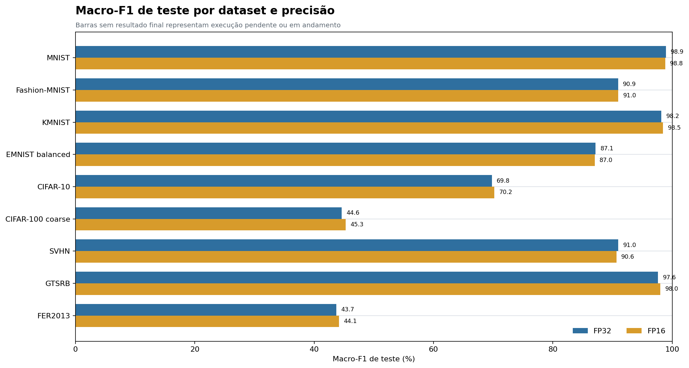
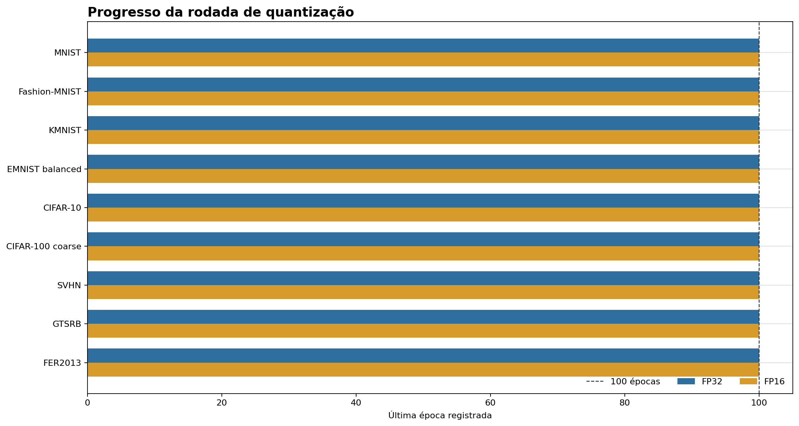

# Relatório técnico — treinamento da rodada de quantização

**Snapshot dos artefatos:** 16/09/2026 21:59 -03. Este relatório cobre exclusivamente `outputs/controlled-quantization-fast-mac-m4`, com 9 datasets × 2 precisões, seed 42, 100 épocas, batch 256 e augmentation 0,5.

## Resumo executivo

- Foram concluídos **18/18 treinos**; há **0 execução(ões) ativa(s)** e **0 ainda não iniciada(s)**.
- Os treinos concluídos chegaram a 100 épocas e possuem métricas de teste, previsões e checkpoints finais.
- A execução ativa é **nenhuma**, no momento do snapshot.
- Há **9/9 conversões INT8/LiteRT** com benchmark persistido.

## Resultados finais disponíveis

| Dataset | FP32 | FP16 | INT8/LiteRT | Observação |
|---|---:|---:|---:|---|
| MNIST | 98.94% | 98.82% | 98.32% | Concluído; INT8/LiteRT: completed |
| Fashion-MNIST | 90.95% | 90.97% | 71.80% | Concluído; INT8/LiteRT: completed |
| KMNIST | 98.19% | 98.46% | 96.55% | Concluído; INT8/LiteRT: completed |
| EMNIST balanced | 87.14% | 87.01% | 86.72% | Concluído; INT8/LiteRT: completed |
| CIFAR-10 | 69.78% | 70.18% | 68.44% | Concluído; INT8/LiteRT: completed |
| CIFAR-100 coarse | 44.63% | 45.26% | 41.50% | Concluído; INT8/LiteRT: completed |
| SVHN | 90.95% | 90.64% | 90.47% | Concluído; INT8/LiteRT: completed |
| GTSRB | 97.62% | 98.03% | 79.19% | Concluído; INT8/LiteRT: completed |
| FER2013 | 43.68% | 44.14% | 37.81% | Concluído; INT8/LiteRT: completed |

A Macro-F1 é a média harmônica das precisões e revocações por classe. Ela é usada aqui como métrica principal porque evita que classes com maior suporte dominem a leitura. Os valores acima são de teste e não devem ser comparados com a acurácia de validação durante um treino ativo.

## Estado e checkpoints

| Dataset | Precisão | Estado | Última época | Artefato de teste |
|---|---|---|---:|---|
| MNIST | FP32 | completed | 100/100 | sim |
| MNIST | FP16 | completed | 100/100 | sim |
| Fashion-MNIST | FP32 | completed | 100/100 | sim |
| Fashion-MNIST | FP16 | completed | 100/100 | sim |
| KMNIST | FP32 | completed | 100/100 | sim |
| KMNIST | FP16 | completed | 100/100 | sim |
| EMNIST balanced | FP32 | completed | 100/100 | sim |
| EMNIST balanced | FP16 | completed | 100/100 | sim |
| CIFAR-10 | FP32 | completed | 100/100 | sim |
| CIFAR-10 | FP16 | completed | 100/100 | sim |
| CIFAR-100 coarse | FP32 | completed | 100/100 | sim |
| CIFAR-100 coarse | FP16 | completed | 100/100 | sim |
| SVHN | FP32 | completed | 100/100 | sim |
| SVHN | FP16 | completed | 100/100 | sim |
| GTSRB | FP32 | completed | 100/100 | sim |
| GTSRB | FP16 | completed | 100/100 | sim |
| FER2013 | FP32 | completed | 100/100 | sim |
| FER2013 | FP16 | completed | 100/100 | sim |

## O que falta fazer

1. Auditar a presença de `test_metrics.json`, `predictions.csv`, `classification_report.json`, checkpoints e telemetria nos 18 treinos concluídos.
2. Consolidar a comparação FP32/FP16 por dataset e selecionar resultados vencedores conforme o protocolo.

## Previsão de término

Os **18/18 treinos FP32/FP16 e 9/9 pós-processamentos INT8/LiteRT estão concluídos**; portanto, a duração pendente é zero.

Não há uma estimativa de duração para os dois pós-processamentos restantes porque ainda não existe tempo observado equivalente nesta rodada. A comparação de duração dos treinos concluídos permanece válida apenas para a execução na GPU Apple M4; executar em CPU mudaria duração e comparabilidade.

## Evidências e reprodutibilidade

- Configuração: `configs/controlled-quantization-fast-mac-m4.yaml`.
- Estado global: `outputs/controlled-quantization-fast-mac-m4/pipeline-status.json` (pode ficar desatualizado).
- Estado primário: `outputs/controlled-quantization-fast-mac-m4/quantization/**/status.json`.
- Métricas: `quantization/**/logs/epoch_metrics.csv` ou `checkpoints/epoch_metrics.csv`.
- Resultados de teste: `quantization/**/artifacts/test_metrics.json` e `classification_report.json`.
- INT8/LiteRT: `quantization/**/int8_ptq/**/artifacts/int8_ptq.tflite` e `litert_benchmark.json` quando presentes.
- Comando de retomada: repetir a execução com o mesmo `--output-root` e `--resume`.

## Limitações

O snapshot é uma fotografia do diretório no horário indicado. A classificação foi feita pelos artefatos individuais; o status global foi tratado como auxiliar. O treinamento e o pós-processamento INT8/LiteRT estão completos no snapshot.
