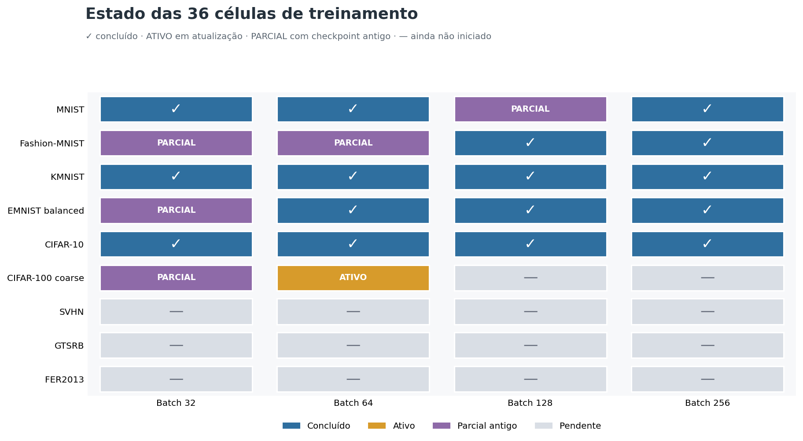
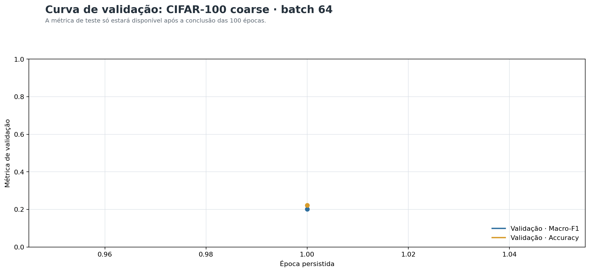
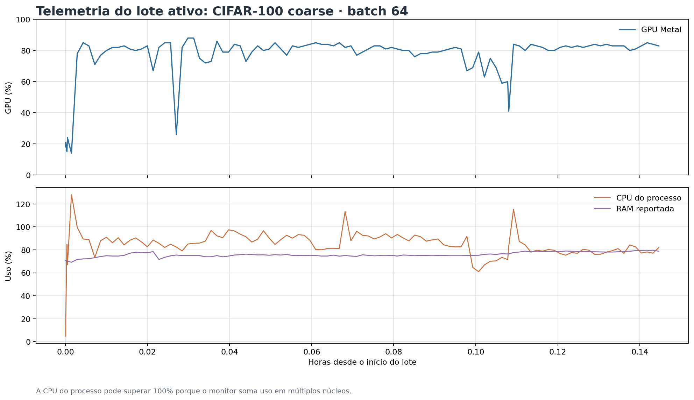
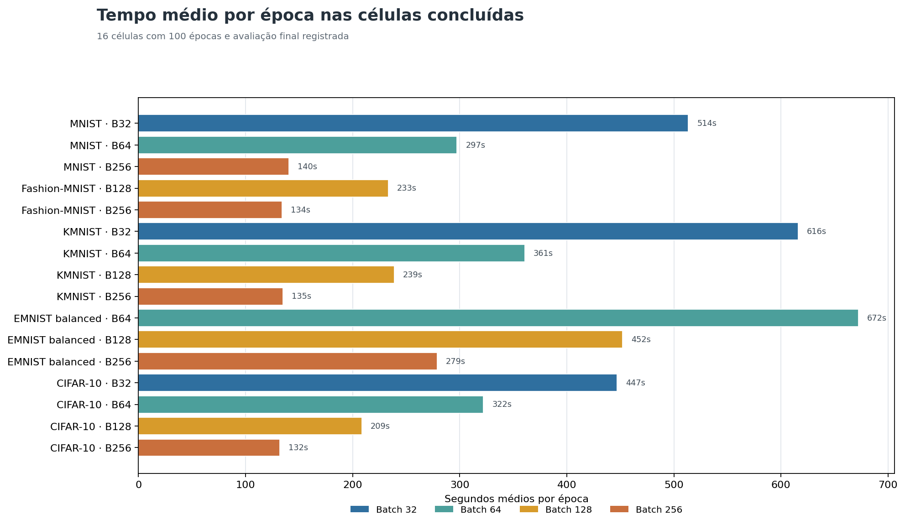

# Relatório técnico de progresso do treinamento — 14/09/2026

## Resumo técnico

O treinamento está ativo na fase de testes de batch. No snapshot de **14/09/2026 às 17:14 BRT**, o processo TensorFlow executava **CIFAR-100 coarse, batch 64**. O primeiro epoch já foi persistido e o segundo estava em andamento, aproximadamente no step 225/985.

Há **16 resultados finais de batch em 36 células**. MNIST, Fashion-MNIST, KMNIST, EMNIST balanced e CIFAR-10 já possuem resultados parciais ou completos; CIFAR-10 foi concluído nos quatro batches. A matriz ainda possui cinco execuções parciais sem avaliação final e 14 células sem execução.

A quantização ainda não começou: `quantization/` não possui arquivos. Ela está habilitada no comando atual, que contém `--skip-activation` mas não contém `--skip-quantization`. As ativações continuam separadas para o outro Mac.

## Estado da matriz batch

O experimento avalia 9 datasets × 4 tamanhos de batch (`32, 64, 128, 256`), totalizando 36 células.

| Estado | Quantidade | Interpretação |
|---|---:|---|
| Concluídas com métricas finais | 16 | Possuem métricas de teste e artefatos finais |
| Em execução real | 1 | CIFAR-100 coarse, batch 64 |
| Parciais antigas | 5 | Possuem checkpoint, mas não avaliação final |
| Não iniciadas | 14 | Sem checkpoint ou telemetria de treino |
| **Total** | **36** | |

Os 16 resultados finais representam **44,4% da matriz**. A célula ativa não deve ser contada como concluída até terminar as 100 epochs e a avaliação de teste.

## Processo ativo e métricas atuais

- Supervisor: PID 48123, iniciado em **14/09/2026 17:04:54 BRT**.
- Processo TensorFlow: PID 49513, iniciado em **14/09/2026 17:06:59 BRT**.
- Célula ativa: `cifar100_coarse/batch-064`.
- Último epoch persistido: **1/100**.
- Últimas métricas persistidas: `val_accuracy = 0,2214` e `val_macro_f1 = 0,2009`.
- Tempo do primeiro epoch: **364,9 s**.
- Log ao vivo: segundo epoch avançando em aproximadamente **225/985 steps**, com cerca de 4:31 restantes naquele ponto.

As métricas atuais são de validação e ainda não representam a qualidade final no conjunto de teste. A primeira epoch também sofre custo de inicialização; a previsão deve usar os próximos epochs, quando o tempo estabilizar.

## Telemetria de hardware

A telemetria está sendo capturada e salva em `telemetry/samples.csv`. Na amostra mais recente, às **17:14:52 BRT**, foram registrados:

| Indicador | Valor |
|---|---:|
| CPU total do sistema | 33,9% |
| CPU do processo | 76,2% |
| RAM utilizada | 78,2% |
| RSS do processo | 1,11 GiB |
| Utilização GPU Apple M4 | 83% |
| Memória alocada pelo driver Metal | 2,75 GiB |
| Pressão térmica | `nominal` |

Não há sinal de OOM, throttling térmico ou perda de telemetria no lote ativo. A CPU do processo pode variar acima de 100% quando o monitor agrega vários núcleos.

## Resultados finais disponíveis

| Dataset | Batches concluídos | Melhor Macro-F1 de teste | Melhor batch |
|---|---|---:|---:|
| MNIST | 32, 64, 256 | 0,9908 | 64 |
| Fashion-MNIST | 128, 256 | 0,9112 | 128 |
| KMNIST | 32, 64, 128, 256 | 0,9863 | 32 |
| EMNIST balanced | 64, 128, 256 | 0,8780 | 64 |
| CIFAR-10 | 32, 64, 128, 256 | 0,7235 | 32 |

Os resultados confirmam que batches maiores reduzem o tempo por epoch, mas não garantem a maior precisão. A seleção do batch vencedor deve combinar Macro-F1 de teste, tempo de treino e latência, e ainda não pode ser fechada para os quatro datasets que não possuem resultados finais.

## Células parciais que exigem retomada

Estas células possuem checkpoints, mas não possuem `test_metrics.json`:

| Dataset | Batch | Último checkpoint observado | Situação |
|---|---:|---:|---|
| MNIST | 128 | 37 epochs | Execução antiga, marcada para retomada |
| Fashion-MNIST | 32 | 2 epochs | Execução antiga, marcada para retomada |
| Fashion-MNIST | 64 | 58 epochs | Execução antiga, marcada para retomada |
| EMNIST balanced | 32 | 66 epochs | Execução antiga, marcada para retomada |
| CIFAR-100 coarse | 32 | 66 epochs | Execução anterior, sem avaliação final |

O supervisor atual foi iniciado sem `--resume`. O runtime identifica essas células como `skip_needs_resume` e passa adiante. Assim, ele continua executando a fila, mas a matriz não ficará completa se esses cinco checkpoints não forem retomados em uma execução explícita.

## Células ainda não iniciadas

As 14 células sem execução final são:

- CIFAR-100 coarse: batches 128 e 256;
- SVHN: batches 32, 64, 128 e 256;
- GTSRB: batches 32, 64, 128 e 256;
- FER2013: batches 32, 64, 128 e 256.

Esses datasets concentram a incerteza da previsão porque ainda não há tempo de 100 epochs medido nesta configuração.

## Quantização e ativações

### Quantização

A quantização ainda não começou. Como o comando atual não usa `--skip-quantization`, a sequência prevista após a fase batch é:

1. Treino FP32 e FP16 para os 9 datasets, totalizando 18 treinos.
2. Conversão e benchmark INT8 PTQ para cada dataset, totalizando 9 conversões/benchmarks.
3. Seleção da variante dentro da tolerância de Macro-F1.

### Ativações

As ativações não serão executadas neste Mac. O comando usa `--skip-activation`, e não há artefatos em `activations/`. Essa fase permanece pendente para o outro Mac.

## Qualidade dos dados

Os 9 datasets passaram pela auditoria de leitura e estrutura com zero erros:

| Dataset | Exemplos auditados | Erros | Alertas |
|---|---:|---:|---:|
| MNIST | 70.000 | 0 | 0 |
| Fashion-MNIST | 70.000 | 0 | 0 |
| KMNIST | 70.000 | 0 | 0 |
| EMNIST balanced | 131.600 | 0 | 1 |
| CIFAR-10 | 60.000 | 0 | 0 |
| CIFAR-100 coarse | 60.000 | 0 | 2 |
| SVHN | 99.289 | 0 | 2 |
| GTSRB | 39.270 | 0 | 0 |
| FER2013 | 35.887 | 0 | 2 |

Os alertas são duplicatas detectadas pela auditoria. CIFAR-100 coarse, SVHN e FER2013 também apresentam duplicatas com rótulos conflitantes; isso não bloqueia o treinamento, mas deve ser considerado na interpretação das métricas finais.

## Interrupções e observabilidade

O processo atual está ativo e o `pipeline.log` continua recebendo dados. Não foram encontrados `KeyboardInterrupt`, `SIGTERM`, `SIGKILL`, `Killed`, `Traceback`, `OutOfMemory` ou falha fatal equivalente no log.

Há registros de processos anteriores que terminaram sem uma transição final clara no `pipeline-status.json`. O motivo exato dessas interrupções não está registrado. Também há cinco células antigas marcadas como `running`, mas sem processo correspondente; elas são checkpoints parciais, não treinos ativos.

O `pipeline-status.json` permanece com `stages: {}` e não deve ser usado sozinho para determinar o progresso. A fonte de evidência é a combinação de processos ativos, logs, checkpoints, `status.json`, métricas por epoch e telemetria.

## Previsão de término

As estimativas assumem execução serial, configuração inalterada e ausência de nova interrupção.

| Marco | Previsão | Confiança |
|---|---|---|
| CIFAR-100 coarse batch 64 atual | 15/09, aproximadamente 02:30–04:00 BRT | Média/baixa |
| Matriz batch visitada pelo supervisor, sem retomar os 5 parciais | 22/09–02/10 | Baixa |
| Matriz batch completa, incluindo os 5 parciais | Após a faixa acima | Baixa |
| Batch + quantização, sem ativações | 29/09–16/10 | Baixa |
| Experimento completo com ativações | Não estimável neste Mac | — |

A faixa é ampla porque SVHN, GTSRB e FER2013 ainda não têm tempos reais nesta configuração. O primeiro resultado completo de cada dataset permitirá recalcular a previsão com maior precisão.

## O que falta

1. Finalizar CIFAR-100 coarse batch 64 e os batches 128/256.
2. Executar os quatro batches de SVHN, GTSRB e FER2013.
3. Retomar as cinco células parciais com `--resume` se todos os 36 batches forem obrigatórios.
4. Consolidar os vencedores de batch por dataset.
5. Executar a quantização habilitada no comando atual.
6. Executar e consolidar as ativações no outro Mac.
7. Atualizar o estado consolidado após o término das fases.

## Evidências consultadas

- `outputs/controlled-augmentation2-mac-m4-aug05/logs/pipeline.log`
- `outputs/controlled-augmentation2-mac-m4-aug05/pipeline-status.json`
- `outputs/controlled-augmentation2-mac-m4-aug05/batch/**/status.json`
- `outputs/controlled-augmentation2-mac-m4-aug05/batch/**/checkpoints/epoch_metrics.csv`
- `outputs/controlled-augmentation2-mac-m4-aug05/batch/**/telemetry/samples.csv`
- `outputs/controlled-augmentation2-mac-m4-aug05/batch/**/logs/training_summary.json`
- `outputs/controlled-augmentation2-mac-m4-aug05/audit/*/audit/audit.json`
- `scripts/run_controlled_pipeline.py`
- `src/tcc_benchmark/controlled.py`
