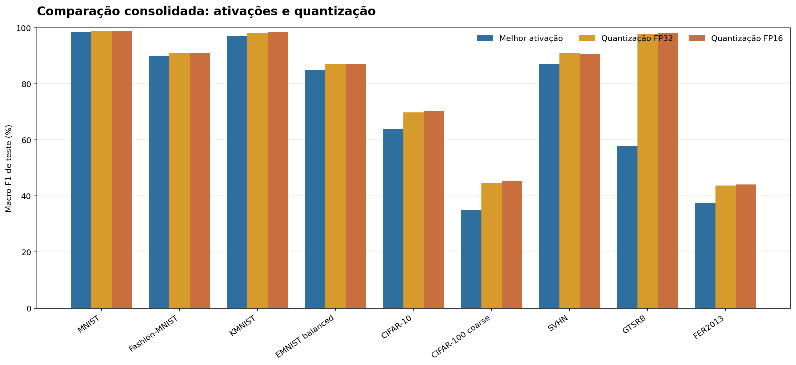

# Relatório consolidado — treinamento, ativações e quantização

**Snapshot dos artefatos:** 16/09/2026 21:59 -03. O documento junta a rodada de ativações com augmentation 0,5 e a rodada isolada de quantização com o mesmo protocolo de 100 épocas e augmentation 0,5.

## Resumo executivo

- **Ativações:** 27/27 treinos concluídos, 2.700 épocas e 99,46 horas acumuladas.
- **Treinamento da quantização:** 18/18 treinos concluídos, 0 ativo(s) e 0 pendente(s) no snapshot.
- **INT8/LiteRT:** 9/9 datasets possuem conversão e benchmark persistidos; etapa concluída.
- A melhor ativação por Macro-F1 foi Sigmoid em 8/9 datasets; ReLU venceu no GTSRB. Softmax apresentou colapso sistemático e não venceu nenhum dataset.
- A comparação consolidada é útil por dataset, mas não deve ser lida como comparação entre dificuldades diferentes de datasets.

## Comparação consolidada

| Dataset | Melhor ativação | Macro-F1 ativação | Quant. FP32 | Quant. FP16 | INT8/LiteRT | Estado do treinamento |
|---|---|---:|---:|---:|---:|---|
| MNIST | Sigmoid | 98.44% | 98.94% | 98.82% | 98.32% | FP32 completed; FP16 completed |
| Fashion-MNIST | Sigmoid | 90.04% | 90.95% | 90.97% | 71.80% | FP32 completed; FP16 completed |
| KMNIST | Sigmoid | 97.11% | 98.19% | 98.46% | 96.55% | FP32 completed; FP16 completed |
| EMNIST balanced | Sigmoid | 84.93% | 87.14% | 87.01% | 86.72% | FP32 completed; FP16 completed |
| CIFAR-10 | Sigmoid | 63.90% | 69.78% | 70.18% | 68.44% | FP32 completed; FP16 completed |
| CIFAR-100 coarse | Sigmoid | 35.02% | 44.63% | 45.26% | 41.50% | FP32 completed; FP16 completed |
| SVHN | Sigmoid | 87.07% | 90.95% | 90.64% | 90.47% | FP32 completed; FP16 completed |
| GTSRB | ReLU | 57.75% | 97.62% | 98.03% | 79.19% | FP32 completed; FP16 completed |
| FER2013 | Sigmoid | 37.54% | 43.68% | 44.14% | 37.81% | FP32 completed; FP16 completed |

## Resultados completos da fase de ativações

A fase de ativações está finalizada. A tabela abaixo reúne os 27 resultados de teste; Macro-F1 é a métrica principal, com accuracy e balanced accuracy como apoio.

| Dataset | Ativação | Accuracy | Balanced accuracy | Macro-F1 | Tempo (h) |
|---|---|---:|---:|---:|---:|
| MNIST | ReLU | 98.37% | 98.35% | 98.36% | 3.20 |
| MNIST | Sigmoid | 98.46% | 98.43% | 98.44% | 4.23 |
| MNIST | Softmax | 11.25% | 10.00% | 2.02% | 3.27 |
| Fashion-MNIST | ReLU | 87.82% | 87.82% | 87.50% | 3.27 |
| Fashion-MNIST | Sigmoid | 90.05% | 90.05% | 90.04% | 4.18 |
| Fashion-MNIST | Softmax | 10.00% | 10.00% | 1.82% | 3.25 |
| KMNIST | ReLU | 97.02% | 97.02% | 97.02% | 3.20 |
| KMNIST | Sigmoid | 97.11% | 97.11% | 97.11% | 3.43 |
| KMNIST | Softmax | 10.00% | 10.00% | 1.82% | 3.23 |
| EMNIST Balanced | ReLU | 84.86% | 84.86% | 84.42% | 3.81 |
| EMNIST Balanced | Sigmoid | 85.28% | 85.28% | 84.93% | 8.44 |
| EMNIST Balanced | Softmax | 2.13% | 2.13% | 0.09% | 6.80 |
| CIFAR-10 | ReLU | 56.64% | 56.64% | 56.45% | 3.20 |
| CIFAR-10 | Sigmoid | 63.67% | 63.67% | 63.90% | 3.95 |
| CIFAR-10 | Softmax | 10.00% | 10.00% | 1.82% | 3.16 |
| CIFAR-100 coarse | ReLU | 30.32% | 30.32% | 29.98% | 3.17 |
| CIFAR-100 coarse | Sigmoid | 36.61% | 36.61% | 35.02% | 3.95 |
| CIFAR-100 coarse | Softmax | 5.00% | 5.00% | 0.48% | 3.21 |
| SVHN | ReLU | 86.44% | 84.99% | 86.86% | 5.24 |
| SVHN | Sigmoid | 87.76% | 86.12% | 87.07% | 6.58 |
| SVHN | Softmax | 19.10% | 10.00% | 3.21% | 5.30 |
| GTSRB | ReLU | 68.76% | 67.91% | 57.75% | 2.09 |
| GTSRB | Sigmoid | 75.37% | 47.10% | 45.31% | 2.38 |
| GTSRB | Softmax | 12.34% | 4.57% | 0.96% | 2.13 |
| FER2013 | ReLU | 40.32% | 33.33% | 27.47% | 1.68 |
| FER2013 | Sigmoid | 47.45% | 38.37% | 37.54% | 2.19 |
| FER2013 | Softmax | 25.05% | 14.29% | 5.72% | 0.92 |

Para os gráficos detalhados de accuracy, tempo, hardware e comparação com augmentation 2,0, consulte o [relatório final da fase de ativações](../../docs/augmentation05_final/README.md).

## Interpretação dos resultados de ativações

- Sigmoid foi a melhor ativação em MNIST, Fashion-MNIST, KMNIST, EMNIST balanced, CIFAR-10, CIFAR-100 coarse, SVHN e FER2013.
- ReLU foi superior no GTSRB.
- Softmax teve Macro-F1 entre 0,09% e 5,72% e comportamento de previsão concentrada em uma classe. Isso é compatível com colapso da representação quando Softmax é usado repetidamente como ativação oculta; deve ser tratado como ablação negativa neste protocolo.
- Os resultados usam uma única seed (42). As diferenças entre ativações são descritivas e não medem incerteza entre seeds.

## Estado da quantização

A matriz de treinamento da quantização foi concluída: 18/18 execuções FP32/FP16 chegaram a 100 épocas, com batch 256 e `mixed_float16` conforme a configuração. Os 9/9 datasets possuem artefatos INT8/LiteRT com `litert_benchmark.json`.

Para detalhes por época, checkpoints, curva ativa e previsão específica da quantização, consulte o [relatório da quantização](../quantizacao_2026-09-14/README.md).

## O que falta fazer

1. Auditar os 18 runs FP32/FP16 e confirmar a presença de todos os artefatos finais.
2. Usar múltiplas seeds para confirmar a escolha de Sigmoid/ReLU e quantificar variabilidade.
3. Manter Softmax como condição negativa ou revisar sua posição arquitetural antes de novos treinos longos.

## Previsão de término

A fase de ativações, os 18 treinos FP32/FP16 e o pós-processamento INT8/LiteRT estão concluídos no snapshot; não há duração pendente.

## Evidências e método

- Ativações: `outputs/controlled-augmentation05-activations-mac2/` e `docs/augmentation05_final/data/resultados_augmentation05.csv`.
- Quantização: `outputs/controlled-quantization-fast-mac-m4/quantization/**`.
- Configuração de quantização: `configs/controlled-quantization-fast-mac-m4.yaml`.
- Métricas finais: `test_metrics.json`, `classification_report.json`, `predictions.csv`, `training_summary.json` e, quando disponível, `int8_ptq.tflite`/`litert_benchmark.json`.
- Estados: `status.json` por run; o `pipeline-status.json` global foi tratado apenas como auxiliar.

## Limitações

O relatório é um snapshot dos artefatos no horário indicado. A fase de ativações está confirmada como 27/27 completa; os treinos FP32/FP16 e a cobertura INT8/LiteRT estão completos.
