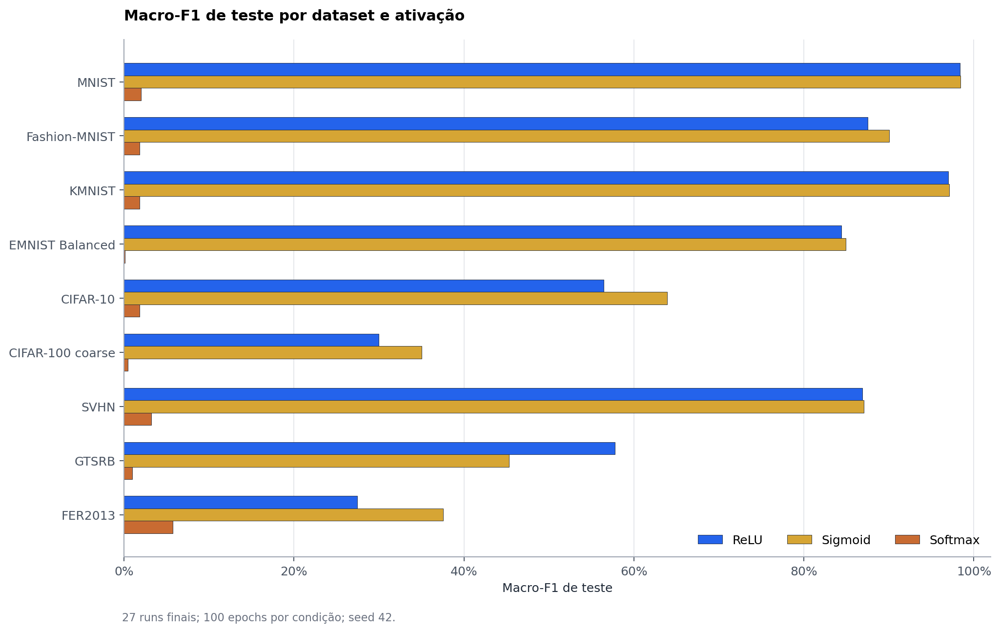
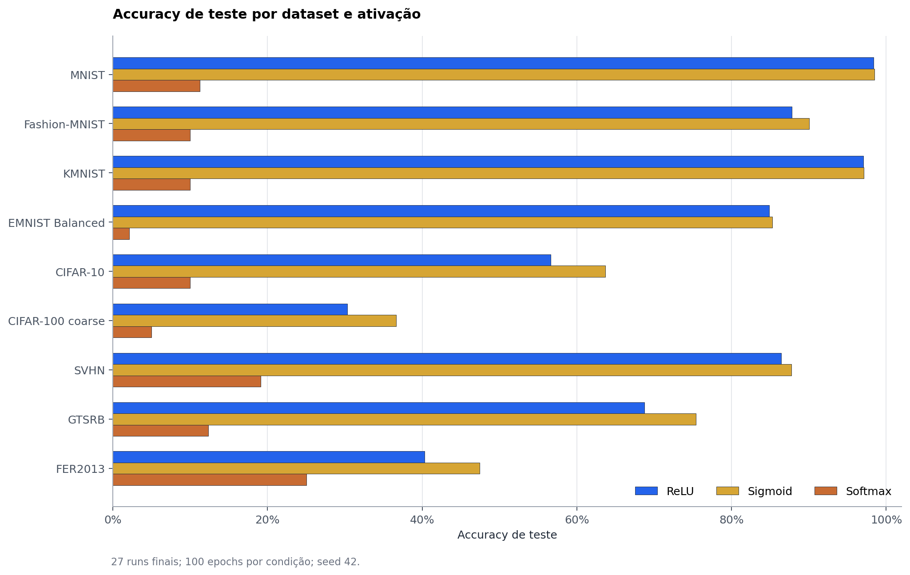
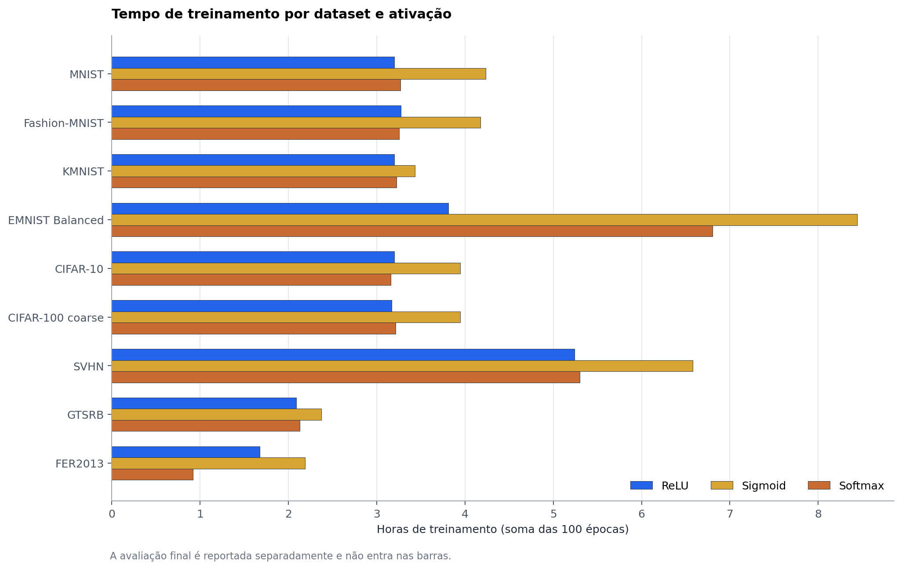
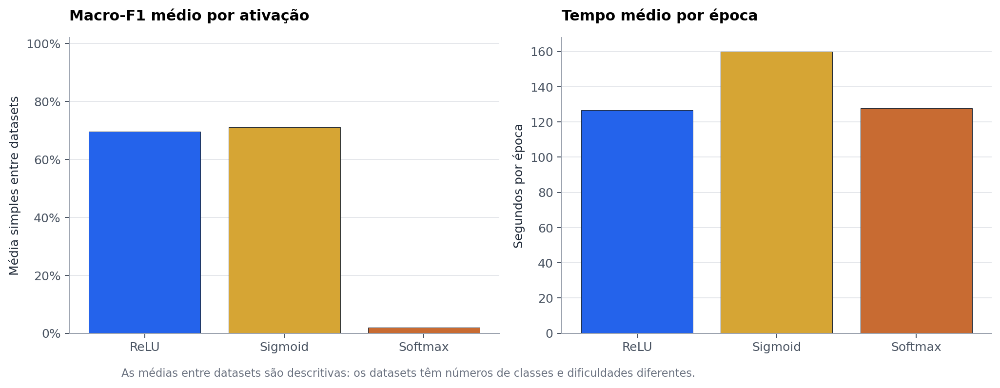
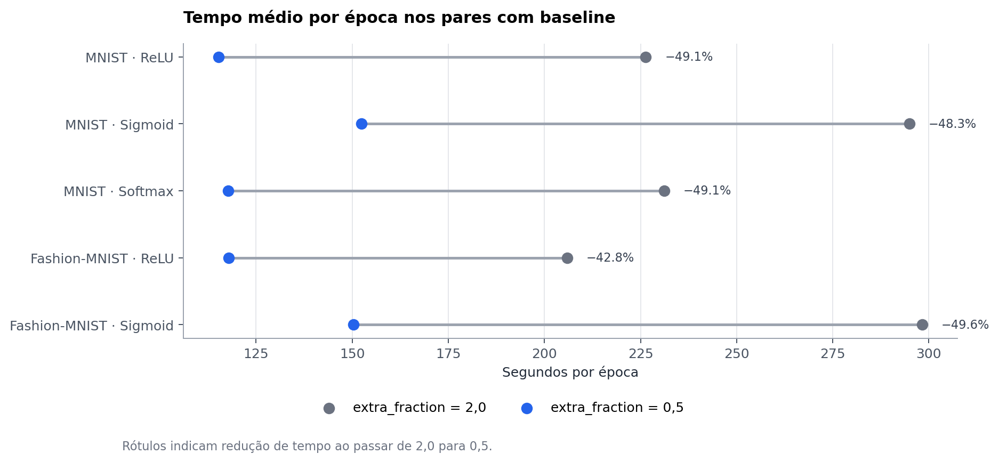
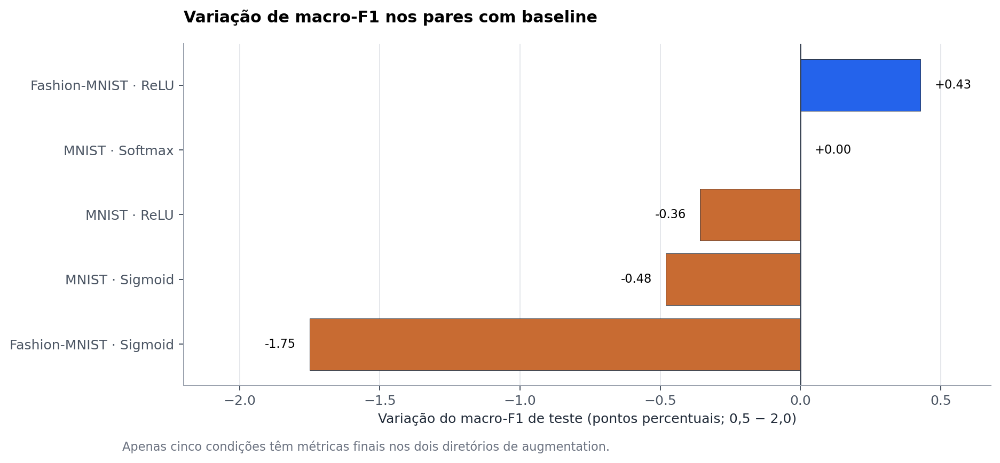
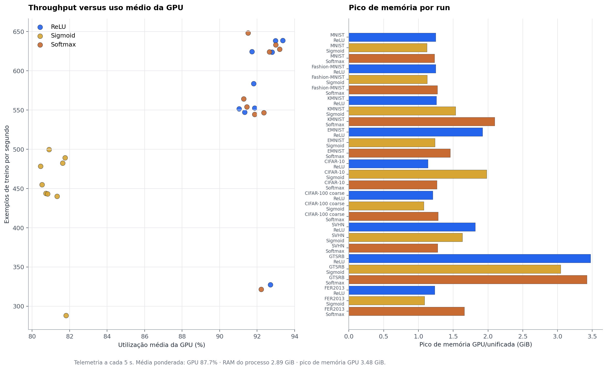

# Relatório final — ativações com augmentation 0,5 (Mac M4)

**Escopo:** apenas a rodada local deste Mac: 9 datasets × 3 ativações, seed 42, 100 epochs por condição. Testes feitos em outro Mac não entram nas contagens, tempos nem comparações.

## Resumo técnico

- A rodada foi concluída: **27/27 runs**, **2,700 epochs** e **99.46 horas** de treinamento acumulado. Não há run pendente.
- O melhor resultado é **MNIST/Sigmoid**, com macro-F1 de teste de **98.44%** e accuracy de **98.46%**.
- A ativação Sigmoid venceu 8 de 9 datasets por macro-F1; ReLU venceu 1; Softmax não venceu nenhum. O intervalo de macro-F1 do Softmax foi **0.09%–5.72%**, caracterizando desempenho degenerado neste protocolo.
- Nos **5 pares** com baseline final em augmentation 2,0, `extra_fraction=0,5` reduziu o tempo médio por epoch em **47.8%**. A variação média simples de macro-F1 foi **-0.43 p.p.**, portanto a qualidade não melhorou de forma uniforme.

## Resultados por dataset e ativação



O ranking é majoritariamente favorável ao Sigmoid, exceto no GTSRB, em que ReLU apresentou macro-F1 maior. A comparação entre datasets deve ser lida com cautela porque os conjuntos têm diferentes números de classes, distribuições e níveis de dificuldade.



| Dataset | Ativação | Accuracy | Balanced accuracy | Macro-F1 | s/epoch | Tempo treino (h) |
| --- | --- | --- | --- | --- | --- | --- |
| MNIST | ReLU | 98.37% | 98.35% | 98.36% | 115.2 | 3.20 |
| MNIST | Sigmoid | 98.46% | 98.43% | 98.44% | 152.4 | 4.23 |
| MNIST | Softmax | 11.25% | 10.00% | 2.02% | 117.8 | 3.27 |
| Fashion-MNIST | ReLU | 87.82% | 87.82% | 87.50% | 117.9 | 3.27 |
| Fashion-MNIST | Sigmoid | 90.05% | 90.05% | 90.04% | 150.3 | 4.18 |
| Fashion-MNIST | Softmax | 10.00% | 10.00% | 1.82% | 117.1 | 3.25 |
| KMNIST | ReLU | 97.02% | 97.02% | 97.02% | 115.1 | 3.20 |
| KMNIST | Sigmoid | 97.11% | 97.11% | 97.11% | 147.1 | 3.43 |
| KMNIST | Softmax | 10.00% | 10.00% | 1.82% | 116.2 | 3.23 |
| EMNIST Balanced | ReLU | 84.86% | 84.86% | 84.42% | 236.8 | 3.81 |
| EMNIST Balanced | Sigmoid | 85.28% | 85.28% | 84.93% | 303.8 | 8.44 |
| EMNIST Balanced | Softmax | 2.13% | 2.13% | 0.09% | 244.9 | 6.80 |
| CIFAR-10 | ReLU | 56.64% | 56.64% | 56.45% | 115.1 | 3.20 |
| CIFAR-10 | Sigmoid | 63.67% | 63.67% | 63.90% | 142.0 | 3.95 |
| CIFAR-10 | Softmax | 10.00% | 10.00% | 1.82% | 113.7 | 3.16 |
| CIFAR-100 coarse | ReLU | 30.32% | 30.32% | 29.98% | 114.2 | 3.17 |
| CIFAR-100 coarse | Sigmoid | 36.61% | 36.61% | 35.02% | 142.1 | 3.95 |
| CIFAR-100 coarse | Softmax | 5.00% | 5.00% | 0.48% | 115.7 | 3.21 |
| SVHN | ReLU | 86.44% | 84.99% | 86.86% | 188.7 | 5.24 |
| SVHN | Sigmoid | 87.76% | 86.12% | 87.07% | 236.9 | 6.58 |
| SVHN | Softmax | 19.10% | 10.00% | 3.21% | 190.7 | 5.30 |
| GTSRB | ReLU | 68.76% | 67.91% | 57.75% | 75.3 | 2.09 |
| GTSRB | Sigmoid | 75.37% | 47.10% | 45.31% | 85.5 | 2.38 |
| GTSRB | Softmax | 12.34% | 4.57% | 0.96% | 76.7 | 2.13 |
| FER2013 | ReLU | 40.32% | 33.33% | 27.47% | 60.3 | 1.68 |
| FER2013 | Sigmoid | 47.45% | 38.37% | 37.54% | 78.8 | 2.19 |
| FER2013 | Softmax | 25.05% | 14.29% | 5.72% | 58.2 | 0.92 |

Dados tabulares completos: [`data/resultados_augmentation05.csv`](data/resultados_augmentation05.csv).

## Tempo de treinamento e comparação com augmentation 2,0



O total de **99.46 h** é a soma do tempo de treinamento registrado por cada run, não tempo de relógio com paralelismo. O tempo médio ponderado foi de **132.6 s/epoch**; a avaliação final acrescentou **6.5 min** acumulados.



As médias de macro-F1 por ativação são apenas descritivas — não constituem uma medida de desempenho global comum, pois os datasets não têm a mesma dificuldade nem a mesma taxonomia de classes.





| Condição | Acc. 2,0 | Acc. 0,5 | Δ acc. (p.p.) | F1 2,0 | F1 0,5 | Δ F1 (p.p.) | s/epoch 2,0 → 0,5 | Redução |
| --- | --- | --- | --- | --- | --- | --- | --- | --- |
| MNIST · ReLU | 98.74% | 98.37% | -0.37 | 98.72% | 98.36% | -0.36 | 226.4 → 115.2 | 49.1% |
| MNIST · Sigmoid | 98.92% | 98.46% | -0.47 | 98.92% | 98.44% | -0.48 | 294.9 → 152.4 | 48.3% |
| MNIST · Softmax | 11.25% | 11.25% | +0.00 | 2.02% | 2.02% | +0.00 | 231.1 → 117.8 | 49.1% |
| Fashion-MNIST · ReLU | 87.60% | 87.82% | +0.22 | 87.07% | 87.50% | +0.43 | 205.9 → 117.9 | 42.8% |
| Fashion-MNIST · Sigmoid | 91.81% | 90.05% | -1.76 | 91.79% | 90.04% | -1.75 | 298.2 → 150.3 | 49.6% |

Dados comparativos: [`data/comparacao_augmentation20_vs_05.csv`](data/comparacao_augmentation20_vs_05.csv). Só entram condições com métricas finais persistidas nos dois diretórios: MNIST (três ativações) e Fashion-MNIST (ReLU e Sigmoid).

## Hardware e uso observado

| Métrica | Valor |
| --- | --- |
| CPU lógico | 10 núcleos |
| Memória unificada | 16 GiB |
| GPU | Apple M4 · 10 núcleos |
| Backend | apple-metal-ioreg · Metal 3 |
| Sistema | macOS 15.5 · Python 3.10.21 |
| Framework | TensorFlow 2.18.1 · tensorflow-metal 1.2.0 |
| Amostras de telemetria | 75,999 a cada 5 s |
| GPU — utilização | média ponderada 87.7% · máximo 100.0% |
| GPU — memória compartilhada | média ponderada 1.04 GiB · pico 3.48 GiB |
| Processo — CPU | média ponderada 88.1% · pico 230.9% (multicore) |
| Processo — RSS | média ponderada 2.89 GiB · pico 5.12 GiB |
| RAM do sistema | média ponderada 74.1% · pico 85.9% |
| Pressão térmica | nominal: 27 |



O backend reportado pelos próprios runs foi Apple Metal com memória unificada. Os picos de memória devem ser lidos como uso da memória compartilhada do driver/SoC, não como VRAM dedicada. O percentual de CPU é do processo e pode exceder 100% em uma máquina multicore. As estatísticas de uso são agregações de amostras a cada 5 segundos; elas descrevem execução observada, mas não medem energia elétrica nem permitem inferir causalidade sobre throughput.

## Escopo, dados e método

- **Protocolo:** `extra_fraction=0,5`, batch de ativação 256, `mixed_float16`, seed 42, normalização `unit_interval`, `all_raw`, 100 epochs, mesmo conjunto de transformações da configuração `configs/controlled-augmentation05-mac-m4.yaml`.
- **Métricas de qualidade:** accuracy, balanced accuracy e macro-F1 são calculadas no conjunto de teste final; macro-F1 é a média não ponderada de F1 por classe.
- **Tempo:** `training_seconds` e `mean_epoch_seconds` vêm de `logs/training_summary.json`; avaliação final vem do mesmo arquivo.
- **Hardware:** telemetria das 27 execuções (`telemetry/summary.json`), com backend e versões em `telemetry/environment.json`.
- **Comparação 2,0 vs. 0,5:** diferença é novo menos antigo para qualidade (pontos percentuais) e redução relativa do tempo por epoch para desempenho operacional.

## Limitações e verificações de robustez

- Há **uma única seed (42)** por condição. As diferenças são descritivas, não estimativas de significância estatística.
- Apenas cinco pares têm baseline final de augmentation 2,0; não é válido extrapolar a comparação direta para os demais 22 runs.
- A média entre datasets não substitui análise dentro de cada dataset; classes, resolução, volume e dificuldade variam.
- Todos os 27 status estão como `completed`, cada `training_summary.json` registra 100 epochs e cada condição possui `artifacts/test_metrics.json` e telemetria. A pressão térmica agregada permaneceu nominal nas 27 condições.
- O escopo exclui deliberadamente resultados produzidos em outro Mac.

## Próximos passos recomendados

1. Repetir as condições mais promissoras e os casos fracos com múltiplas seeds para quantificar variabilidade.
2. Tratar Softmax como condição de falha do protocolo atual: revisar sua posição na arquitetura e validar logits/perdas antes de novos treinamentos extensos.
3. Completar baselines 2,0 que faltam caso a decisão exija comparar todos os datasets diretamente.
4. Para uso prático, priorizar Sigmoid como primeiro candidato e ReLU como alternativa para GTSRB, sempre validando com replicações.

## Artefatos reprodutíveis

- [Notebook executado](../../notebooks/augmentation05_final_analysis.ipynb)
- [Script de geração](../../scripts/build_augmentation05_final_report.py)
- [Snapshot de métricas](data/resultados_augmentation05.csv)
- [Resumo consolidado](data/resumo_augmentation05.json)

Para reconstruir a partir dos outputs locais, execute:

```bash
.venv-mac/bin/python -m pip install -r requirements/reporting-notebook.txt
.venv-mac/bin/python scripts/build_augmentation05_final_report.py --execute
```
