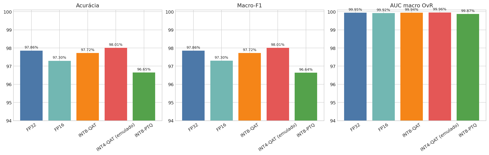
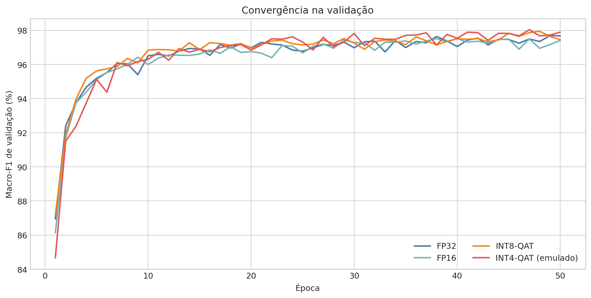
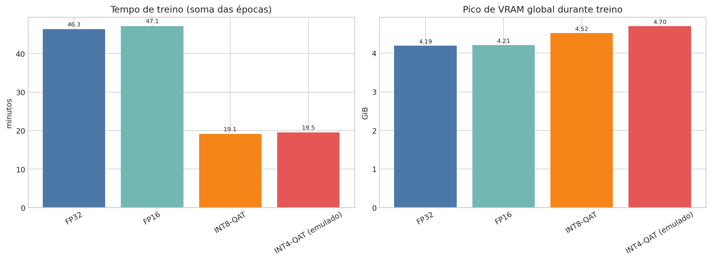
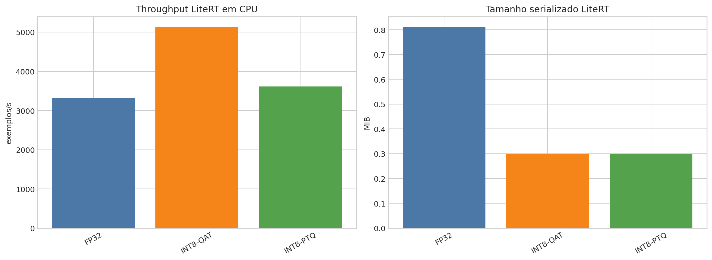

# Benchmark de quantização KMNIST — análise técnica

Gerado em 2026-08-09 23:38 UTC a partir de `/mnt/e/tcc-benchmark/outputs/kmnist-quantization-2026-08-09`. Este relatório é descritivo: cada variante foi treinada uma vez com seed 42; diferenças entre variantes não devem ser interpretadas como inferência estatística ou causal isolada.

## Resumo técnico

Os cinco tratamentos foram concluídos (`status` global: **completed**, falhas: **0**). A melhor acurácia de teste foi **98.010%** em **INT4-QAT (emulado)**, 0.152 p.p. em relação ao FP32 (97.857%). A QAT INT8 preservou qualidade próxima ao FP32 (-0.133 p.p.), enquanto a PTQ INT8 reduziu o LiteRT de 0.813 para 0.297 MiB (63.5% menor) e elevou o throughput LiteRT/CPU de 3312.0 para 3610.4 exemplos/s (1.09×). Essa PTQ tem perda de -1.210 p.p. de acurácia.

INT4-QAT obteve o melhor resultado numérico, mas é uma implementação **emulada** de fake quantização com pesos mestres FP32: não é evidência de implantação INT4 suportada. FP16 teve tempo somado das épocas 1.8% maior que o FP32, porém sua conversão LiteRT falhou e, portanto, não tem resultado de inferência CPU comparável.

## Evidências visuais

## Escopo, dados e definições

- **Dados:** KMNIST, 70.000 exemplos brutos (`all_raw`), 10 classes, entrada 64×64×1 com normalização `unit_interval`.
- **Partição:** estratificada 70/15/15, seed 42: 49.000 treino, 10.500 validação e 10.500 teste; 1.050 exemplos por classe em validação e teste.
- **Treino:** 50 épocas, batch size 256, CNN estruturalmente idêntica, sem augmentation, `TF_FORCE_GPU_ALLOW_GROWTH=true` e `memory_growth` ativado antes do TensorFlow.
- **Variantes:** FP32, FP16 (`mixed_float16`), W8A8 QAT, W4A8 QAT emulada e INT8-PTQ do checkpoint FP32 com 1.024 exemplos de calibração.
- **Métricas de teste:** acurácia; precision, recall e F1 macro; AUC ROC macro one-vs-rest. MSE de logits é a média do erro quadrático entre logits da variante e logits FP32 no mesmo conjunto de 10.500 exemplos. Para QAT treinada do zero, esse MSE mede divergência final completa, não somente o efeito de quantização.
- **Desempenho de implantação:** LiteRT Python em CPU, batch 256, 10 warm-ups e 30 passagens cronometradas. VRAM não se aplica a essa trilha CPU.

## Qualidade e integridade dos dados

- ✅ `top_level_status_completed`
- ✅ `zero_reported_failures`
- ✅ `all_five_variants_present`
- ✅ `all_variant_statuses_completed`
- ✅ `all_training_runs_have_50_epochs`
- ✅ `all_training_summaries_report_50_epochs`
- ✅ `fixed_batch_256`
- ✅ `augmentation_disabled`
- ✅ `memory_growth_enabled`
- ✅ `same_split_fingerprint`
- ✅ `same_source_fingerprint`
- ✅ `same_70_15_15_sizes`

Contagem de linhas de épocas por variante: `{"fp16": 50, "fp32": 50, "int4_qat": 50, "int8_qat": 50}`.

- A telemetria registrou menos de 50 eventos `epoch_end` em FP32 (47). Os CSVs de época e os `training_summary.json` registram as 50 épocas; por isso este é um aviso de instrumentação, não uma evidência de treino incompleto.
- A conversão LiteRT FP16 falhou; não há métrica de inferência LiteRT/CPU nem tamanho LiteRT para FP16.
- INT4-QAT é fake quantização experimental/emulada; o tamanho de 4 bits é estimado e não representa um artefato LiteRT INT4 implantável.
- O LiteRT INT8-PTQ contém tensores float32 auxiliares; ele é classificado como grafo híbrido/float_or_hybrid, não como INT8 integral.

## Qualidade preditiva no teste

| Variante | Acurácia | Precisão macro | Recall macro | Macro-F1 | AUC macro OvR | Loss | MSE logits vs FP32 | Acordo vs FP32 |
| --- | --- | --- | --- | --- | --- | --- | --- | --- |
| FP32 | 97.857% | 97.865% | 97.857% | 97.855% | 99.945% | 0.113842 | 0.000000 | 100.000% |
| FP16 | 97.295% | 97.307% | 97.295% | 97.296% | 99.918% | 0.140786 | 5.753087 | 97.352% |
| INT8-QAT | 97.724% | 97.733% | 97.724% | 97.725% | 99.941% | 0.117955 | 4.211951 | 97.629% |
| INT4-QAT (emulado) | 98.010% | 98.015% | 98.010% | 98.010% | 99.956% | 0.082188 | 8.096385 | 97.457% |
| INT8-PTQ | 96.648% | 96.677% | 96.648% | 96.640% | 99.868% | — | 1.583283 | 97.495% |

FP32 é a referência. INT8-QAT ficou muito próximo da referência em acurácia e Macro-F1. INT8-PTQ perdeu mais qualidade e concentrou a maior degradação de recall na classe 4 (consultar `classification_report.json` por variante para o detalhamento por classe). INT4-QAT obteve valores superiores nesta única execução, o que é compatível tanto com variação do processo de treino quanto com a regularização induzida pelo fake quant; sem repetições independentes, não se pode atribuir a melhoria ao uso de 4 bits.

### Deltas contra FP32

| Variante | Δ acurácia (p.p.) | Δ Macro-F1 (p.p.) | Δ AUC (p.p.) | MSE logits | Acordo |
| --- | --- | --- | --- | --- | --- |
| FP32 | 0.000 | 0.000 | 0.000 | 0.000000 | 100.000% |
| FP16 | -0.562 | -0.560 | -0.027 | 5.753087 | 97.352% |
| INT8-QAT | -0.133 | -0.130 | -0.004 | 4.211951 | 97.629% |
| INT4-QAT (emulado) | 0.152 | 0.154 | 0.011 | 8.096385 | 97.457% |
| INT8-PTQ | -1.210 | -1.215 | -0.077 | 1.583283 | 97.495% |

## Tempo de treinamento e uso de hardware

| Variante | Épocas | Tempo das épocas (s) | Wall/fit atual (s) | Média/época (s) | Treino (ex/s) | GPU média (%) | VRAM pico (GiB) | RSS processo pico (GiB) | Temp. GPU pico (°C) |
| --- | --- | --- | --- | --- | --- | --- | --- | --- | --- |
| FP32 | 50.0 | 2778.93 | 3304.82 | 59.13 | 830.71 | 39.04 | 4.19 | 3.03 | 57.00 |
| FP16 | 50.0 | 2828.20 | 3379.12 | 56.56 | 869.56 | 32.21 | 4.21 | 3.53 | 53.00 |
| INT8-QAT | 50.0 | 1147.69 | 1803.80 | 22.95 | 2159.42 | 45.34 | 4.52 | 3.09 | 60.00 |
| INT4-QAT (emulado) | 50.0 | 1169.80 | 1792.49 | 23.40 | 2118.04 | 46.13 | 4.70 | 3.21 | 60.00 |

`Tempo das épocas` soma as durações por época persistidas no histórico, robusta a retomadas. `Wall/fit atual` é o tempo de `model.fit` da tentativa atual e inclui sobrecargas não atribuídas às épocas. As métricas de VRAM são globais pela NVML (incluem o processo e contexto da GPU); o pico do alocador TensorFlow deve ser lido separadamente porque mede somente o allocator TensorFlow. A telemetria amostra a cada cinco segundos, então picos muito curtos podem não ter sido observados.

INT8-QAT e INT4-QAT usaram aproximadamente 57.9% menos tempo de épocas que FP32 nesta máquina. Como se trata de execuções únicas e a instrumentação inclui E/S e inicialização, isso é uma observação operacional, não uma garantia de aceleração generalizável.

## Tamanho e implantação LiteRT/CPU

| Variante | Checkpoint (MiB) | LiteRT (MiB) | Pesos estimados (MiB) | Bits dos pesos | Interpretação | Conversão | Validade | Latência/batch (ms) | Throughput (ex/s) | RSS inferência (MiB) |
| --- | --- | --- | --- | --- | --- | --- | --- | --- | --- | --- |
| FP32 | 2.481 | 0.813 | 0.767 | 32.000 | measured | completed | float_or_hybrid | 76.438 | 3312.047 | 1617.637 |
| FP16 | 4.051 | — | 0.387 | 16.000 | measured | failed | failed | — | — | — |
| INT8-QAT | 2.522 | 0.298 | 0.198 | 8.000 | measured | completed | float_or_hybrid | 49.081 | 5141.263 | 1875.812 |
| INT4-QAT (emulado) | 2.522 | — | 0.103 | 4.000 | emulated_int4 | not_exported | emulated_int4 | — | — | — |
| INT8-PTQ | 2.481 | 0.297 | 0.197 | 8.000 | measured | completed | float_or_hybrid | 63.356 | 3610.371 | 2055.699 |

A variante INT8-PTQ possui entrada/saída int8 e tamanho físico LiteRT de 0.297 MiB, mas os metadados mostram 40 tensores float32 auxiliares: foi corretamente marcada como `float_or_hybrid`, não como grafo INT8 integral. A variante INT8-QAT também deve ser interpretada pela validade de conversão gravada nos metadados, não somente pelo rótulo da variante. INT4-QAT não tem exportação LiteRT e o valor de quatro bits é uma estimativa dos pesos quantizáveis. FP16 tem checkpoint treinado, porém falhou ao converter para LiteRT; por isso latência, throughput e RSS de inferência estão ausentes, em vez de serem imputados.

## Metodologia e rastreabilidade

Os dados deste relatório vêm de `manifest.json`, `status.json`, `training_summary.json`, `epoch_metrics.csv`, `test_metrics.json`, `model_size.json`, `litert_benchmark.json`, `quantization_postprocess.json` e `telemetry/summary.json` de cada run. As tabelas CSV em `analysis/` são a camada tabular auditável. O notebook entregue relê essas tabelas, reproduz os gráficos e registra sua própria execução.

## Limitações, incerteza e checagens de robustez

- Há uma única seed por variante; não foram calculados intervalos de confiança, testes de hipótese ou significância.
- QAT foi treinada do zero, portanto diferenças para FP32 combinam quantização, ordem estocástica de treino e possíveis diferenças numéricas do backend.
- CPU LiteRT e GPU TensorFlow são trilhas de hardware distintas; não compare latência LiteRT/CPU com throughput de treino GPU como se fosse a mesma carga.
- FP16 não é uma medida de implantação neste experimento porque o conversor não gerou FlatBuffer válido.
- INT4-QAT é experimental/emulado; tamanho serializado de checkpoint não é tamanho de um binário INT4 implantável.
- A PTQ INT8 é híbrida em termos de tensores e não deve ser reportada como INT8 integral.

## Próximos passos recomendados

1. Repetir cada tratamento com ao menos 3–5 seeds e reportar média, desvio-padrão e intervalos de confiança dos deltas contra FP32.
2. Corrigir ou isolar a rota de exportação FP16 antes de compará-la no runtime de implantação.
3. Caso o alvo seja hardware INT8 estrito, inspecionar e eliminar os tensores float remanescentes da PTQ ou declarar explicitamente o artefato como híbrido.
4. Para INT4, migrar para um backend que aceite pesos INT4 reais e medir o binário/latência nesse backend; não extrapolar do fake quant atual.

## Questões em aberto

- A vantagem numérica observada no INT4-QAT se repete sob seeds independentes?
- Qual é o custo de qualidade da PTQ ao aumentar a calibração de 1.024 exemplos para um subconjunto maior?
- Em qual dispositivo-alvo (por exemplo, ARM ou NPU) a redução de tamanho INT8 se converte de fato em menor latência e energia?
